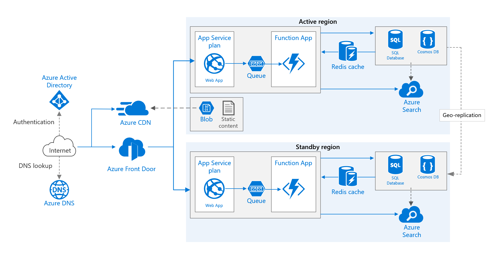

# Azure Cloud Documentation
## Getting Started
A series of Bash scripts are provided to perform Infrastructure related tasks.

### Installation
Multiple options exist to use the Azure CLI for working with FAST Infrastructure.

Begin by [installing](https://docs.microsoft.com/en-us/cli/azure/install-azure-cli?view=azure-cli-latest) a preferred Azure CLI.

Sign in happens interactively with Azure CLI upon executing `bash login.sh`. Leverages the security groups within the Azure tenent by launching the user into a web browser for authentication.

```bash
bash login.sh
```

When using Bash scripts it's not necessary to manually login and perform CLI commands. The scripts will collect and perform the complete operations.

However, some may find it useful to perform other management and lookup tasks using the Azure CLI as it's fast and efficient.

### Configuration
Configuration occurs automatically upon first executing `bash login.sh` and is stored in the user's home directory.

* On Linux or MacOS it's stored at `$HOME/.azure`. To view execute `cat ~/.azure/config` on your CLI. 
* On Windows it's stored at `%USERPROFILE%\.azure`.

For additional details on [Azure CLI Configuration](https://docs.microsoft.com/en-us/cli/azure/azure-cli-configuration?view=azure-cli-latest).

### Execution Commands
Bash scripts are available to perform all Infrastructure actions and are ordered based on the necessary procedures to build out new infrastructure. Assuming the user has an Azure Subscription, anyone can quickly and easily onboard to Azure using these scripts. Assuming they have the proper permissions to read/write/execute in the Azure Cloud.

1. Create an Azure App Service: Automates setting up a web application.

```bash
bash create-app-service.sh
```

2. Delete an Azure App Service: Automates tearing down a web application.

```bash
bash delete-app-service.sh
```

### Deletion
Configuration management requires frequent build up and tear down procedures against Azure Cloud resources. This will safely delete the entire resource group and all resources that reside within.  

This is an intentionally manual process that uses the interactive shell for added protection and safety from harming the Infrastructure.

```bash
az group delete --name "some-resource-group-name"
```

## Architecture
FAST uses Azure Cloud Infrasture and Platform as a Service for highly available multi-regional web applications.

This architecture uses an active/passive with hot standby approach. Meaning the primary regions is receives all traffic, while the other region awaits on hot standby. Hot standby means the VMs in the secondary region are allocated and running at all times.

Learn more from [Azure Documentation](https://docs.microsoft.com/en-us/azure/architecture/reference-architectures/app-service-web-app/multi-region).


_Fast Production Subscription_

### Naming Standards
Follow all naming standards from https://docs.microsoft.com/en-us/azure/cloud-adoption-framework/ready/azure-best-practices/naming-and-tagging with the one exception, suffics instead of prefix. For example `rg-` is the recommendation. However, choose `-rg` instead to allow for product / area groupings considering that the Azure Portal already has a column for Resource Type.

### Organizational Structure
This hierarchy uses the Workload separation strategy. 

* Fast Design Management Group
  * Production Management Group

    * Fast Subscription 1
      * Frontdoor West US
      * Active Resource Group (Primary Region - West US)  
      * Standby Resource Group (Secondary Region - East US)
      * Backdoor East US

    * Fast Subscription 2
      * Frontdoor West US
      * Active Resource Group (Primary Region - West US)  
      * Standby Resource Group (Secondary Region - East US)
      * Backdoor East US
  
  * Staging Management Group

    * Fast Subscription 3
      * Frontdoor West US
      * Active Resource Group (Primary Region - West US)  
      * Standby Resource Group (Secondary Region - East US)
      * Backdoor East US

    * Fast Subscription 4
      * Frontdoor West US
      * Active Resource Group (Primary Region - West US)  
      * Standby Resource Group (Secondary Region - East US)
      * Backdoor East US
  
  * Development Management Group


### Front Door
Front Door is a modern Content Delivery Network (CDN) and so along with dynamic site acceleration and load balancing, it also supports caching behaviors just like any other CDN. [learn more](https://docs.microsoft.com/en-us/azure/frontdoor/front-door-caching)


### Storage
Uses read-access geo-redundant storage (RA-GRS), where the data is replicated to a secondary region. You have read-only access to the data in the secondary region through a separate endpoint. If there is a regional outage or disaster, the Azure Storage team might decide to perform a geo-failover to the secondary region. There is no customer action required for this failover. [learn more](https://docs.microsoft.com/en-us/azure/storage/common/storage-redundancy)

### Key Vault
Uses one key vault per environment (development, staging, and production)

#### TODO
1. Setup Permissions for management groups
  1. Production (Contributor)
  1. Staging (Contributor)
  1. Development ()
1. https://docs.microsoft.com/en-us/azure/frontdoor/quickstart-create-front-door#create-a-front-door-for-your-application


### Building for Resiliency
https://docs.microsoft.com/en-us/azure/architecture/framework/resiliency/overview


#### Acceptable Risks
Front Door is a possible failure point in the system. If the service fails, clients cannot access your application during the downtime. Review the Front Door service level agreement (SLA) and determine whether using Front Door alone meets your business requirements for high availability. If not, consider adding another traffic management solution as a fallback. If the Front Door service fails, change your canonical name (CNAME) records in DNS to point to the other traffic management service. This step must be performed manually, and your application will be unavailable until the DNS changes are propagated.