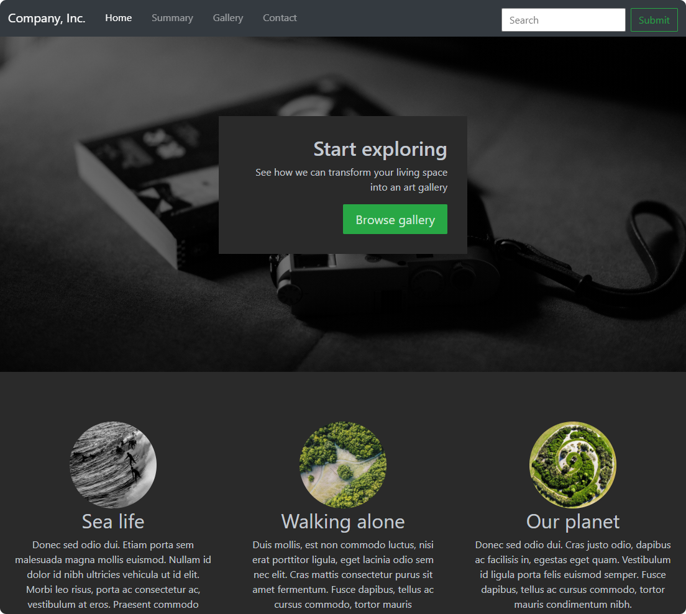
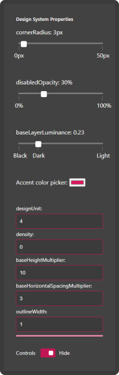
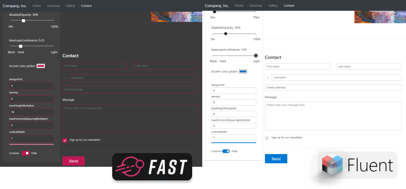

If you've ever tried to build consistent, custom markup structures for a website or an app, you might have looked at web components. As they're standards compliant and supported by all the main evergreen browsers, web components allow you to define reusable and encapsulated HTML tags.

FAST gives you a collection of packages that include web components to define a set of reusable, stylable, and flexible HTML components. These components can encapsulate an entire user experience design language like Microsoft's Fluent design or Google's Material design. The other packages include an intelligent color system and a design system provider.

This tutorial will introduce you to FAST web components. You'll add the components to an existing website and see the impact of changing the design system's properties. You'll see how to completely alter the design language of a website within seconds, by making a few minor changes.

## Prerequisites

In this tutorial, you'll be editing an existing HTML static website. If you'd like to follow the step-by-step guide, you'll need some tools. Start with a code editor like [Visual Studio Code](https://code.visualstudio.com/). You'll also need a local development server. A simple way to set one up is to use the [Live Server](https://marketplace.visualstudio.com/items?itemName=ritwickdey.LiveServer) extension for VS Code.

You should have some understanding of web design and experience with HTML, CSS, and JavaScript. Experience with web components is not required.

## Scenario

Imagine you work for a company that has an existing website. Your company's design department has been asked to rebrand the company and needs to apply this new look and feel to the website. The current website has been built with classic HTML and CSS for styling. You'd like to take this opportunity to switch to web components and have recently discovered FAST as an option.

## The website



To start this tutorial, you'll clone your company's existing website. Exploring the code, you'll see it's a simple static website with this folder structure:


The web page itself is simple and has menu, hero, gallery, contact, and footer sections.

```html
  <body>
    <header />

    <div class="hero"></div>

    <div class="summary"></div>

    <div class="row featurette"></div>
        
    <footer />
  </body>
```

## Using FAST on a website

FAST takes a component-based approach. You're in control and can choose to use only some parts of it, or wholesale as a suite of tools. In this example, you'll be adding FAST as a whole. It will include the web components and a design system that you can use out-of-the-box.

There are only four things you need to do to start using FAST on your website:

  1. Add the JavaScript module.
  1. Add the design system provider to the section you'd like to use FAST inside.
  1. Add the custom FAST web components you'd like to use.
  1. Adjust the design system's properties to match your company's branding.

Later in this tutorial, we'll discuss some features of the design system provider. We'll then look in more detail at some of the specific web components you can use.

### Setting up your development environment

This guide is assuming you are using Visual Studio Code and have already installed the Live Server extension. On your computer open a terminal and navigate to where you'd like to download the tutorial files. Download the zipped source code from [here](https://github.com/microsoft/fast/blob/master/examples/site-rebrand-tutorial/start.zip), or view the source in our [GitHub repository](https://github.com/microsoft/fast/tree/master/examples/site-rebrand-tutorial).

In VS Code, open the CompanyPage folder. Right-click on the index.html file and select `Open with Live Server`. You should see a new browser window open on localhost. Have a look at the current webpage.

### Add the Web Component and color modules

The first step is to add the Web Component module. You can use the current published pre-bundled script that contains all the APIs you need, by importing it from the [unpkg.com](https://unpkg.com).

Before the end `</body>` tag at line 177, import the module. Make sure you specify that this is a JavaScript module by using [`type="module"`](https://developer.mozilla.org/en-US/docs/Web/JavaScript/Guide/Modules).

```html
        ...
        <!-- Add FAST web components -->
        <script type="module" src="https://unpkg.com/@microsoft/fast-components"></script>

    </body>
</html>
```

Save your changes, and the browser should automatically reload. You'll see nothing has changed on the website.

### Enable FAST web components

The second step is to add the [Design System Provider](https://www.fast.design/docs/design-systems/overview#the-designsystemprovider) that contains the design properties and web components on the page. At line 13, under the `<body>` tag, add this HTML tag:

```html
<body>
  <fast-design-system-provider use-defaults>
  ...
```

Then close this tag at line 180, just before the closing `</body>` tag:

```html

  </fast-design-system-provider>
</body>
```

Adding these tags enables you to use the imported design system provider and its web components. You can now start to replace the standard HTML controls or add some new [FAST components](https://explore.fast.design/components). For your company's website, you'll be replacing all the buttons, links, and text buttons.

When you saved these changes, you might not have noticed much of an impact on the website. The background went a little darker, and the text brightened slightly. This is because the design system provider you added includes an implementation of the FAST design language. This is a dark theme, with magenta accents.

You can access these colors using CSS variables, for the background `var(--background-color)`, with the main color of the page being `var(--neutral-foreground-rest)`. To learn more about how colors palettes are supported, see the [documentation](https://www.fast.design/docs/design-systems/fast-frame#adaptive-color).

An advantage of using a FAST design system is that the color pallete is calculated. It has built-in support to create enough contrast between elements based on the [WCAG specification](https://www.w3.org/TR/WCAG21/#contrast-minimum).

### Add FAST web components


Taking each section of your website in turn, you'll replace the existing HTML controls with FAST web components. In the menu, you'll replace the search controls.

Replace the HTML on line 33 with this code:

```html
  <fast-text-field id="search" appearance="filled" placeholder="Search"></fast-text-field>
  <fast-button id="submit-search" appearance="neutral">Submit</fast-button>
```

Save your changes and you'll instantly see that the controls have been replaced. The `<fast-text-field>` uses the accents from the FAST design language. The previous CSS won't apply to the new controls, so you need to add some tweaks to the **css\style.css** file.

At the bottom of the file, add these lines of code:

```css
fast-text-field {
    width: 100%;
}

#search {
    padding-right: 10px;
    width: calc(100% - 70px);
    margin-top: -4px;
}
```

Next you'll fix the hero section. Here you're going to replace the call to action link. On line 48, replace the line with this code:

```html
  <fast-button class="call-to-action" href="#" appearance="accent">Browse gallery</fast-button>
```

Replace all the buttons in the summary section, lines 64, 75, and 84, with this code:

```html
<fast-button appearance="outline">View details &raquo;</fast-button>
```

Save your changes and view the updated webpage. You'll see the two different appearances in the design system. The `"accent"` appearance on the **Browse gallery** button uses a filled magenta color. Compare this to the **View details »** button that's using the `"outline"` appearance. There is also a third appearance included in the design system, the default `"neutral"` style. You can see this on the **Submit** button in the menu.

All of the colors are based around color recipes that inherit from one of FAST's two palettes. These are the `neutralPalette` and the `accentPalette`. You can see all the available color recipes in the [documentation](https://www.fast.design/docs/design-systems/fast-frame/#using-color-recipes).

:::note
If you refresh your browser, you might notice the new web components flash. This is because the browser doesn't know how to display the web components until they have been defined. To stop the flash of unstyled content, add this CSS at line 9 in the header of the page:

```css
  <style>
    :not(:defined) {
      visibility: hidden;
    }
  </style>
</head>
```
:::

Replace all the `<hr class="featurette-divider">` with the `<fast-divider class="featurette-divider" />`

The last section that needs changing is the footer. Here you'll replace all the controls with web components. Replace all the HTML that is defined in the `<footer class="container">` tag, starting at line 136. Use this new footer code:

```html
    <div class="container">
      <div class="col-md-8 offset-md-2">
        <h4 class="mb-3">Contact</h4>
        <form class="needs-validation" novalidate="">
          <div class="row">
            <div class="col-md-6 mb-3">
              <fast-text-field appearance="neutral" placeholder="First name" />
            </div>
            <div class="col-md-6 mb-3">
              <fast-text-field appearance="neutral" placeholder="Last name" />
            </div>
          </div>
          <div class="mb-3">
            <div class="input-group">
              <div class="input-group-prepend">
                <fast-text-field id="at" disabled placeholder="@" />
              </div>
              <fast-text-field id="username" appearance="neutral" placeholder="Username" />
            </div>
          </div>
          <div class="mb-3">
            <fast-text-field type="email" id="email" placeholder="Email (optional)" />
          </div>
          <div class="mb-3">
            <label for="message">Message</label>
            <fast-text-area id="message" placeholder="Please enter your message here." />
          </div>
          <div>
            <fast-checkbox checked id="sign-up" />
            <label for="signup">&nbsp;Sign up for our newsletter</label>
          </div>
          <fast-divider class="footer-divider"></fast-divider>
          <fast-button class="call-to-action" id="submit-contact" appearance="accent">Send</fast-button>
        </form>
      </div>
    </div>

  </main>

  <footer class="container">
    <fast-divider class="featurette-divider"></fast-divider>
    <fast-anchor class="float-right" href="#home" appearance="lightweight">Back to top</fast-anchor>
    <div>
      <span>© 2017-2020 Company, Inc. · </span>
      <fast-anchor href="#" appearance="lightweight">Privacy</fast-anchor> · 
      <fast-anchor href="#" appearance="lightweight">Terms</fast-anchor>
    </div>
  </footer>
```

Again, there are some style issues that need to be fixed. Add this CSS at the bottom of **css\style.css**.

```css
#message {
  width: 100%;
  height: 150px;
}

#message::part(control) {
  width: 100%;
  height: 100%;
}

#at {
  width: 35px;
}

#username {
  width: calc(100% - 35px);
}
```

[Web components](https://developer.mozilla.org/en-US/docs/Web/Web_Components) are made up of custom elements, Shadow DOM, and HTML templates. The CSS for the message text-area inside the `<fast-text-area>` web components is set using the `::part` in the Shadow tree to set the width. You only need to do this for some controls like the <fast-text-area> because it combines a label and a textarea control. For most of the simpler FAST web components you can target the styles at the control itself.


### Change the design system dynamically

Another strength of using FAST alongside the color pallete is the codified design properties. You can access and change a number of properties.

| Name                                   | Description   |
|----------------------------------------|-------------  |
| `backgroundColor`                   | Defines the background color of the node. This is used by color recipes and should represent the color the UI is rendering on for a given node tree. |
| `baseLayerLuminance`                   | Defines the base luminance used in layer recipes.  |
| `density`                            | A multiplier to control the density of UI elements.                        |
| `designUnit`                        | The core sizing unit that all sizes are derived from.                      |
| `baseHeightMultiplier`             | The number of design units used for component height at the base density.   |
| `baseHorizontalSpacingMultiplier` | The number of design units used for horizontal spacing at the base density. |
| `cornerRadius`                      | The corner radius of controls.                                             |
| `outlineWidth`                      | The width of the outline on controls.                              |
| `disabledOpacity`                   | Opacity of disabled controls.                                              |

You've been asked to demonstrate how these properties affect the look and feel of the website. You decide to add a new FAST Web Component, the `<fast-card>`, to contain a number of components to surface the underlying design system.

At line 52, under the `<a>` tag in index.html, add this HTML:



```html
<!-- Design system properties pallete -->
<fast-card id="designPalletteOn">
  <h5>Design System Properties</h5>
  <p>cornerRadius: <label id="currentCorner">0</label>px
    <fast-slider id="cornerControl" orientation="horizontal" min="0" max="50" step="1">
      <fast-slider-label position="0">
        0px
      </fast-slider-label>
      <fast-slider-label position="50">
        50px
      </fast-slider-label>
    </fast-slider>
  </p>
  <br/>
  <p>disabledOpacity: <label id="currentOpacity">0</label>%
    <fast-slider id="opacityControl" orientation="horizontal" min="0" max="1" step="0.01">
      <fast-slider-label position="0">
        0%
      </fast-slider-label>
      <fast-slider-label position="100">
        100%
      </fast-slider-label>
    </fast-slider>
  </p>
  <br/>
  <p>baseLayerLuminance: <label id="currentbaseLayerLuminance">0</label>
    <fast-slider id="baseLayerLuminanceControl" orientation="horizontal" min="0" max="1" step="0.01">
      <fast-slider-label position="0">
        Black
      </fast-slider-label>
      <fast-slider-label position="0.23">
        Dark
      </fast-slider-label>
      <fast-slider-label position="1">
        Light
      </fast-slider-label>
    </fast-slider>
  </p>
  <br/>
  <p><label>Accent color picker: <input type="color"></label></p>
  <br/>
  <fast-text-field type="number" id="designUnit">designUnit:</fast-text-field>
  <fast-text-field type="number" id="density">density:</fast-text-field>
  <fast-text-field type="number" id="heightMultiplier">baseHeightMultiplier:</fast-text-field>
  <fast-text-field type="number" id="baseHorizontalSpacingMultiplier">baseHorizontalSpacingMultiplier:
  </fast-text-field>
  <fast-text-field type="number" id="outlineWidth">outlineWidth:</fast-text-field>
  <fast-progress min="0" max="100" value="100"></fast-progress>
  <br/>
  <fast-switch id="hidePanel" checked>
    Controls&nbsp;
    <span slot="checked-message">Hide</span>
    <span slot="unchecked-message">Show</span>
  </fast-switch>
</fast-card>

<!-- Design pallete off -->
<fast-card id="designPalletteOff">
  <fast-switch id="showPanel" checked>
    Controls&nbsp;
    <span slot="checked-message">Hide</span>
    <span slot="unchecked-message">Show</span>
  </fast-switch>
</fast-card>
```

Some additional CSS is needed to make the panel usable. At the bottom of the CSS, add this code:

```css
#designPalletteOn {
    --card-width: 300px;
    padding:2em;
    margin: 1em;
    position:sticky;
    top: 80px;
    z-index: 999;
    float: left;
}

#designPalletteOff {
    --card-width: 180px;
    padding:0.5em;
    margin: 0.5em;
    position:sticky;
    top: 80px;
    z-index: 999;
    float: left;
    display: none;
}
```

The controls themselves now need some JavaScript to manage the design system provider. At line 240, above the closing `</fast-design-system-provider>` tag, add this JavaScript module:

```javascript
<!-- connect Web Components -->
<script type="module">
  // To reference the FAST components loaded you'll need to import them to your inline JavaScript module
  import { FASTDesignSystemProvider, neutralLayerL1Behavior, neutralForegroundRestBehavior, createColorPalette, parseColorString }
    from "https://unpkg.com/@microsoft/fast-components";

  const designSystemProvider = document.querySelector("fast-design-system-provider");
  const cornerSlider = document.getElementById("cornerControl");
  const opacitySlider = document.getElementById("opacityControl");
  const themeSwitch = document.getElementById("baseLayerLuminanceControl");
  const accentSwitcher = document.querySelector("input[type='color']");

  // Tells the design-system-provider to create the layer CSS custom property
  designSystemProvider.registerCSSCustomProperty(neutralLayerL1Behavior);
  // Tells the design-system-provider to use the above as the CSS background for the region
  designSystemProvider.style.setProperty("background-color", `var(--${neutralLayerL1Behavior.name})`);
  // Set the background *property* to the value of the product of the recipe, for other recipes to use
  designSystemProvider.backgroundColor = (neutralLayerL1Behavior.value)(designSystemProvider.designSystem);

  // Hook up corner
  cornerSlider.value = designSystemProvider.cornerRadius;
  cornerSlider.addEventListener("change", (e) => {
    designSystemProvider.cornerRadius = e.target.value;
    document.getElementById('currentCorner').textContent = e.target.value;
  });

  // Hook up pacity
  opacitySlider.value = designSystemProvider.disabledOpacity;
  opacitySlider.addEventListener("change", (e) => {
    designSystemProvider.disabledOpacity = e.target.value;
    document.getElementById('currentOpacity').textContent = Math.round(e.target.value * 100);
  });

  // Hook up theme switcher
  themeSwitch.addEventListener("change", (e) => {
    // When the "baseLayerLuminosity" changes, set the new value
    designSystemProvider.baseLayerLuminance = parseFloat(e.target.value);
    // Re-evaluate the layer recipe and set the backgroundColor *property* to the result
    designSystemProvider.backgroundColor = (neutralLayerL1Behavior.value)({ ...designSystemProvider.designSystem });
    document.getElementById("currentbaseLayerLuminance").textContent = parseFloat(e.target.value).toFixed(2);
  });

  // Control the accent color
  accentSwitcher.value = designSystemProvider.accentBaseColor;
  accentSwitcher.addEventListener("change", (e) => {
    if (e.target instanceof HTMLInputElement) {
      // Change both the base color and the palette
      designSystemProvider.accentBaseColor = e.target.value;
      designSystemProvider.accentPalette = createColorPalette(parseColorString(e.target.value));
    }
  });

  // Load the design system properties
  document.getElementById("currentCorner").textContent = designSystemProvider.cornerRadius;
  document.getElementById("currentOpacity").textContent = Math.round(designSystemProvider.disabledOpacity * 100);
  document.getElementById("currentbaseLayerLuminance").textContent = themeSwitch.value;
  document.getElementById("density").value = designSystemProvider.density;
  document.getElementById("heightMultiplier").value = designSystemProvider.baseHeightMultiplier;
  document.getElementById("designUnit").value = designSystemProvider.designUnit;
  document.getElementById("baseHorizontalSpacingMultiplier").value = designSystemProvider.baseHorizontalSpacingMultiplier;
  document.getElementById("outlineWidth").value = designSystemProvider.outlineWidth;

  // Connect design system properties to the FAST controls
  document.getElementById("density").addEventListener("keypress", (e) => {
    designSystemProvider.density = e.target.value;
  });
  document.getElementById("outlineWidth").addEventListener("keypress", (e) => {
    designSystemProvider.outlineWidth = e.target.value;
  });
  document.getElementById("designUnit").addEventListener("keypress", (e) => {
    designSystemProvider.designUnit = e.target.value;
  });
  document.getElementById("baseHorizontalSpacingMultiplier").addEventListener("keypress", (e) => {
    designSystemProvider.baseHorizontalSpacingMultiplier = e.target.value;
  });
  document.getElementById("heightMultiplier").addEventListener("keypress", (e) => {
    designSystemProvider.baseHeightMultiplier = e.target.value;
  });


  // Toggle the design panel
  const designCard = document.getElementById("designPalletteOn");
  const designOpen = document.getElementById("designPalletteOff");

  document.getElementById("hidePanel").addEventListener("click", (e) => {
    designCard.style = "display: none";
    designOpen.style = "display: block";
    document.getElementById("showPanel").checked = false;
  });

  document.getElementById("showPanel").addEventListener("click", (e) => {
    designOpen.style = "display: none";
    designCard.style = "display: block";
    document.getElementById("hidePanel").checked = true;
  });

</script>
```

Stepping through the JavaScript line by line, you'll see how the `designSystemProvider` properties are being connected to the individual web components. Save your changes and reload the website.

Drag the `cornerRadius` slider and see all the FAST components change. Try the `baseLayerLuminance` slider to see the whole page adapting to a lighter or darker theme. You might notice that this breaks the call to action in the header. This is because the hero text is statically defined in the CSS. You need to use the design system's CSS variables.

In the CSS file, at line 38, change the declaration for `.hero-text` to this:

```css
.hero-text {
  border-radius: calc(var(--corner-radius, 10) * 1px);
  background-color: var(--background-color);
  color: var(--neutral-foreground-rest);
  width: 400px;
  display: flex;
  flex-direction: column;
  text-align: right;
  margin: auto;
  padding: 2rem;
}
```

The hero text panel will now reflect the changes to the corner radius, background, and foreground colors. There is another CSS problem on the page. In the gallery section, there are subtitles defined with a `.text-muted` class. This class also needs to change, depending on the background color. Change the class at line 466 to:

```css
.text-muted {
  color: var(--neutral-foreground-hint);
}
```

The next fix is around how the call to action and contact buttons are no longer larger than other buttons on the site. FAST has defined a [typography ramp](https://www.fast.design/docs/design-systems/fast-frame#type-ramp) system that allows you to scale text relatively. You're going to increase the font size and line-height by adding this CSS declaration:

```css

.call-to-action::part(control) {
  font-size: var(--type-ramp-plus-2-font-size);
  line-height: var(--type-ramp-plus-2-line-height);
}
```

To allow the other text to also use the type ramp, change the CSS declarations for `h2` and `featurette-heading` to:

```css
h2,
.h2 {
  font-size: var(--type-ramp-plus-4-font-size);
  line-height: var(--type-ramp-plus-4-line-height);
}

.featurette-heading {
  font-size: var(--type-ramp-plus-6-font-size);
  margin-top: 7rem; 
}
```

Save your changes and alter the `baseLayerLuminance` slider again. See how the hero and muted text adjust to the different values. Also, note the updated sizes of the calls to action.

## The FAST adaptive color system

Earlier in this tutorial you saw how adding an accented appearance to a FAST button filled it with the loaded design system's chosen highlight color. In the design properties panel you can choose to change the accent color. The code that supports this is:

```javascript
  designSystemProvider.accentBaseColor = e.target.value;
  designSystemProvider.accentPalette = createColorPalette(parseColorHexRGB(e.target.value));
```

FAST allows you to change the palette. The change will then be propagated to all the controls that are using that color palette. Try changing the color and see how all the controls that use the `accentPalette` are updated. For more information see the [Algorithmic Colors (Recipes)](https://www.fast.design/docs/design-systems/fast-frame#using-color-recipes) section in the documentation.

## FAST and the flexibility of the design system

So far in this tutorial, you've updated a statically designed website to use FAST's modern responsive design system. FAST separates the base web components from their flexible design system. Through this example, you've been using the default FAST web components. The out-of-the-box design system provided is based on a dark user experience.

To demonstrate how the separation of this design system from its components works, you're going to switch to the FAST implementation of Microsoft's Fluent design system.

As the design system and components are all defined in the pre-bundled FAST JavaScript module, you just need to change two lines of code and execute a simple search and replace.

Change line 247 to:

```html
  <script type="module" src="https://unpkg.com/@fluentui/web-components"></script>
```

And the import statement at line 253 to:

```javascript
    from "https://unpkg.com/@fluentui/web-components";
```

Finally, using search and replace within the HTML and CSS files, replace all instances of "fast-" with "fluent-".



Fluent is based around a lighter user experience, using blue accents. There's also a different corner radius to controls and a smaller height multiplier.

As you can see, it's possible to encapsulate your company's entire design philosophy as a FAST design system provider, and deploy it across all your websites and apps. However, the flexibility is still there. You can still change the base luminance to a darker or black theme. You could adjust all the design properties to make the design system provider match the appearance of the default FAST design system.

There's a completed sample webpage located in FastPage\index.html if you'd like to view all of the above changes already made to the example.

