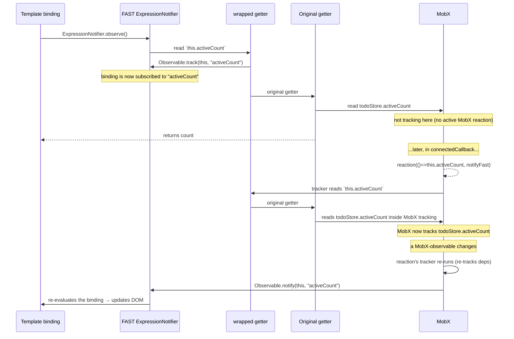

# Todo MobX App — Design Overview

This document explains how the example bridges **MobX**'s reactive system into **`@microsoft/fast-element`**'s template binding system, and the conventions the example uses to keep the bridge ergonomic and correct.

For a user-facing intro and run instructions, see [README.md](./README.md).

---

## Table of contents

1. [The two reactivity systems](#the-two-reactivity-systems)
2. [The bridge — `@mobxObserver` and `@mobxObservableProperty`](#the-bridge--mobxobserver-and-mobxobservableproperty)
3. [Lifecycle and ordering](#lifecycle-and-ordering)
4. [State layer (`src/state/`)](#state-layer-srcstate)
5. [Persistence (`autorun` → `localStorage`)](#persistence-autorun--localstorage)
6. [Component composition](#component-composition)
7. [`repeat` + per-item reactions: why `recycle: false`](#repeat--per-item-reactions-why-recycle-false)
8. [Known gotchas](#known-gotchas)
9. [Package layout](#package-layout)

---

## The two reactivity systems

FAST and MobX both track property reads to invalidate dependents when state changes, but they do it independently:

| | FAST (`@microsoft/fast-element`) | MobX |
|---|---|---|
| What gets observed | `@attr`, `@observable`, array mutations through FAST's `arrays.ts` patch, and any access wrapped in `Observable.track(source, name)` | Properties touched while a `reaction`, `autorun`, `computed`, or rendering observer is running |
| Subscriber primitive | `ExpressionNotifier` (an internal "watcher" stack — see [`observation/observable.ts`](../../packages/fast-element/src/observation/observable.ts)) | `Reaction` / `ComputedValue` |
| How a change re-renders | `Observable.notify(source, name)` → bound `ExpressionNotifier`s fire `handleChange` → enqueues an `Updates` task | The reaction's effect function runs synchronously |

There is no direct interop. If a FAST template binding reads a MobX-observable, MobX doesn't know to notify FAST. If a MobX `reaction` reads a FAST `@observable`, FAST doesn't know to notify MobX.

The example builds **a one-direction bridge**: MobX → FAST. FAST stays the source of truth for DOM updates; MobX stays the source of truth for application state.

---

## The bridge — `@mobxObserver` and `@mobxObservableProperty`

Two small decorators in [`src/mobx-integration/mobx-observer.ts`](./src/mobx-integration/mobx-observer.ts) make a FASTElement reactive to MobX state.

### `@mobxObservableProperty` — applied to a getter

The decorator does two things:

1. **Wraps the getter** so the first thing it does is `Observable.track(this, name)`. When a FAST template binding evaluates the getter inside an active `ExpressionNotifier`, this call subscribes the binding to the property on the element.
2. **Registers** the property name on the element's prototype (in a module-scoped `WeakMap<prototype, Set<string>>`). The `@mobxObserver` class decorator reads these names when the element connects.

```typescript
@mobxObservableProperty
public get activeCount(): number {
    return todoStore.activeCount;
}
```

### `@mobxObserver` — applied to the class

The decorator wraps `connectedCallback` and `disconnectedCallback` on the prototype. The `connectedCallback` wrapper:

1. Calls the original `connectedCallback` so FAST's controller renders and binds the template normally.
2. Walks the prototype chain via `collectMobxObservableKeys` to gather every `@mobxObservableProperty` getter registered on this class **and any ancestors**.
3. For each registered name, calls `reaction(() => this[name], () => Observable.notify(this, name))`. The reaction's tracker reads the getter inside MobX's tracking context, so MobX subscribes to whatever MobX-observable the getter reads. When any of those inputs change, the effect calls `Observable.notify(this, name)`, which FAST fans out to the bound `ExpressionNotifier`.
4. Stores all disposers in a non-enumerable `_mobxReactionDisposers` instance slot.

The `disconnectedCallback` wrapper disposes every reaction before invoking the original `disconnectedCallback`, so the bridge does not leak observers when the element is removed.

Both wrappers carry a `Symbol("mobx-observer-wrapped")` sentinel so re-applying `@mobxObserver` to a subclass is safe (no double-wrap, no double-fire).

### What happens at render time



The crucial detail is that `Observable.track` is a no-op when no FAST watcher is active (see `Observable.track` in [`observable.ts`](../../packages/fast-element/src/observation/observable.ts) — it guards on `watcher && …`). That means it's safe for the wrapped getter to be called from inside the MobX reaction's tracker too — it simply does nothing for FAST in that pass while MobX tracks normally.

---

## Lifecycle and ordering

The wrapped `connectedCallback` calls the original first, then sets up MobX reactions. The order matters because:

- The original `connectedCallback` (provided by FAST) synchronously renders the template, which gives each `@mobxObservableProperty` a chance to register a FAST subscription via `Observable.track` during the binding's first evaluation.
- The MobX reactions are then created, so subsequent MobX-observable changes notify FAST.

There is **no event-loop gap** between FAST render and reaction setup — both happen synchronously inside `connectedCallback`. If a component override of `connectedCallback` mutates MobX-observable state *after* `super.connectedCallback()` returns, the bridge will see that mutation in its first reaction tracking pass, not as a notification — which is fine, because the value will be correctly read by both FAST and MobX in their initial passes.

On disconnect the order is reversed: reactions are disposed first, then the original `disconnectedCallback` runs.

---

## State layer (`src/state/`)

`TodoStore` (in [`todo-store.ts`](./src/state/todo-store.ts)) is a plain class made reactive with `makeAutoObservable(this)`. That call automatically annotates:

- Class fields (`todos`, `activeFilter`) as `observable`.
- `get` accessors (`filtered`, `activeCount`, `completedCount`, `total`, `allCompleted`) as `computed` (cached while observed; recomputed only when their MobX dependencies change).
- Regular methods (`add`, `remove`, `toggle`, `toggleAll`, `clearCompleted`, `setFilter`, `hydrate`) as `action` (so mutations are batched).

Because the array is deeply observable, the plain `{ id, description, done }` objects inserted by `add()` are wrapped as observable objects when they enter the array. That is what lets `<todo-item>` track `this.todo.done` and `this.todo.description` reactively.

`hydrate(snapshot)` accepts both an array of todos (legacy shape) and `{ todos, activeFilter }`. It validates entries before assigning so corrupted `localStorage` payloads cannot poison the store.

The module exports a singleton `todoStore` — components import it directly rather than using DI / Context, which mirrors the typical MobX usage from React. (The plain `todo-app` example in this monorepo uses FAST `Context` instead; either pattern works.)

---

## Persistence (`autorun` → `localStorage`)

[`persistence.ts`](./src/state/persistence.ts) exports `connectStoreToStorage(store, key)` which:

1. Reads `key` from `localStorage` on call, parses, and hands the payload to `store.hydrate(...)`. Wrapped in `try/catch` for environments without storage (SSR, private mode).
2. Returns the disposer from `autorun(() => localStorage.setItem(key, JSON.stringify({ todos: store.todos, activeFilter: store.activeFilter })))`.

`autorun` runs once on creation (an immediate write), then re-runs whenever any observable read inside its body changes. Reading `store.todos` and `store.activeFilter` ties the autorun to the array, every Todo's enumerable fields, and the filter — so any toggle, add, remove, or filter switch triggers a persist.

---

## Component composition

Each component imports the singleton `todoStore` and exposes the slices it needs as `@mobxObservableProperty` getters. Templates bind only to those getters — they never read `todoStore` directly. This keeps the bridge contract local: the only way for the DOM to read MobX state is through a tracked getter.

| Component | Tracked getters | Actions |
|---|---|---|
| `<todo-app>` | `total`, `hasTodos` | (renders sub-components, dispatches none directly) |
| `<todo-form>` | local FAST `@observable description` (UI-only state) | `todoStore.add` |
| `<todo-filter>` | `activeFilter` | `todoStore.setFilter` |
| `<todo-list>` | `items` (proxies `todoStore.filtered`) | (renders `<todo-item>`s) |
| `<todo-item>` | `done`, `description` (per-item) | `todoStore.toggle`, `todoStore.remove` |
| `<todo-stats>` | `activeCount`, `completedCount`, `allCompleted`, `hasCompleted` | `todoStore.toggleAll`, `todoStore.clearCompleted` |

The form's input value is intentionally a FAST `@observable`, not MobX state — it's transient UI state local to that element. The bridge does not need to be involved.

---

## `repeat` + per-item reactions: why `recycle: false`

The `<todo-list>` template uses `repeat(x => x.items, ..., { positioning: true, recycle: false })`. The `recycle: false` flag is **necessary**, not stylistic.

FAST's `repeat` directive recycles child views by default: when an item is removed mid-list, the existing `<todo-item>` view at that position can be re-bound to a different Todo rather than torn down and recreated. That is fine for plain FAST observables, but the MobX-side reactions installed by `@mobxObserver` are bound to the *original* Todo's MobX-observable fields. After rebinding, the `:todo` property points to a new Todo, but the underlying `reaction(() => this.done, …)` is still subscribed to the previous Todo's `done`. Subsequent MobX mutations to the new Todo would not notify FAST, and the row's checkbox state would go stale.

Disabling recycling guarantees `disconnectedCallback` runs for the removed row (disposing its reactions) and a fresh `<todo-item>` instance is created for the new position (installing reactions against the current Todo).

If you build a more sophisticated bridge that hooks into `@observable` input changes (e.g. via a `todoChanged()` callback that re-installs reactions), you could re-enable recycling for performance.

---

## Known gotchas

- **`useDefineForClassFields: false`** — required by MobX 6's `makeAutoObservable` so class-field initializers run as constructor assignments rather than `Object.defineProperty` declarations. The example's `tsconfig.json` sets this explicitly.
- **`skipLibCheck: true`** — set because MobX 6's `ObservableMap` lib types lag the `Map` definitions in TypeScript's `esnext` lib (missing `getOrInsert` / `getOrInsertComputed`). This affects type-checking only, not runtime.
- **One-direction interop** — the bridge moves MobX changes into FAST. The reverse (FAST `@observable` → MobX `reaction`) is **not** wired. The single FAST `@observable` in the example (`<todo-item>.todo`) is consumed only inside `@mobxObservableProperty` getters, which works because FAST's expression notifier tracks both `this.todo` *and* the MobX-observable read on `todo.done` during the same evaluation.
- **No volatile detection on the wrapped getter** — FAST's volatility regex inspects the getter's source. Because the wrapped getter calls `originalGetter.call(this)`, the inspection sees the wrapper, not the original. This has not caused issues in practice for the getters in this example, but for getters with conditional branches (`&&`, `||`, `?.`), you may want to apply FAST's `@volatile` decorator after `@mobxObservableProperty`.

---

## Package layout

```
examples/todo-mobx-app/
├── DESIGN.md                       ← this file
├── README.md                       ← developer-facing intro
├── index.html
├── package.json
├── tsconfig.json
├── vite.config.ts
└── src/
    ├── exports.ts
    ├── main.ts
    ├── mobx-integration/
    │   ├── index.ts                ← barrel
    │   └── mobx-observer.ts        ← the bridge decorators
    ├── state/
    │   ├── index.ts
    │   ├── persistence.ts          ← autorun → localStorage
    │   └── todo-store.ts           ← MobX store
    ├── todo-app.{ts,template.ts,styles.ts}
    ├── todo-form.{ts,template.ts,styles.ts}
    ├── todo-list.{ts,template.ts,styles.ts}
    ├── todo-item.{ts,template.ts,styles.ts}
    ├── todo-filter.{ts,template.ts,styles.ts}
    └── todo-stats.{ts,template.ts,styles.ts}
```

Implementation entry points worth reading first:

1. [`src/mobx-integration/mobx-observer.ts`](./src/mobx-integration/mobx-observer.ts) — the bridge.
2. [`src/state/todo-store.ts`](./src/state/todo-store.ts) — the MobX model.
3. [`src/todo-stats.ts`](./src/todo-stats.ts) — the cleanest example of consuming the bridge end-to-end.
