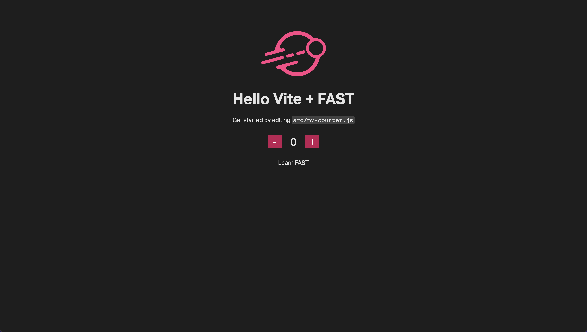

## vite-fast-starter

This is a Vite + FAST starter project.

- [Vite](https://vitejs.dev/): Next Generation Frontend Tooling

- [FAST](https://www.fast.design/): The adaptive interface system for modern web experiences

---

### Requirements

- [Node.js](https://nodejs.org/) version >=12.2.0

---

### Getting started

```shell
git clone https://github.com/microsoft/fast.git
```

```shell
cd examples/vite-starters/vite-fast-starter
```

```shell
npm install --save @microsoft/fast-components @microsoft/fast-foundation @microsoft/fast-element
```

```shell
npm run dev
```

---

### Starter screenshot:

