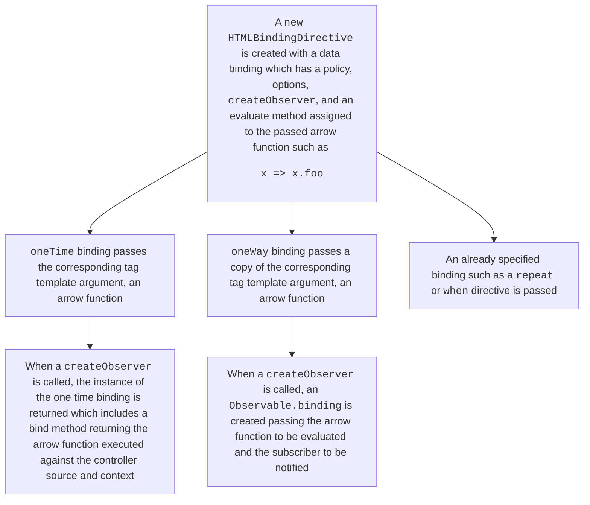

# `html` tagged template literal

The `html` export from `@microsoft/fast-element` is used to create the template logic for the custom element.

## Pre-processing the `html` tagged template literal contents

Before the template can be used it goes through a step to convert it into a `ViewTemplate` which it does via the `ViewTemplate.create()` method. This is then used during the `compose` step, before `FASTElement` is instantiated.

During the `Compiler.compile()` method(triggered by `ViewTemplate.create()` method), the following happens for each string:
- Factories with unique IDs are created for each tag template literal argument (or `TemplateValue`) which matches with the corresponding string
- A binding is created from the `TemplateValue`

A resulting string using a `createHTML()` function is produced using the `HTMLDirective`s executed for each factory. The behavior is augmented by the previous string from the `html` tag template which determines the aspect if one exists, these aspects are the `@`, `:`, or other binding aspect attached to attributes.

The `createHTML()` function utilizes a `Markup` attribute which is assigned to a factory's unique ID. The strings are concatenated and passed to a new `ViewTemplate` with all the factories (empty until one is assigned) that act as a dictionary with the unique IDs as the key to look up each factory once it has been created. The string this creates is injected into a `<template>` as `innerHTML`, which allows the browser to create the nodes and placeholder factory IDs, with the only `DOM` node that is explicitly created being the wrapping `<template>` element.

## Directives

The `HTMLBindingDirective` applies bindings to items identified as various `TemplateValue`s within the `html` tagged template. The `createHTML` step uses the factory associated with the binding to create strings in the markup using the factory's ID.

