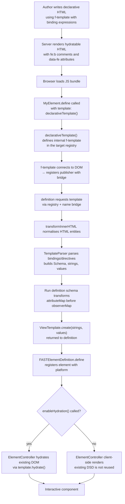
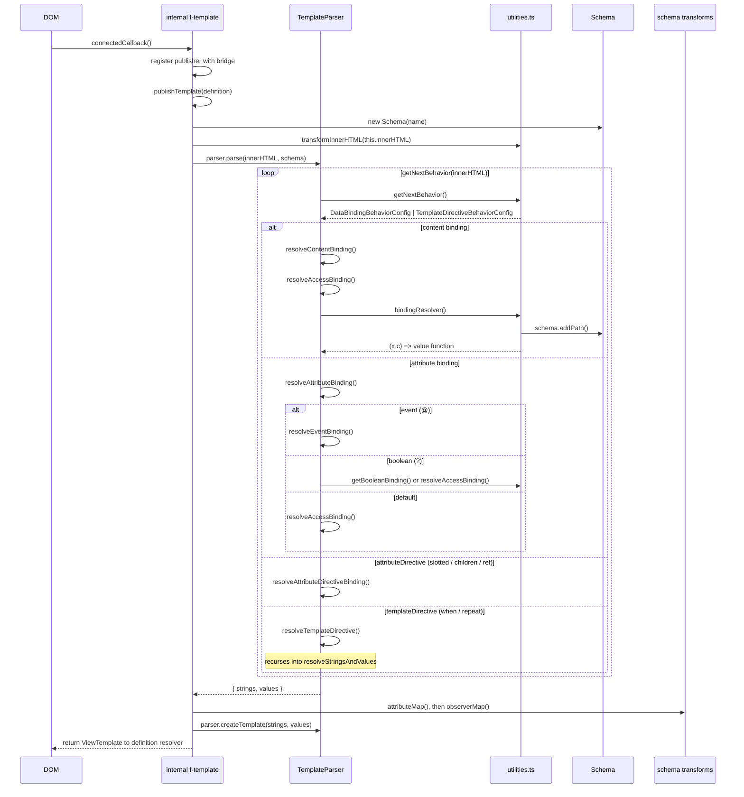
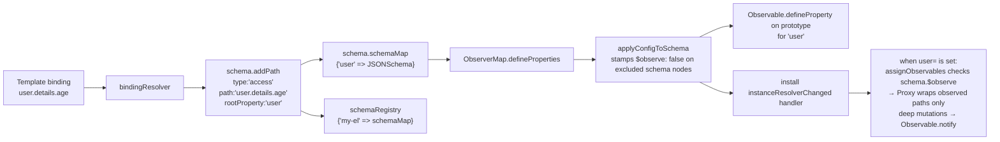

# Declarative HTML Design

This document is intended for contributors who want to understand the internal
architecture of the declarative runtime and schema-driven map extensions in
`@microsoft/fast-element`. It covers the feature's purpose, core concepts, data
flow, and its integration with the rest of `@microsoft/fast-element`.

## Table of Contents

1. [Overview](#overview)
2. [Goals](#goals)
3. [Core Concepts](#core-concepts)
4. [Package Structure](#package-structure)
5. [Exports and Public API](#exports-and-public-api)
6. [Template Syntax](#template-syntax)
7. [Data Flow](#data-flow)
8. [Template Parsing Pipeline](#template-parsing-pipeline)
9. [Schema and Observer Map](#schema-and-observer-map)
10. [Lifecycle](#lifecycle)
11. [Integration with fast-element](#integration-with-fast-element)
12. [Hydration Model](#hydration-model)
13. [Testing Architecture](#testing-architecture)
14. [Further Reading](#further-reading)

---

## Overview

`@microsoft/fast-element` lets you write FAST Web Component
templates as plain HTML rather than JavaScript `html` tagged template literals.
The browser-side JS bundle defines FAST's internal native `<f-template>`
publisher on demand. It parses declarative template markup at runtime and
returns a `ViewTemplate` to the waiting FAST element definition through the
registry-aware declarative template bridge.

```html
<!-- Declarative template — stack-agnostic, no JS needed to render -->
<my-component greeting="Hello">
    <template shadowrootmode="open">
        <!--fe:b-->Hello<!--fe:/b-->
    </template>
</my-component>

<!-- Template definition — parsed once by the browser bundle -->
<f-template name="my-component">
    <template>{{greeting}}</template>
</f-template>
```

---

## Goals

| Goal | Description |
|---|---|
| **Server-agnostic rendering** | Templates are plain HTML strings with no dependency on Node.js or any specific SSR framework. |
| **Progressive enhancement** | Components can be server-rendered and then hydrated client-side without a full re-render. |
| **FAST parity** | The declarative syntax maps 1-to-1 to FAST Element directive helpers (`repeat`, `when`, `slotted`, `children`, `ref`) exported from `@microsoft/fast-element`. |
| **Minimal authoring overhead** | Component authors write HTML, not tagged template strings, while retaining full reactive capabilities. |

---

## Core Concepts

### `<f-template>` — the internal template publisher

`<f-template>` is an internal custom element implemented as a lightweight native
`HTMLElement`. It is defined automatically by `declarativeTemplate()` in the same
`CustomElementRegistry` as the FAST element definition. Consumers should not
import, subclass, or define the implementation directly.

When connected to the DOM it:

1. Registers itself with the declarative template bridge using its registry and
   `name` attribute.
2. Publishes a template when a matching FAST element definition requests one.
3. Delegates parsing of the inner `<template>` tag to `TemplateParser`, which
   converts declarative bindings into FAST `ViewTemplate` strings and values.
4. Runs definition-scoped schema transforms, such as `attributeMap()` and
   `observerMap()`, before returning the concrete `ViewTemplate`.

When multiple connected `<f-template>` publishers share the same `name`, the
bridge resolves pending definitions from the first connected publisher and keeps
the resolved template stable. Later duplicate publishers do not reassign the
definition template.

### `TemplateParser` — declarative HTML parser

A standalone class that converts declarative HTML template markup into the
`strings` and `values` arrays that `ViewTemplate.create()` consumes. It is used
by the internal `<f-template>` publisher but can also be used independently for
programmatic template compilation. The parsing pipeline is fully synchronous —
no promises are allocated during template resolution. A `StringsAccumulator`
tracks the running concatenation of preceding HTML, eliminating repeated O(N)
`join("")` calls at each binding site. `createTemplate()` lazily installs the
declarative runtime's debug messages; hydration support is installed only by
`enableHydration()`.

### `Schema` — JSON schema builder

Built during declarative template parsing, one `Schema` instance per
`<f-template>`. Non-declarative callers can also create and attach a `Schema`
manually. It records every binding path discovered in the template or supplied
by code and constructs a JSON Schema-compatible data structure. This schema:

- Describes the shape of each root property referenced in the template.
- Tracks repeat context chains (parent/child array relationships).
- Uses an instance-level `schemaMap` for its own property schemas.
- Registers itself in the module-level `schemaRegistry` (keyed by custom element name) for cross-element `$ref` resolution.

`FASTElementDefinition.schema` is optional. `declarativeTemplate()` assigns it
automatically after parsing; manual schema users can pass `schema` in the
definition object.

### `ObserverMap` — automatic observable setup

An optional layer that uses the `Schema` to automatically:

- Call `Observable.defineProperty()` for every root property on the element prototype.
- Install property-change handlers that wrap newly assigned objects/arrays in `Proxy` instances.
- Propagate deep property mutations back through FAST's observable system so bindings re-render.

Enabled via the `observerMap()` definition extension exported from
`@microsoft/fast-element/observer-map.js`. Calling `observerMap()` without
arguments observes all root properties discovered in the template or supplied
schema.

#### Path-level observation control

The `ObserverMapConfig` interface accepts an optional `schema` for
non-declarative/manual schema use and an optional `properties` key that maps
root property names to a recursive path tree controlling observation
granularity:

```typescript
MyElement.define(
    {
        name: "my-element",
        template: declarativeTemplate(),
    },
    [
        observerMap({
            properties: {
                user: {
                    name: true,          // user.name — observed
                    details: {
                        age: true,       // user.details.age — observed
                        history: false,  // user.details.history — NOT observed
                    },
                },
                // root properties not listed here are skipped
            },
        }),
    ],
);
```

Each path entry can be:
- **`true`** — observe this path and all descendants (unless overridden deeper).
- **`false`** — skip this path and all descendants (unless overridden deeper).
- **`ObserverMapPathNode`** — an object with an optional `$observe` boolean and child property overrides, allowing alternating opt-in/opt-out to arbitrary depth.

When `properties` is omitted, all root properties are observed. When
`properties` is present but empty (`{ properties: {} }`), no root properties
are observed.

Observer-map-managed array updates replace the array reference when `deepMerge`
receives a new array. This avoids mutating an existing observed array while it
may be notifying subscribers and lets repeat bindings observe the new array
reference. Replaced arrays are wrapped with the schema for the assigned
property, and array observer subscriptions are installed once per array so
reprocessing does not duplicate accessors or notification work.

For non-declarative elements, pass a schema directly to `observerMap()`:

```typescript
import { FASTElement, Schema } from "@microsoft/fast-element";
import { observerMap } from "@microsoft/fast-element/observer-map.js";

class MyElement extends FASTElement {}

const schema = new Schema("my-element");
schema.addPath({
    rootPropertyName: "user",
    pathConfig: {
        type: "default",
        parentContext: null,
        currentContext: null,
        path: "user.name",
    },
    childrenMap: null,
});

MyElement.define({ name: "my-element" }, [observerMap({ schema })]);
```

The resolution algorithm walks the schema and configuration tree in parallel:
1. If `properties` is present and a root property is not listed, it is skipped.
2. `true`/`false` booleans apply to the entire subtree.
3. `$observe` on a node object controls the current level; children inherit when unspecified.
4. Paths in the config but not in the schema are silently ignored (forward-compatible).

### `AttributeMap` — automatic `@attr` definitions

An optional layer that uses the `Schema` to automatically register `@attr`-style reactive properties for every **leaf binding** in the template — i.e. simple expressions like `{{foo}}` or `id="{{foo-bar}}"` that have no nested properties, no explicit type, and no child element references.

- By default (`attribute-name-strategy: "camelCase"`), the binding key is treated as a camelCase property name and the HTML attribute name is derived by converting it to kebab-case (e.g. `{{fooBar}}` → property `fooBar`, attribute `foo-bar`). This matches the build-time `--attribute-name-strategy` option in `@microsoft/fast-build`.
- When `attribute-name-strategy` is `"none"`, the **attribute name** and **property name** are both the binding key exactly as written in the template (e.g. `{{foo-bar}}` → attribute `foo-bar`, property `foo-bar`). No normalization is applied.
- Because HTML attributes are case-insensitive, binding keys should use lowercase names (optionally dash-separated) when using the `"none"` strategy.
- Properties already decorated with `@attr` or `@observable` are left untouched.
- `FASTElementDefinition.attributeLookup` is keyed by the HTML attribute name, and `propertyLookup` is keyed by the JS property name so `attributeChangedCallback` correctly delegates to the new `AttributeDefinition`.

Enabled via the `attributeMap()` definition extension exported from
`@microsoft/fast-element/attribute-map.js`. Calling `attributeMap()` without
arguments uses the default `"camelCase"` strategy. To preserve binding keys
exactly as written, pass `attributeMap({ "attribute-name-strategy": "none" })`.
Outside declarative templates, `attributeMap()` uses the optional `schema` on the
FAST element definition.

### Syntax constants (`syntax.ts`)

All delimiters used by the parser are defined in a single `Syntax` interface and exported as named constants from `syntax.ts`. This makes the syntax pluggable and easy to audit.

| Constant | Value | Use |
|---|---|---|
| `openExpression` / `closeExpression` | `{{` / `}}` | Default (SSR-compatible) binding |
| `unescapedOpenExpression` / `unescapedCloseExpression` | `{{{` / `}}}` | Raw HTML binding |
| `clientSideOpenExpression` / `clientSideCloseExpression` | `{` / `}` | Client-only (event / attribute directive) binding |
| `repeatDirectiveOpen` / `repeatDirectiveClose` | `<f-repeat` / `</f-repeat>` | Repeat directive |
| `whenDirectiveOpen` / `whenDirectiveClose` | `<f-when` / `</f-when>` | When directive |
| `attributeDirectivePrefix` | `f-` | Attribute directive prefix |
| `eventArgAccessor` | `$e` | DOM event argument |
| `executionContextAccessor` | `$c` | Execution context argument |

---

## Package Structure

```
packages/fast-element/
├── src/
│   ├── components/
│   │   ├── schema.ts          # Shared Schema class + schemaRegistry
│   │   └── definition-schema-transforms.ts # Definition-scoped schema transform storage
│   └── declarative/
│       ├── index.ts           # Public declarative entrypoint implementation
│       ├── interfaces.ts      # Message enum (error codes)
│       ├── debug.ts           # Human-readable declarative debug messages
│       ├── template.ts        # declarativeTemplate(), internal <f-template> publisher, lifecycle orchestration
│       ├── template-bridge.ts # Registry/name bridge between definitions and publishers
│       ├── template-parser.ts # TemplateParser — converts declarative HTML to ViewTemplate strings/values
│       ├── observer-map.ts    # observerMap() implementation
│       ├── attribute-map.ts   # attributeMap() implementation
│       ├── observer-map-utilities.ts # Shared observer-map helpers
│       ├── utilities.ts       # Declarative parsing helpers
│       └── syntax.ts          # Syntax delimiter constants
├── scripts/
│   └── declarative/           # Fixture build + webui integration scripts
└── test/
    └── declarative/fixtures/  # One directory per feature, each with spec + index.html + main.ts
```

### Module dependency direction

The default `declarativeTemplate()` path avoids importing optional map
implementations. Map helpers attach schema transforms to the definition only
when the consumer passes them as define extensions.

```
declarative/template.ts ──imports──▶ components/definition-schema-transforms.ts (schema transform reads)
declarative/template.ts ──imports──▶ components/schema.ts (Schema)
declarative/attribute-map.ts ──imports──▶ components/definition-schema-transforms.ts (register attribute-map transform)
declarative/observer-map.ts ──imports──▶ components/definition-schema-transforms.ts (register observer-map transform)
declarative/observer-map.ts ──imports──▶ components/schema.ts (Schema types)
declarative/attribute-map.ts ──imports──▶ components/schema.ts (Schema types)
declarative/utilities.ts ──imports──▶ components/schema.ts (schemaRegistry for cross-element $ref resolution)
```

Schema transforms run in deterministic order. `attributeMap()` runs before
`observerMap()`, so generated attributes are available to observer mapping.

---

## Exports and Public API

```typescript
import {
    declarativeTemplate,
    TemplateParser,
    type ResolvedStringsAndValues,
} from "@microsoft/fast-element/declarative.js";
import {
    Schema,
    schemaRegistry,
    type CachedPathMap,
    type JSONSchema,
} from "@microsoft/fast-element/schema.js";
import { type FASTElementExtension } from "@microsoft/fast-element";
import {
    attributeMap,
    type AttributeMapConfig,
} from "@microsoft/fast-element/attribute-map.js";
import {
    observerMap,
    type ObserverMapConfig,
    type ObserverMapPathEntry,
    type ObserverMapPathNode,
} from "@microsoft/fast-element/observer-map.js";
```

Declarative template helpers, map helpers, and their configuration types are
available from focused path exports.

Primary declarative exports intended for application code:

| Export | Purpose |
|---|---|
| `declarativeTemplate()` | `@microsoft/fast-element/declarative.js` template resolver for subclass `define()` calls; auto-defines the internal `<f-template>` publisher and waits for the matching template. |
| `TemplateParser` | `@microsoft/fast-element/declarative.js` standalone parser that converts declarative HTML into `ViewTemplate` strings/values. Can be used independently of `<f-template>` for programmatic template compilation. |
| `Schema` | `@microsoft/fast-element/schema.js` JSON schema builder that records binding paths discovered during template parsing. Each instance owns its own schema map and registers itself in the `schemaRegistry` for cross-element `$ref` resolution. |
| `schemaRegistry` | `@microsoft/fast-element/schema.js` module-level `Map<string, Map<string, JSONSchema>>` that indexes schemas by custom element name. Used for cross-element lookups (e.g. nested component `$ref` resolution). |

Primary map extension exports:

| Export | Import path | Purpose |
|---|---|---|
| `attributeMap()` | `@microsoft/fast-element/attribute-map.js` | Define extension that registers `@attr`-style properties for leaf bindings discovered during parsing or supplied by `definition.schema`. |
| `observerMap()` | `@microsoft/fast-element/observer-map.js` | Define extension that defines observable root properties and proxy-based deep change tracking from `config.schema`, `definition.schema`, or a declarative template schema. |

The implementation element class (`<f-template>`), `TemplateElement.config()`,
`TemplateElement.options()`, `ElementOptions*`, and
`HydrationLifecycleCallbacks` are not exported from the public declarative
entrypoint. Use `declarativeTemplate()`, `attributeMap()`, `observerMap()`, and
`enableHydration()` instead. The `AttributeMap` and `ObserverMap` implementation
classes are available for advanced scenarios, but application code should
normally use the extension factories.

Additionally, `@microsoft/fast-element` exports these types:

| Type | Source Module | Purpose |
|---|---|---|
| `FASTElementExtension` | `fast-definitions.ts` | Definition extension callback signature used by `attributeMap()` and `observerMap()`. |
| `JSONSchema` | `components/schema.ts` | JSON Schema interface used by `Schema` for property structure. |
| `CachedPathMap` | `components/schema.ts` | `Map<string, Map<string, JSONSchema>>` — the shape of the schema registry. |

The map configuration types are exported from the same map-specific paths:

| Type | Import path | Purpose |
|---|---|---|
| `ObserverMapConfig` | `@microsoft/fast-element/observer-map.js` | Configuration object for `observerMap()`; accepts optional `schema` and `properties` keys. |
| `ObserverMapPathEntry` | `@microsoft/fast-element/observer-map.js` | `boolean \| ObserverMapPathNode` — a node in the observation path tree. |
| `ObserverMapPathNode` | `@microsoft/fast-element/observer-map.js` | Object node with optional `$observe` and child property overrides. |
| `AttributeMapConfig` | `@microsoft/fast-element/attribute-map.js` | Configuration object for `attributeMap()`; accepts `attribute-name-strategy`. |

---

## Template Syntax

The declarative syntax is a superset of HTML with three binding delimiters:

| Syntax | Example | Behaviour |
|---|---|---|
| `{{expr}}` | `{{greeting}}` | SSR-compatible content / attribute binding |
| `{{{expr}}}` | `{{{rawHtml}}}` | Unescaped HTML (wraps in `<div :innerHTML>`) |
| `{expr}` | `@click="{handleClick($e)}"` | Client-only binding (events, attribute directives) |

### Directives

| Directive | Example |
|---|---|
| `<f-when value="{{expr}}">` | Conditional rendering |
| `<f-repeat value="{{item in list}}">` | List rendering |
| `f-slotted="{prop}"` | Slotted nodes attribute directive |
| `f-children="{prop}"` | Children attribute directive |
| `f-ref="{prop}"` | Element ref attribute directive |

For full syntax reference see [README.md](./README.md).

---

## Data Flow

The high-level data flow from authoring to interactive component:



---

## Template Parsing Pipeline

The internal `<f-template>` publisher orchestrates the pipeline by creating a
`TemplateParser` instance and delegating all parsing logic to it. The recursive
parsing context is encapsulated in a `TemplateResolutionContext` object internal
to the parser, keeping method signatures lean.

### Architecture

The parsing pipeline is split across two classes plus definition-scoped
transforms:

- **Internal `<f-template>` publisher** (`template.ts`) — Custom element
  lifecycle, registry/name bridge registration, lifecycle callback dispatch, and
  schema-transform execution. It is a native `HTMLElement`, not a `FASTElement`.
- **`TemplateParser`** (`template-parser.ts`) — Synchronous template parser:
  converts declarative HTML into `strings`/`values` arrays for
  `ViewTemplate.create()`. Uses a `StringsAccumulator` to track the running
  previous-string in O(1) per binding site instead of O(N) `join("")` calls.
  Independently testable without DOM.
- **Schema transforms** (`definition-options.ts`) — Extension-provided callbacks run
  after parsing and before `ViewTemplate.create()`. `attributeMap()` runs before
  `observerMap()`.



### TemplateParser method decomposition

| Method | Visibility | Role |
|---|---|---|
| `parse()` | public | Entry point: parses declarative HTML into `{ strings, values }`. |
| `createTemplate()` | public | Creates a `ViewTemplate` from resolved strings and values, lazily installing declarative debug messages. |
| `resolveStringsAndValues()` | private | Creates `strings`/`values` arrays and delegates to `resolveInnerHTML()`. |
| `resolveInnerHTML()` | private | Recursive HTML parser that dispatches to data binding or template directive handlers. |
| `resolveDataBinding()` | private | Thin dispatcher that routes to `resolveContentBinding()`, `resolveAttributeBinding()`, or `resolveAttributeDirectiveBinding()`. |
| `resolveContentBinding()` | private | Handles `{{expression}}` in text content. |
| `resolveAttributeBinding()` | private | Handles `{{expression}}` in HTML attributes; dispatches to `resolveEventBinding()` or `resolveAccessBinding()` based on aspect. |
| `resolveAttributeDirectiveBinding()` | private | Handles `f-children`, `f-slotted`, `f-ref` directives. |
| `resolveAccessBinding()` | private | Shared helper for access-type bindings (content, boolean-attribute fallback, default attribute). |
| `resolveEventBinding()` | private | Handles event bindings (`@event`), including arg parsing and owner resolution. |
| `resolveTemplateDirective()` | private | Handles `<f-when>` and `<f-repeat>` directives. |
| `resolveAttributeDirective()` | private | Creates FAST `children()`, `slotted()`, or `ref()` directives. |

### TemplateResolutionContext

The `TemplateResolutionContext` interface (internal to `TemplateParser`) groups the stable fields that flow through the recursive parsing pipeline:

```typescript
interface TemplateResolutionContext {
    parentContext: string | null;  // Current repeat item alias (e.g. "item")
    level: number;          // Nesting depth for repeat directives
    schema: Schema;         // JSON schema builder for property tracking
}
```

`rootPropertyName` is intentionally kept separate because it is selectively mutated per branch and must not leak across sibling binding resolutions.

### Key parsing functions (utilities.ts)

| Function | Role |
|---|---|
| `getNextBehavior(innerHTML)` | Top-level scanner: returns the next `DataBindingBehaviorConfig` or `TemplateDirectiveBehaviorConfig`, or `null` when done. |
| `getNextDataBindingBehavior(innerHTML)` | Identifies whether the next binding is `{{}}`, `{{{}}}`, or `{}` and classifies it as content/attribute/attributeDirective. |
| `getNextDirectiveBehavior(innerHTML)` | Finds the next `<f-when>` or `<f-repeat>` and its matching close tag. |
| `bindingResolver(...)` | Builds a `(x, c) => value` closure for a given path; also calls `schema.addPath()`. |
| `pathResolver(path, contextPath, level, schema)` | Returns a closure that traverses an object using dot-notation, handling repeat context levels. |
| `getBooleanBinding(...)` | Returns a `(x, c) => boolean` closure for `<f-when>` expressions. |
| `assignObservables(schema, rootSchema, data, target, rootProperty)` | Wraps objects/arrays in `Proxy` for deep observation. |
| `deepMerge(target, source)` | Merges source into an existing proxy, preserving proxy identity and triggering observable notifications. |
| `transformInnerHTML(html)` | Normalises HTML-encoded operator characters (`&gt;`, `&lt;`, etc.) used in `<f-when>` expressions. |
| `escapeBracesInCodeElements(html)` | Replaces `{` / `}` characters inside every `<code>` element with `&#123;` / `&#125;` so binding-like syntax in code samples renders literally rather than being interpreted as FAST bindings. Client-side half of a two-stage escape — the brace escape mirrors the server-side pass in `microsoft-fast-build` (necessary client-side because `&#123;` / `&#125;` decode back to literal `{` / `}` in the DOM and `.innerHTML` does not re-encode them). The angle-bracket escape for FAST directive tags (`<f-when>`, `</f-when>`, `<f-repeat>`, `</f-repeat>`) inside `<code>` runs only on the server because the DOM serializer re-encodes `<` / `>` in text content automatically. Real HTML elements (`<button>`) and custom elements inside `<code>` keep their angle brackets and continue to render as live DOM elements. Modeled on Microsoft WebUI's `webui-press` markdown renderer. |

### Binding classification

```
innerHTML token
  ├── {{{ ... }}}  → unescaped content binding  (innerHTML div)
  ├── {{ ... }}    → default binding
  │     ├── attr="{{expr}}"    → attribute binding   (aspect: null / ":" / "?")
  │     └── {{expr}} in text  → content binding
  └── { ... }      → client-side binding
        ├── @event="{handler(...)}"  → event binding (aspect "@")
        └── f-dir="{prop}"           → attribute directive binding
```

---

## Schema and Observer Map

The `Schema` class accumulates all binding paths discovered during parsing into an instance-level JSON Schema map (`schemaMap`) indexed by `rootPropertyName → JSONSchema`. Each `Schema` instance also registers itself in the module-level `schemaRegistry` (keyed by custom element name) for cross-element `$ref` resolution.



For a deep dive into the schema structure, context tracking, and proxy system
see
[DECLARATIVE_SCHEMA_OBSERVER_MAP.md](./DECLARATIVE_SCHEMA_OBSERVER_MAP.md).

### `$observe` flag on schema nodes

When an `ObserverMapConfig` with a `properties` key is provided, `ObserverMap.defineProperties()` calls `applyConfigToSchema()` to stamp `$observe: false` on excluded schema nodes **before** the proxy system runs. This is a one-time pre-processing pass that walks the config and schema trees in parallel:

- `false` in the config → `$observe: false` is stamped recursively on the node and all its descendants.
- `$observe: false` on a config node → the schema node is stamped, and unlisted children inherit the stamp.
- `true` in the config → no stamp needed (observed is the default).
- Config paths not in the schema are silently ignored.

**Convention: stamp-only-when-excluding.** The `$observe` flag is only ever set to `false` — it is never explicitly set to `true`. Absence of `$observe` (i.e. `undefined`) means the node is observed. This means:

- When Observer Map is enabled without a `properties` tree, `applyConfigToSchema`
  is never called and no schema nodes are mutated — zero overhead for the
  common case.
- The proxy system uses `isSchemaExcluded(schema)` (checks `$observe === false` with no observed descendants) as the single predicate for all skip/suppress decisions.
- Schema nodes without `$observe` are always treated as observed.

### AttributeMap and leaf bindings

When `attributeMap()` is enabled with a declarative template, it registers a
definition schema transform. With a manually supplied definition schema, it runs
immediately. The extension constructs an `AttributeMap` implementation and calls
`defineProperties()`. It iterates `Schema.getRootProperties()` and skips any
property whose schema entry contains `properties`, `type`, or `anyOf` — keeping
only plain leaf bindings. For each leaf:

1. The schema key is used as the **JS property name**.
2. The **HTML attribute name** depends on the `attribute-name-strategy`:
   - `"camelCase"` (default): the attribute name is derived by converting the camelCase property name to kebab-case (e.g. `fooBar` → `foo-bar`).
   - `"none"`: the attribute name equals the property name (e.g. `foo-bar` → `foo-bar`).
3. A new `AttributeDefinition` is registered via `Observable.defineProperty`.
4. `FASTElementDefinition.attributeLookup` is keyed by the HTML attribute name and `propertyLookup` is keyed by the JS property name so `attributeChangedCallback` can route attribute changes to the correct property.

When using the `"none"` strategy, property names may contain dashes and must be
accessed via bracket notation (e.g. `element["foo-bar"]`). When using
`"camelCase"`, property names are standard JS identifiers (e.g.
`element.fooBar`).

Schema transforms run in deterministic order. When both extensions are supplied,
attribute mapping runs before observer mapping.

---

## Lifecycle

```mermaid
sequenceDiagram
    participant App as Application JS
    participant FER as FASTElementDefinition
    participant FTE as internal f-template
    participant EC as ElementController
    participant Hydration as enableHydration().whenHydrated()

    App->>Hydration: const hydration = enableHydration() [optional]
    App->>FER: await MyElement.define({name:'my-el', template: declarativeTemplate()}, [attributeMap(), observerMap()])
    note over FER: definition composed; resolver waits for template

    DOM->>FTE: f-template connected to DOM
    FTE->>FTE: bridge matches registry + name
    FTE->>FTE: parse template → schema → transforms → ViewTemplate
    FTE->>FER: return viewTemplate to resolver
    FER->>FER: customElements.define('my-el', MyElement)

    DOM->>EC: element instance connects with existing shadow root
    EC->>EC: isPrerendered = true (existing shadow root detected)
    alt enableHydration() was called
        EC->>EC: template.hydrate() — maps existing DOM to binding targets
        EC->>Hydration: resolve active batch when all pending elements finish
    else hydration not enabled
        EC->>EC: client-side render; isHydrated = false
    end
```

### Promise readiness reference

| Promise | Import path | Resolves when |
|---|---|---|
| `enableHydration().whenHydrated("my-element")` | `@microsoft/fast-element/hydration.js` | Hydration work for that tag name completes. |
| `enableHydration().whenHydrated()` | `@microsoft/fast-element/hydration.js` | The active hydration batch completes. |

By default, hydration no-ops for later prerendered batches after the initial
batch completes. Set
`enableHydration({ stopHydration: StopHydration.never })` when Declarative Shadow
DOM may be streamed into the page after the initial hydration batch. In that
mode, `enableHydration().whenHydrated()` intentionally remains pending because
there is no global completion point.

For usage examples see
[DECLARATIVE_RENDERING_LIFECYCLE.md](./DECLARATIVE_RENDERING_LIFECYCLE.md).

---

## Integration with fast-element

The declarative runtime is a thin orchestration layer on top of
`@microsoft/fast-element`. It does not re-implement any reactive primitives; it
converts declarative HTML syntax into the same data structures that `html`
tagged templates produce.

| fast-element primitive | How the declarative runtime uses it |
|---|---|
| `FASTElement` | Base class for user components; the internal `<f-template>` publisher is a native `HTMLElement` |
| `FASTElementDefinition.register()` / template resolvers | Deferred element registration — element waits for its template |
| `FASTElementDefinition.schema` | Optional schema used by schema-driven extensions; assigned automatically by `declarativeTemplate()` and available for manual schemas |
| `FASTElementExtension` | Extension callback mechanism used by `attributeMap()` and `observerMap()` to attach schema transforms before template resolution or consume manually supplied schemas |
| `ViewTemplate.create(strings, values)` | Compiles the resolved strings/values arrays into a `ViewTemplate` |
| `ElementController` | Automatically detects prerendered content (`isPrerendered`) and hydrates server-rendered DOM using `fe-b` comment/dataset markers via `template.hydrate()` |
| `Observable.defineProperty()` | Defines observable root properties on element prototypes (ObserverMap) |
| `Observable.getNotifier()` | Triggers change notifications from proxy handlers |
| `when(expr, template)` | FAST directive used for `<f-when>` |
| `repeat(expr, template)` | FAST directive used for `<f-repeat>` |
| `slotted(options)` | FAST directive used for `f-slotted` |
| `children(prop)` | FAST directive used for `f-children` |
| `ref(prop)` | FAST directive used for `f-ref` |

### Deferred template attachment via define

Standard subclass `define()` calls return a `Promise` that resolves immediately when a concrete template is provided at definition time. When `template: declarativeTemplate()` is used, the `Promise` resolves after the matching `<f-template>` supplies a concrete template through the bridge. This unified API replaces the previous `defineAsync()` / `composeAsync()` methods.

---

## Hydration Model

When declarative templates are used, the server must render:

1. The custom element tag with its attributes and initial state.
2. A `<template shadowrootmode="open">` containing pre-rendered HTML annotated with FAST's hydration markers.
3. An `<f-template>` element somewhere in the page that carries the template definition.

With `declarativeTemplate()`, connection gating happens before platform registration: the resolver waits for the matching `<f-template>` and keeps the definition concrete before elements can connect. Hydration can therefore start immediately when `ElementController.connect()` runs. The `defer-hydration` and `needs-hydration` attributes are no longer needed in server-rendered markup.

### Hydration marker formats

**Content bindings** use HTML comments (data-free, matched by string equality):

```
<!--fe:b-->
<!--fe:/b-->
```

**Attribute bindings** use a single `data-fe` dataset attribute with binding count:

```html
<el data-fe="3">
```

**Repeat directives** wrap each item in comment pairs:
```
<!--fe:r-->
...item DOM...
<!--fe:/r-->
```

For detailed examples see
[DECLARATIVE_RENDERING.md](./DECLARATIVE_RENDERING.md).

---

## Testing Architecture

Each feature is verified by a **Playwright** integration test against a live
Vite dev server. The `test/declarative/fixtures/` directory contains one
subdirectory per feature:

```
test/declarative/fixtures/<feature>/
├── <feature>.spec.ts        # Playwright test
├── entry.html               # Entry template with root custom elements
├── fast-build.config.json   # Build configuration for @microsoft/fast-build
├── index.html               # Pre-rendered page (GENERATED by scripts/declarative/build-fixtures.js — do not edit)
├── main.ts                  # Component definitions, declarativeTemplate(), extensions, and enableHydration() setup
├── state.json               # Initial state for server-side rendering
└── templates.html           # Declarative <f-template> definitions
```

Fixtures are auto-discovered by scanning for directories that contain `entry.html`, `templates.html`, `state.json`, and `fast-build.config.json`. Both the build script and the Vite config pick up new fixtures automatically — no registration step is needed.

For fixtures that use SSR-style pre-rendered HTML,
`scripts/declarative/build-fixtures.js` invokes `@microsoft/fast-build` with
`--config` pointing to each fixture's `fast-build.config.json` to generate
`index.html` from the configured source files.

### WebUI Integration Tests

A separate integration test suite validates that `@microsoft/webui` can build and render the same fixture templates that `@microsoft/fast-build` processes. This is split into two steps:

1. **Build** (`npm run build:fixtures:webui`) — runs
   `scripts/declarative/build-fixtures-with-webui.js`, which extracts
   `<f-template>` elements, builds each fixture with `webui build --plugin=fast`,
   renders the protocol with `state.json`, and writes the output alongside
   `main.ts` and assets to `temp/integrations/webui/fixtures/`.
2. **Test** (`npm run test:webui-integration`) — builds the fixtures, then runs
   the same Playwright specs against the webui-rendered output served by a Vite
   dev server on port 5174 (configured in
   `playwright.declarative.webui.config.ts`).

Run locally with `npm run test:webui-integration` or via the `ci-webui-integration.yml` GitHub Action on PRs and pushes to `main`.

#### Skipped tests

Some tests are conditionally skipped when running under the webui integration
config. The `playwright.declarative.webui.config.ts` file sets
`process.env.FAST_WEBUI_INTEGRATION = "true"`, and individual tests check this
variable with `test.skip()` to opt out of cases that exercise known differences
between `fast-build` and `webui` rendering:

- **`errors.spec.ts` — "throws an error when no template element is present"**: webui does not render `<f-template>` elements that lack a `<template>` child, so the expected error is never thrown.

### Hydration readiness

Fixtures that exercise prerendered output wait for hydration to complete before
running assertions. Each `main.ts` calls `enableHydration()` and then awaits
the returned controller's `whenHydrated` promise to set a global flag, and each spec file calls
`page.waitForFunction()` after `page.goto()` to block until the flag is set.
See [test/declarative/fixtures/README.md](./test/declarative/fixtures/README.md)
for the implementation pattern.

See
[test/declarative/fixtures/WRITING_FIXTURES.md](./test/declarative/fixtures/WRITING_FIXTURES.md)
for the complete fixture authoring guide,
[test/declarative/fixtures/README.md](./test/declarative/fixtures/README.md)
for a quick reference, and
[test/declarative/fixtures/extensions/observer-map-deep-merge/README.md](./test/declarative/fixtures/extensions/observer-map-deep-merge/README.md)
for an example of a complex multi-feature fixture.

---

## Further Reading

| Document | Topic |
|---|---|
| [DECLARATIVE_HTML.md](./DECLARATIVE_HTML.md) | Installation, syntax reference, lifecycle callbacks, usage examples |
| [DECLARATIVE_RENDERING.md](./DECLARATIVE_RENDERING.md) | Hydratable HTML format: comment markers, dataset attributes, directive markers |
| [DECLARATIVE_RENDERING_LIFECYCLE.md](./DECLARATIVE_RENDERING_LIFECYCLE.md) | Phase-by-phase rendering lifecycle, callback ordering, performance notes |
| [DECLARATIVE_SCHEMA_OBSERVER_MAP.md](./DECLARATIVE_SCHEMA_OBSERVER_MAP.md) | Deep dive into Schema JSON structure, ObserverMap proxy system, debugging |
| [test/declarative/fixtures/README.md](./test/declarative/fixtures/README.md) | Quick reference for fixture structure |
| [test/declarative/fixtures/WRITING_FIXTURES.md](./test/declarative/fixtures/WRITING_FIXTURES.md) | Complete guide to writing new Playwright fixture tests |
| [test/declarative/fixtures/extensions/observer-map-deep-merge/README.md](./test/declarative/fixtures/extensions/observer-map-deep-merge/README.md) | Complex deep-merge fixture: observable arrays, nested repeats, conditionals |
