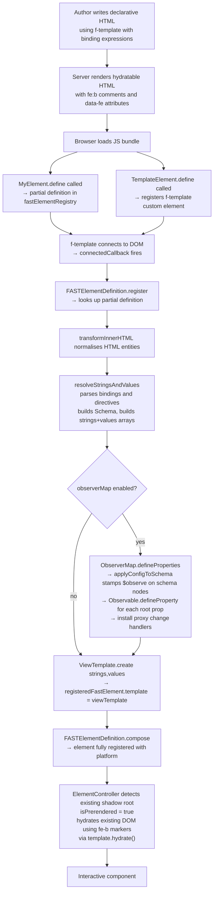
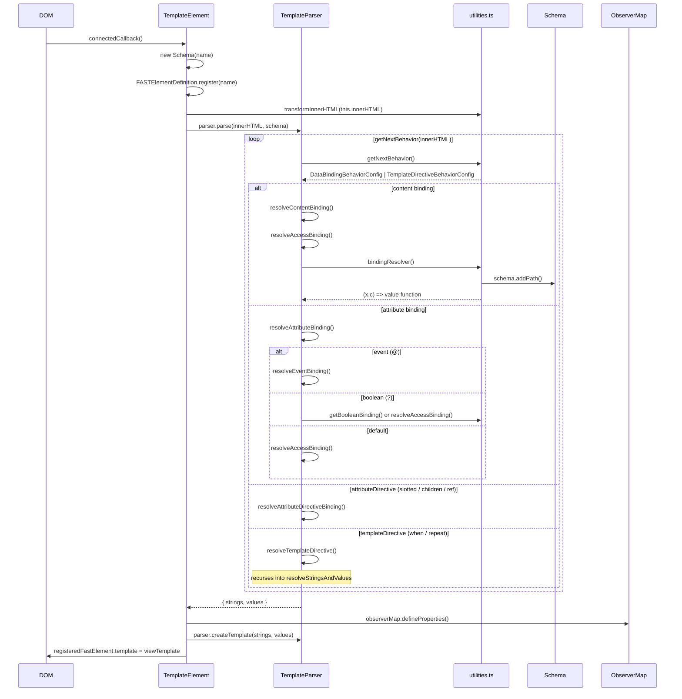
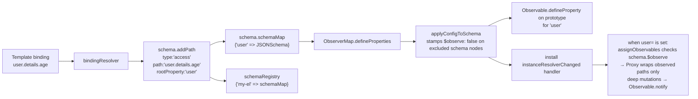
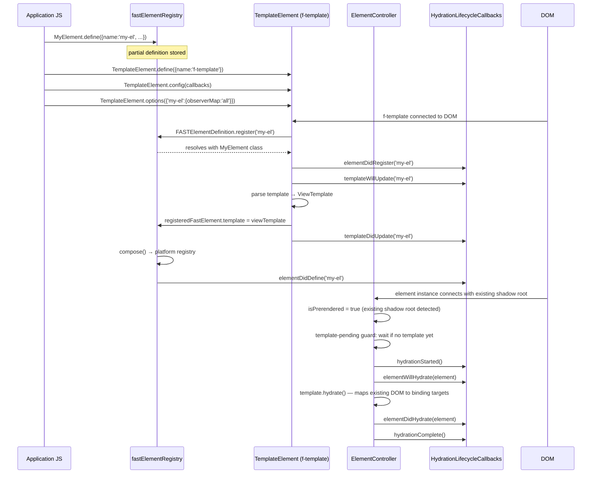

# Declarative HTML Design

This document is intended for contributors who want to understand the internal
architecture of the declarative runtime in
`@microsoft/fast-element/declarative.js`. It covers the feature's purpose, core
concepts, data flow, and its integration with the rest of
`@microsoft/fast-element`.

## Table of Contents

1. [Overview](#overview)
2. [Goals](#goals)
3. [Core Concepts](#core-concepts)
4. [Package Structure](#package-structure)
5. [Exports and Public API](#exports-and-public-api)
6. [Template Syntax](#template-syntax)
7. [Data Flow](#data-flow)
8. [Template Parsing Pipeline](#template-parsing-pipeline)
9. [Schema and Observer Map](#schema-and-observer-map)
10. [Lifecycle](#lifecycle)
11. [Integration with fast-element](#integration-with-fast-element)
12. [Hydration Model](#hydration-model)
13. [Testing Architecture](#testing-architecture)
14. [Further Reading](#further-reading)

---

## Overview

`@microsoft/fast-element/declarative.js` lets you write FAST Web Component
templates as plain HTML rather than JavaScript `html` tagged template literals.
The browser-side JS bundle includes the `<f-template>` custom element, which
parses a declarative template at runtime and attaches it as a `ViewTemplate` to
a waiting FAST element definition.

```html
<!-- Declarative template — stack-agnostic, no JS needed to render -->
<my-component greeting="Hello">
    <template shadowrootmode="open" shadowroot="open">
        <!--fe:b-->Hello<!--fe:/b-->
    </template>
</my-component>

<!-- Template definition — parsed once by the browser bundle -->
<f-template name="my-component">
    <template>{{greeting}}</template>
</f-template>
```

---

## Goals

| Goal | Description |
|---|---|
| **Server-agnostic rendering** | Templates are plain HTML strings with no dependency on Node.js or any specific SSR framework. |
| **Progressive enhancement** | Components can be server-rendered and then hydrated client-side without a full re-render. |
| **FAST parity** | The declarative syntax maps 1-to-1 to `@microsoft/fast-element` directives (`repeat`, `when`, `slotted`, `children`, `ref`). |
| **Minimal authoring overhead** | Component authors write HTML, not tagged template strings, while retaining full reactive capabilities. |

---

## Core Concepts

### `<f-template>` — the template element

`<f-template>` is a custom element (class `TemplateElement`) that acts as the bridge between a declarative HTML template and the FAST element registry. When connected to the DOM it:

1. Looks up the element definition registered via `define()`.
2. Delegates parsing of the inner `<template>` tag to `TemplateParser`, which converts declarative bindings into FAST `ViewTemplate` strings and values.
3. Assigns the compiled `ViewTemplate` to the element definition.

### `TemplateParser` — declarative HTML parser

A standalone class that converts declarative HTML template markup into the `strings` and `values` arrays that `ViewTemplate.create()` consumes. It is used by `TemplateElement` internally but can also be used independently for programmatic template compilation. The parsing pipeline is fully synchronous — no promises are allocated during template resolution. A `StringsAccumulator` tracks the running concatenation of preceding HTML, eliminating repeated O(N) `join("")` calls at each binding site.

### `Schema` — JSON schema builder

Built during template parsing, one `Schema` instance per `<f-template>`. It records every binding path discovered in the template and constructs a JSON Schema-compatible data structure. This schema:

- Describes the shape of each root property referenced in the template.
- Tracks repeat context chains (parent/child array relationships).
- Uses an instance-level `schemaMap` for its own property schemas.
- Registers itself in the module-level `schemaRegistry` (keyed by custom element name) for cross-element `$ref` resolution.

### `ObserverMap` — automatic observable setup

An optional layer that uses the `Schema` to automatically:

- Call `Observable.defineProperty()` for every root property on the element prototype.
- Install property-change handlers that wrap newly assigned objects/arrays in `Proxy` instances.
- Propagate deep property mutations back through FAST's observable system so bindings re-render.

Enabled via `TemplateElement.options({ "my-element": { observerMap: "all" } })` or by passing a configuration object `TemplateElement.options({ "my-element": { observerMap: {} } })`. Both forms are equivalent and observe all root properties.

#### Path-level observation control

The `ObserverMapConfig` interface accepts an optional `properties` key that maps root property names to a recursive path tree controlling observation granularity:

```typescript
TemplateElement.options({
    "my-element": {
        observerMap: {
            properties: {
                user: {
                    name: true,          // user.name — observed
                    details: {
                        age: true,       // user.details.age — observed
                        history: false,  // user.details.history — NOT observed
                    },
                },
                // root properties not listed here are skipped
            },
        },
    },
});
```

Each path entry can be:
- **`true`** — observe this path and all descendants (unless overridden deeper).
- **`false`** — skip this path and all descendants (unless overridden deeper).
- **`ObserverMapPathNode`** — an object with an optional `$observe` boolean and child property overrides, allowing alternating opt-in/opt-out to arbitrary depth.

When `properties` is omitted (`observerMap: {}` or `observerMap: "all"`), all root properties are observed. When `properties` is present but empty (`{ properties: {} }`), no root properties are observed.

Observer-map-managed array updates replace the array reference when `deepMerge`
receives a new array. This avoids mutating an existing observed array while it
may be notifying subscribers and lets repeat bindings observe the new array
reference. Replaced arrays are wrapped with the schema for the assigned
property, and array observer subscriptions are installed once per array so
reprocessing does not duplicate accessors or notification work.

The resolution algorithm walks the schema and configuration tree in parallel:
1. If `properties` is present and a root property is not listed, it is skipped.
2. `true`/`false` booleans apply to the entire subtree.
3. `$observe` on a node object controls the current level; children inherit when unspecified.
4. Paths in the config but not in the schema are silently ignored (forward-compatible).

### `AttributeMap` — automatic `@attr` definitions

An optional layer that uses the `Schema` to automatically register `@attr`-style reactive properties for every **leaf binding** in the template — i.e. simple expressions like `{{foo}}` or `id="{{fooBar}}"` that have no nested properties, no explicit type, and no child element references.

- By default (`attribute-name-strategy: "camelCase"`), the binding key is treated as a camelCase property name and the HTML attribute name is derived by converting it to kebab-case (e.g. `{{fooBar}}` → property `fooBar`, attribute `foo-bar`). This matches the build-time `--attribute-name-strategy` option in `@microsoft/fast-build`.
- When `attribute-name-strategy` is `"none"`, the **attribute name** and **property name** are both the binding key exactly as written in the template (e.g. `{{foo-bar}}` → attribute `foo-bar`, property `foo-bar`). No normalization is applied. Because HTML attributes are case-insensitive, binding keys should use lowercase names (optionally dash-separated) when using the `"none"` strategy.
- Properties already decorated with `@attr` or `@observable` are left untouched.
- `FASTElementDefinition.attributeLookup` is keyed by the HTML attribute name, and `propertyLookup` is keyed by the JS property name so `attributeChangedCallback` correctly delegates to the new `AttributeDefinition`.

Enabled via `TemplateElement.options({ "my-element": { attributeMap: "all" } })` or by passing a configuration object `TemplateElement.options({ "my-element": { attributeMap: {} } })`. Both forms are equivalent and use the default `"camelCase"` strategy. To use the `"none"` strategy, pass `TemplateElement.options({ "my-element": { attributeMap: { "attribute-name-strategy": "none" } } })`.

### Syntax constants (`syntax.ts`)

All delimiters used by the parser are defined in a single `Syntax` interface and exported as named constants from `syntax.ts`. This makes the syntax pluggable and easy to audit.

| Constant | Value | Use |
|---|---|---|
| `openExpression` / `closeExpression` | `{{` / `}}` | Default (SSR-compatible) binding |
| `unescapedOpenExpression` / `unescapedCloseExpression` | `{{{` / `}}}` | Raw HTML binding |
| `clientSideOpenExpression` / `clientSideCloseExpression` | `{` / `}` | Client-only (event / attribute directive) binding |
| `repeatDirectiveOpen` / `repeatDirectiveClose` | `<f-repeat` / `</f-repeat>` | Repeat directive |
| `whenDirectiveOpen` / `whenDirectiveClose` | `<f-when` / `</f-when>` | When directive |
| `attributeDirectivePrefix` | `f-` | Attribute directive prefix |
| `eventArgAccessor` | `$e` | DOM event argument |
| `executionContextAccessor` | `$c` | Execution context argument |

---

## Package Structure

```
packages/fast-element/
├── src/
│   ├── declarative.ts         # Public declarative entrypoint
│   └── declarative/
│       ├── index.ts           # Declarative barrel export
│       ├── interfaces.ts      # Message enum (error codes)
│       ├── debug.ts           # Human-readable debug messages registered with FAST
│       ├── template.ts        # TemplateElement (<f-template>), lifecycle orchestration, options
│       ├── template-parser.ts # TemplateParser — converts declarative HTML to ViewTemplate strings/values
│       ├── schema.ts          # Schema class — JSON schema builder + schemaRegistry
│       ├── observer-map.ts    # ObserverMap class + config types (ObserverMapConfig, ObserverMapPathEntry, etc.)
│       ├── attribute-map.ts   # AttributeMap class + config types (AttributeMapConfig, AttributeMapOption)
│       ├── utilities.ts       # Parsing engine, binding resolvers, proxy system
│       └── syntax.ts          # Syntax delimiter constants
├── scripts/
│   └── declarative/           # Fixture build + webui integration scripts
└── test/
    └── declarative/fixtures/  # One directory per feature, each with spec + index.html + main.ts
```

### Module dependency direction

Each module owns its configuration types and can be used independently:

```
template.ts ──imports──▶ observer-map.ts (ObserverMapConfig, ObserverMapOption)
template.ts ──imports──▶ attribute-map.ts (AttributeMapConfig, AttributeMapOption)
template.ts ──imports──▶ schema.ts (Schema)
observer-map.ts ──imports──▶ schema.ts (Schema types)
attribute-map.ts ──imports──▶ schema.ts (Schema types)
utilities.ts ──imports──▶ schema.ts (schemaRegistry for cross-element $ref resolution)
```

---

## Exports and Public API

```typescript
import {
    TemplateElement,
    TemplateParser,
    Schema,
    schemaRegistry,
    ObserverMap,
    AttributeMap,
    type ObserverMapConfig,
    type ObserverMapPathEntry,
    type ObserverMapPathNode,
    type AttributeMapConfig,
    type JSONSchema,
    type CachedPathMap,
} from "@microsoft/fast-element/declarative.js";
```

Primary exports intended for application code:

| Export | Purpose |
|---|---|
| `TemplateElement` | Define the `<f-template>` element; configure callbacks and per-element options. |
| `TemplateParser` | Standalone parser that converts declarative HTML into `ViewTemplate` strings/values. Can be used independently of `<f-template>` for programmatic template compilation. |
| `Schema` | JSON schema builder that records binding paths discovered during template parsing. Each instance owns its own schema map and registers itself in the `schemaRegistry` for cross-element `$ref` resolution. |
| `schemaRegistry` | Module-level `Map<string, Map<string, JSONSchema>>` that indexes schemas by custom element name. Used for cross-element lookups (e.g. nested component `$ref` resolution). |
| `ObserverMap` | Automatic observable setup using the schema; defines observable properties and installs proxy-based deep change tracking. Configuration types (`ObserverMapConfig`, `ObserverMapPathEntry`, `ObserverMapPathNode`) are co-located in this module. |
| `AttributeMap` | Automatic `@attr` property registration for leaf bindings in the template. Configuration type (`AttributeMapConfig`) is co-located in this module. |

Additionally, the following types are exported:

| Type | Source Module | Purpose |
|---|---|---|
| `ObserverMapConfig` | `observer-map.ts` | Configuration object for the `observerMap` option; accepts optional `properties` key. |
| `ObserverMapPathEntry` | `observer-map.ts` | `boolean \| ObserverMapPathNode` — a node in the observation path tree. |
| `ObserverMapPathNode` | `observer-map.ts` | Object node with optional `$observe` and child property overrides. |
| `AttributeMapConfig` | `attribute-map.ts` | Configuration object for the `attributeMap` option; accepts `attribute-name-strategy`. |
| `JSONSchema` | `schema.ts` | JSON Schema interface used by `Schema` for property structure. |
| `CachedPathMap` | `schema.ts` | `Map<string, Map<string, JSONSchema>>` — the shape of the schema registry. |

---

## Template Syntax

The declarative syntax is a superset of HTML with three binding delimiters:

| Syntax | Example | Behaviour |
|---|---|---|
| `{{expr}}` | `{{greeting}}` | SSR-compatible content / attribute binding |
| `{{{expr}}}` | `{{{rawHtml}}}` | Unescaped HTML (wraps in `<div :innerHTML>`) |
| `{expr}` | `@click="{handleClick($e)}"` | Client-only binding (events, attribute directives) |

### Directives

| Directive | Example |
|---|---|
| `<f-when value="{{expr}}">` | Conditional rendering |
| `<f-repeat value="{{item in list}}">` | List rendering |
| `f-slotted="{prop}"` | Slotted nodes attribute directive |
| `f-children="{prop}"` | Children attribute directive |
| `f-ref="{prop}"` | Element ref attribute directive |

### Code-sample auto-escape

Any text or attribute value inside a `<code>` element has its `{` and `}` characters automatically replaced with the HTML numeric character references `&#123;` and `&#125;` before template parsing. As a result, binding delimiters (`{{...}}`, `{{{...}}}`, `{...}`) inside `<code>` are rendered as literal text rather than being interpreted as FAST bindings — making `<code>` blocks safe for embedding code samples that contain binding-like syntax.

```html
<h1>{{title}}</h1>
<pre><code>span {{greeting}} /span</code></pre>
```

In the rendered DOM the `<h1>` binds to the `title` property, while the `<code>` displays the literal text `span {{greeting}} /span`.

The server-side preprocessor (`escape_code_sample_elements` in `microsoft-fast-build`) additionally rewrites the `<` and `>` of every **FAST directive tag** (`<f-when>`, `</f-when>`, `<f-repeat>`, `</f-repeat>`) found inside `<code>` as `&lt;` and `&gt;`, so authors can write them literally:

```html
<pre><code><f-when value="{{flag}}">wrapped</f-when></code></pre>
```

renders the visible text `<f-when value="{{flag}}">wrapped</f-when>` without activating the directive. Tag-name matching is case-insensitive because browsers normalise HTML tag names to lowercase during parsing, so `<F-When>` would otherwise become a live `<f-when>` element after the DOM round-trip. Non-directive elements inside `<code>` — including real HTML elements (`<button>`) and custom elements (`<my-widget>`) — are deliberately **not** angle-escaped so they keep rendering as live DOM elements; only brace-binding syntax in their attribute values is neutralised.

The brace escape runs in both the client-side `<f-template>` parser (`escapeBracesInCodeElements` in `utilities.ts`) and the server-side renderer (`escape_code_sample_elements` in `microsoft-fast-build`), guaranteeing identical binding positions between SSR output and client hydration. The directive-tag angle escape only needs to run on the server because the DOM serializer re-encodes `<`/`>` in text content (so the client never sees a raw `<f-when>` inside `<code>` regardless of what the page source contained). This approach is modeled on Microsoft WebUI's `webui-press` markdown renderer, which auto-escapes the same characters inside code spans and code fences.

For full syntax reference see [README.md](./README.md).

---

## Data Flow

The high-level data flow from authoring to interactive component:



---

## Template Parsing Pipeline

`TemplateElement.connectedCallback()` orchestrates the pipeline by creating a `TemplateParser` instance and delegating all parsing logic to it. The recursive parsing context is encapsulated in a `TemplateResolutionContext` object internal to the parser, keeping method signatures lean.

### Architecture

The parsing pipeline is split across two classes:

- **`TemplateElement`** (`template.ts`) — Custom element lifecycle: registration, options, callbacks, `ObserverMap`/`AttributeMap` wiring, and template assignment. ~120 lines.
- **`TemplateParser`** (`template-parser.ts`) — Synchronous template parser: converts declarative HTML into `strings`/`values` arrays for `ViewTemplate.create()`. Uses a `StringsAccumulator` to track the running previous-string in O(1) per binding site instead of O(N) `join("")` calls. Independently testable without DOM.



### TemplateParser method decomposition

| Method | Visibility | Role |
|---|---|---|
| `parse()` | public | Entry point: parses declarative HTML into `{ strings, values }`. |
| `createTemplate()` | public | Creates a `ViewTemplate` from resolved strings and values. |
| `resolveStringsAndValues()` | private | Creates `strings`/`values` arrays and delegates to `resolveInnerHTML()`. |
| `resolveInnerHTML()` | private | Recursive HTML parser that dispatches to data binding or template directive handlers. |
| `resolveDataBinding()` | private | Thin dispatcher that routes to `resolveContentBinding()`, `resolveAttributeBinding()`, or `resolveAttributeDirectiveBinding()`. |
| `resolveContentBinding()` | private | Handles `{{expression}}` in text content. |
| `resolveAttributeBinding()` | private | Handles `{{expression}}` in HTML attributes; dispatches to `resolveEventBinding()` or `resolveAccessBinding()` based on aspect. |
| `resolveAttributeDirectiveBinding()` | private | Handles `f-children`, `f-slotted`, `f-ref` directives. |
| `resolveAccessBinding()` | private | Shared helper for access-type bindings (content, boolean-attribute fallback, default attribute). |
| `resolveEventBinding()` | private | Handles event bindings (`@event`), including arg parsing and owner resolution. |
| `resolveTemplateDirective()` | private | Handles `<f-when>` and `<f-repeat>` directives. |
| `resolveAttributeDirective()` | private | Creates FAST `children()`, `slotted()`, or `ref()` directives. |

### TemplateResolutionContext

The `TemplateResolutionContext` interface (internal to `TemplateParser`) groups the stable fields that flow through the recursive parsing pipeline:

```typescript
interface TemplateResolutionContext {
    parentContext: string | null;  // Current repeat item alias (e.g. "item")
    level: number;          // Nesting depth for repeat directives
    schema: Schema;         // JSON schema builder for property tracking
}
```

`rootPropertyName` is intentionally kept separate because it is selectively mutated per branch and must not leak across sibling binding resolutions.

### Key parsing functions (utilities.ts)

| Function | Role |
|---|---|
| `getNextBehavior(innerHTML)` | Top-level scanner: returns the next `DataBindingBehaviorConfig` or `TemplateDirectiveBehaviorConfig`, or `null` when done. |
| `getNextDataBindingBehavior(innerHTML)` | Identifies whether the next binding is `{{}}`, `{{{}}}`, or `{}` and classifies it as content/attribute/attributeDirective. |
| `getNextDirectiveBehavior(innerHTML)` | Finds the next `<f-when>` or `<f-repeat>` and its matching close tag. |
| `bindingResolver(...)` | Builds a `(x, c) => value` closure for a given path; also calls `schema.addPath()`. |
| `pathResolver(path, contextPath, level, schema)` | Returns a closure that traverses an object using dot-notation, handling repeat context levels. |
| `getBooleanBinding(...)` | Returns a `(x, c) => boolean` closure for `<f-when>` expressions. |
| `assignObservables(schema, rootSchema, data, target, rootProperty)` | Wraps objects/arrays in `Proxy` for deep observation. |
| `deepMerge(target, source)` | Merges source into an existing proxy, preserving proxy identity and triggering observable notifications. |
| `transformInnerHTML(html)` | Normalises HTML-encoded operator characters (`&gt;`, `&lt;`, etc.) used in `<f-when>` expressions. |

### Binding classification

```
innerHTML token
  ├── {{{ ... }}}  → unescaped content binding  (innerHTML div)
  ├── {{ ... }}    → default binding
  │     ├── attr="{{expr}}"    → attribute binding   (aspect: null / ":" / "?")
  │     └── {{expr}} in text  → content binding
  └── { ... }      → client-side binding
        ├── @event="{handler(...)}"  → event binding (aspect "@")
        └── f-dir="{prop}"           → attribute directive binding
```

---

## Schema and Observer Map

The `Schema` class accumulates all binding paths discovered during parsing into an instance-level JSON Schema map (`schemaMap`) indexed by `rootPropertyName → JSONSchema`. Each `Schema` instance also registers itself in the module-level `schemaRegistry` (keyed by custom element name) for cross-element `$ref` resolution.



For a deep dive into the schema structure, context tracking, and proxy system
see
[DECLARATIVE_SCHEMA_OBSERVER_MAP.md](./DECLARATIVE_SCHEMA_OBSERVER_MAP.md).

### `$observe` flag on schema nodes

When an `ObserverMapConfig` with a `properties` key is provided, `ObserverMap.defineProperties()` calls `applyConfigToSchema()` to stamp `$observe: false` on excluded schema nodes **before** the proxy system runs. This is a one-time pre-processing pass that walks the config and schema trees in parallel:

- `false` in the config → `$observe: false` is stamped recursively on the node and all its descendants.
- `$observe: false` on a config node → the schema node is stamped, and unlisted children inherit the stamp.
- `true` in the config → no stamp needed (observed is the default).
- Config paths not in the schema are silently ignored.

**Convention: stamp-only-when-excluding.** The `$observe` flag is only ever set to `false` — it is never explicitly set to `true`. Absence of `$observe` (i.e. `undefined`) means the node is observed. This means:

- When `observerMap: "all"` or `observerMap: {}` is used, `applyConfigToSchema` is never called and no schema nodes are mutated — zero overhead for the common case.
- The proxy system uses `isSchemaExcluded(schema)` (checks `$observe === false` with no observed descendants) as the single predicate for all skip/suppress decisions.
- Schema nodes without `$observe` are always treated as observed.

### AttributeMap and leaf bindings

When `attributeMap` is enabled (via `"all"`, `{}`, or a configuration object), `AttributeMap.defineProperties()` is called after parsing. It iterates `Schema.getRootProperties()` and skips any property whose schema entry contains `properties`, `type`, or `anyOf` — keeping only plain leaf bindings. For each leaf:

1. The schema key is used as the **JS property name**.
2. The **HTML attribute name** depends on the `attribute-name-strategy`:
   - `"camelCase"` (default): the attribute name is derived by converting the camelCase property name to kebab-case (e.g. `fooBar` → `foo-bar`).
   - `"none"`: the attribute name equals the property name (e.g. `foo-bar` → `foo-bar`).
3. A new `AttributeDefinition` is registered via `Observable.defineProperty`.
4. `FASTElementDefinition.attributeLookup` is keyed by the HTML attribute name and `propertyLookup` is keyed by the JS property name so `attributeChangedCallback` can route attribute changes to the correct property.

When using the `"none"` strategy, property names may contain dashes and must be accessed via bracket notation (e.g. `element["foo-bar"]`). When using `"camelCase"`, property names are standard JS identifiers (e.g. `element.fooBar`).

---

## Lifecycle



### Lifecycle callback reference

| Callback | When |
|---|---|
| `elementDidRegister(name)` | `FASTElementDefinition.register` resolves |
| `templateWillUpdate(name)` | Just before template HTML is parsed |
| `templateDidUpdate(name)` | After `ViewTemplate` is assigned to the definition |
| `elementDidDefine(name)` | After `compose` completes |
| `hydrationStarted()` | Once, when the first prerendered element begins hydrating |
| `elementWillHydrate(source)` | Before `ElementController` hydrates a prerendered instance |
| `elementDidHydrate(source)` | After an instance is fully hydrated |
| `hydrationComplete()` | Once, after all prerendered elements have completed hydration |

For usage examples see
[DECLARATIVE_RENDERING_LIFECYCLE.md](./DECLARATIVE_RENDERING_LIFECYCLE.md).

---

## Integration with fast-element

The declarative runtime is a thin orchestration layer on top of
`@microsoft/fast-element`. It does not re-implement any reactive primitives; it
converts declarative HTML syntax into the same data structures that `html`
tagged templates produce.

| fast-element primitive | How the declarative runtime uses it |
|---|---|
| `FASTElement` | Base class for both `TemplateElement` and user components (components extend `FASTElement` directly) |
| `FASTElementDefinition.register()` | Deferred element registration — element waits for its template |
| `fastElementRegistry.getByType()` | Looks up a partial definition to attach the compiled template |
| `ViewTemplate.create(strings, values)` | Compiles the resolved strings/values arrays into a `ViewTemplate` |
| `ElementController` | Automatically detects prerendered content (`isPrerendered`) and hydrates server-rendered DOM using `fe-b` comment/dataset markers via `template.hydrate()` |
| `Observable.defineProperty()` | Defines observable root properties on element prototypes (ObserverMap) |
| `Observable.getNotifier()` | Triggers change notifications from proxy handlers |
| `when(expr, template)` | FAST directive used for `<f-when>` |
| `repeat(expr, template)` | FAST directive used for `<f-repeat>` |
| `slotted(options)` | FAST directive used for `f-slotted` |
| `children(prop)` | FAST directive used for `f-children` |
| `ref(prop)` | FAST directive used for `f-ref` |

### Template attachment after define

Standard `FASTElement.define()` returns a `Promise` that resolves immediately once the definition has been composed and any async template resolver has settled. Declarative HTML can define a host element without an initial template and let `<f-template>` attach the template later through `FASTElementDefinition.template`. This unified API replaces the previous `defineAsync()` / `composeAsync()` methods.

---

## Hydration Model

For declarative hydration, the server must render:

1. The custom element tag with its attributes and initial state.
2. A `<template shadowrootmode="open" shadowroot="open">` containing pre-rendered HTML annotated with FAST's hydration markers. Build-time renderers keep both attributes for Declarative Shadow DOM compatibility and may forward additional `shadowroot`-prefixed attributes from the source `<f-template>`.
3. An `<f-template>` element somewhere in the page that carries the template definition.

If a template is attached after an element has already connected, the observable `template` update recreates the controller so hydration can proceed against the existing prerendered markup. The `defer-hydration` and `needs-hydration` attributes are no longer needed in server-rendered markup.

### Host attributes from the source `<f-template>`

Build-time renderers (e.g. `@microsoft/fast-build`) forward attributes declared on the inner `<template>` element of an `<f-template>` onto the rendered host element opening tag. Static attributes are forwarded verbatim (HTML-escaped); `name="{{expr}}"` and `?name="{{expr}}"` are resolved against the element's initial child state (the root state with the host element's HTML attributes overlaid). Client-only attributes (`@event`, `:prop`, `f-ref`, `f-slotted`, `f-children`) are skipped — they have no meaning on a server-rendered host element.

Author attributes on the host element always win on conflicts (case-insensitive name match; for `?name="{{expr}}"` template attrs, the dedupe key is the bare `name` without the leading `?`). The hydration marker formats described below are unchanged — no additional `data-fe` marker is allocated for these propagated attributes.

### Hydration marker formats

**Content bindings** use HTML comments (data-free, matched by string equality):

```
<!--fe:b-->
<!--fe:/b-->
```

**Attribute bindings** use a single `data-fe` dataset attribute with binding count:

```html
<el data-fe="3">
```

**Repeat directives** wrap each item in comment pairs:
```
<!--fe:r-->
...item DOM...
<!--fe:/r-->
```

For detailed examples see
[DECLARATIVE_RENDERING.md](./DECLARATIVE_RENDERING.md).

---

## Testing Architecture

Each feature is verified by a **Playwright** integration test against a live
Vite dev server. The `test/declarative/fixtures/` directory contains one
subdirectory per feature:

```
test/declarative/fixtures/<feature>/
├── <feature>.spec.ts        # Playwright test
├── entry.html               # Entry template with root custom elements
├── fast-build.config.json   # Build configuration for @microsoft/fast-build
├── index.html               # Pre-rendered page (GENERATED by scripts/declarative/build-fixtures.js — do not edit)
├── main.ts                  # Component definition + TemplateElement setup
├── state.json               # Initial state for server-side rendering
└── templates.html           # Declarative <f-template> definitions
```

Fixtures are auto-discovered by scanning for directories that contain `entry.html`, `templates.html`, `state.json`, and `fast-build.config.json`. Both the build script and the Vite config pick up new fixtures automatically — no registration step is needed.

For fixtures that use SSR-style pre-rendered HTML,
`scripts/declarative/build-fixtures.js` invokes `@microsoft/fast-build` with
`--config` pointing to each fixture's `fast-build.config.json` to generate
`index.html` from the configured source files.

### WebUI Integration Tests

A separate integration test suite validates that `@microsoft/webui` can build and render the same fixture templates that `@microsoft/fast-build` processes. This is split into two steps:

1. **Build** (`npm run build:fixtures:webui`) — runs
   `scripts/declarative/build-fixtures-with-webui.js`, which extracts
   `<f-template>` elements, builds each fixture with `webui build --plugin=fast`,
   renders the protocol with `state.json`, and writes the output alongside
   `main.ts` and assets to `temp/integrations/webui/fixtures/`.
2. **Test** (`npm run test:webui-integration`) — builds the fixtures, then runs
   the same Playwright specs against the webui-rendered output served by a Vite
   dev server on port 5174 (configured in
   `playwright.declarative.webui.config.ts`).

Run locally with `npm run test:webui-integration` or via the `ci-webui-integration.yml` GitHub Action on PRs and pushes to `main`.

#### Skipped tests

Some tests are conditionally skipped when running under the webui integration
config. The `playwright.declarative.webui.config.ts` file sets
`process.env.FAST_WEBUI_INTEGRATION = "true"`, and individual tests check this
variable with `test.skip()` to opt out of cases that exercise known differences
between `fast-build` and `webui` rendering:

- **`errors.spec.ts` — "throws an error when no template element is present"**: webui does not render `<f-template>` elements that lack a `<template>` child, so the expected error is never thrown.

### Hydration readiness

Every fixture must wait for hydration to complete before running assertions.
Each `main.ts` registers a `hydrationComplete()` callback via
`TemplateElement.config()` that sets a global flag, and each spec file calls
`page.waitForFunction()` after `page.goto()` to block until the flag is set.
See [test/declarative/fixtures/README.md](./test/declarative/fixtures/README.md)
for the implementation pattern.

See
[test/declarative/fixtures/WRITING_FIXTURES.md](./test/declarative/fixtures/WRITING_FIXTURES.md)
for the complete fixture authoring guide,
[test/declarative/fixtures/README.md](./test/declarative/fixtures/README.md)
for a quick reference, and
[test/declarative/fixtures/extensions/observer-map-deep-merge/README.md](./test/declarative/fixtures/extensions/observer-map-deep-merge/README.md)
for an example of a complex multi-feature fixture.

---

## Further Reading

| Document | Topic |
|---|---|
| [DECLARATIVE_HTML.md](./DECLARATIVE_HTML.md) | Installation, syntax reference, lifecycle callbacks, usage examples |
| [DECLARATIVE_RENDERING.md](./DECLARATIVE_RENDERING.md) | Hydratable HTML format: comment markers, dataset attributes, directive markers |
| [DECLARATIVE_RENDERING_LIFECYCLE.md](./DECLARATIVE_RENDERING_LIFECYCLE.md) | Phase-by-phase rendering lifecycle, callback ordering, performance notes |
| [DECLARATIVE_SCHEMA_OBSERVER_MAP.md](./DECLARATIVE_SCHEMA_OBSERVER_MAP.md) | Deep dive into Schema JSON structure, ObserverMap proxy system, debugging |
| [test/declarative/fixtures/README.md](./test/declarative/fixtures/README.md) | Quick reference for fixture structure |
| [test/declarative/fixtures/WRITING_FIXTURES.md](./test/declarative/fixtures/WRITING_FIXTURES.md) | Complete guide to writing new Playwright fixture tests |
| [test/declarative/fixtures/extensions/observer-map-deep-merge/README.md](./test/declarative/fixtures/extensions/observer-map-deep-merge/README.md) | Complex deep-merge fixture: observable arrays, nested repeats, conditionals |
