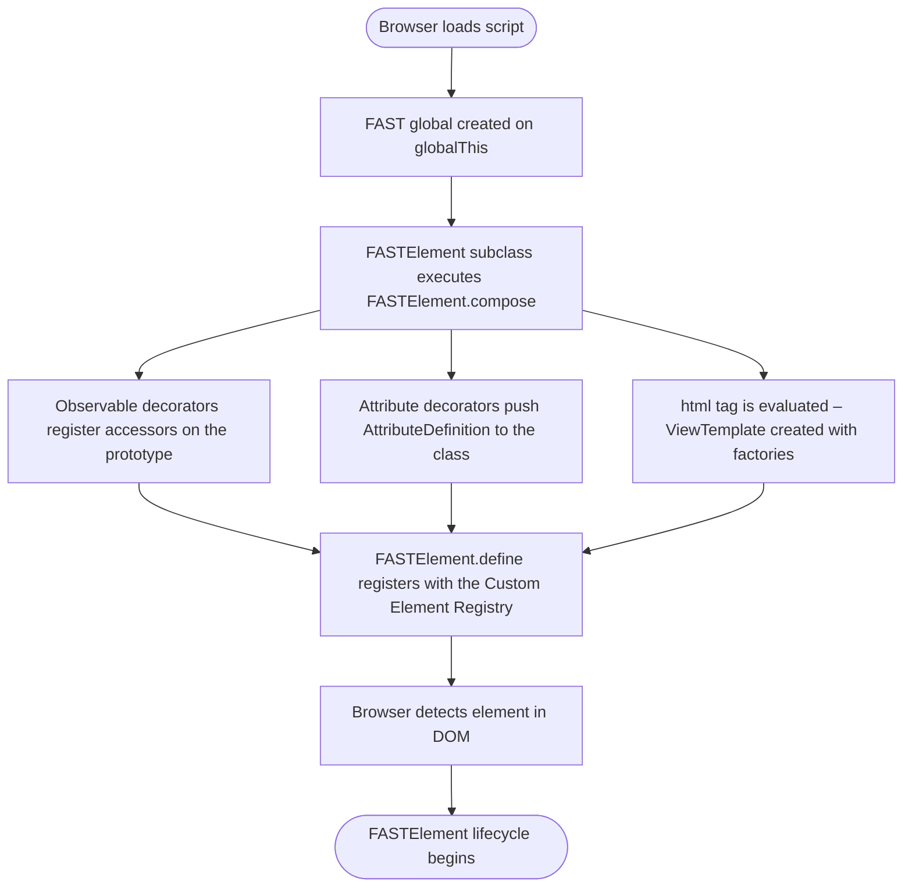
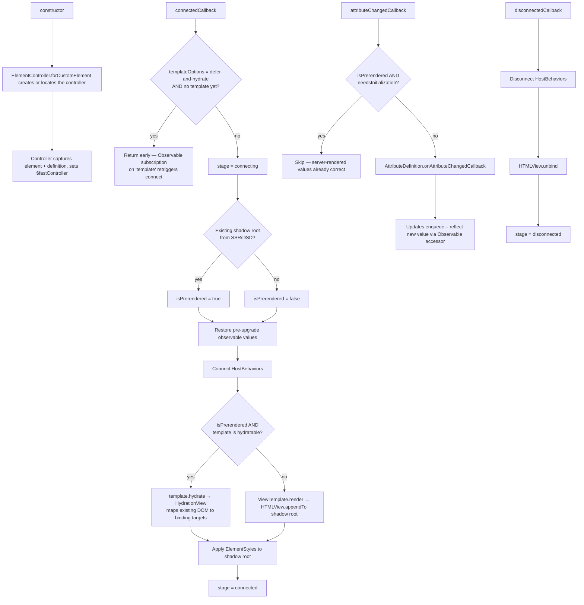
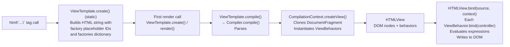
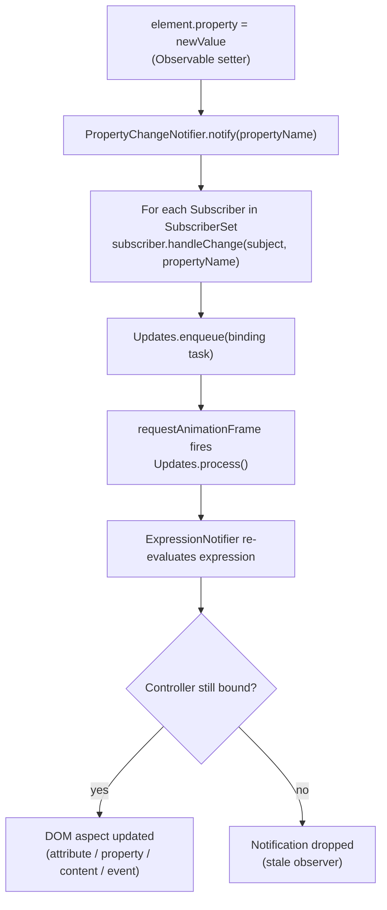

# FAST Element – Design Overview

This document is a contributor-oriented guide to the architecture of `@microsoft/fast-element`. It synthesises the individual architecture documents into a single entry point and explains how all the pieces fit together.

For deep dives into specific areas, see the linked detailed documents.

---

## Table of Contents

1. [High-Level Overview](#high-level-overview)
2. [Core Concepts](#core-concepts)
   - [FAST Global](#fast-global)
   - [FASTElement & ElementController](#fastelement--elementcontroller)
   - [Observables & Notifiers](#observables--notifiers)
   - [Bindings](#bindings)
   - [html Tagged Template Literal](#html-tagged-template-literal)
   - [ViewTemplate & Compiler](#viewtemplate--compiler)
   - [Views & Behaviors](#views--behaviors)
   - [Updates Queue](#updates-queue)
   - [Styles](#styles)
   - [Dependency Injection (DI)](#dependency-injection-di)
   - [Context Protocol](#context-protocol)
   - [State Helpers](#state-helpers)
3. [Data Flow Diagrams](#data-flow-diagrams)
   - [Module Load & Registration](#module-load--registration)
   - [FASTElement Lifecycle](#fastelement-lifecycle)
   - [Template Pipeline](#template-pipeline)
   - [Observable Change Propagation](#observable-change-propagation)
4. [How the Pieces Fit Together](#how-the-pieces-fit-together)
5. [Package Layout](#package-layout)
6. [Detailed Architecture Documents](#detailed-architecture-documents)

---

## High-Level Overview

`@microsoft/fast-element` is a lightweight library for building standards-based Custom Elements (Web Components). Its key responsibilities are:

| Concern | What FAST provides |
|---|---|
| Element authoring | `FASTElement` base class + `@customElement`, `@attr`, `@observable` decorators |
| Reactive data binding | `Observable`, `ExpressionNotifier`, `oneWay`/`oneTime`/`listener` bindings |
| Declarative templating | `html` tagged template literal → `ViewTemplate` → compiled `HTMLView` |
| Async DOM updates | `Updates` queue (batched, `requestAnimationFrame`-aligned) |
| Scoped styles | `css` tagged template literal → `ElementStyles` → `adoptedStylesheets` / `<style>` |
| Dependency injection | `DI` container, `@inject`, `@singleton`, `@transient`, resolvers |
| Context protocol | W3C community Context protocol (`Context.create`, `Context.for`) |
| Reactive state helpers | `state()`, `watch()` (beta) |

The library's kernel (the `FAST` global, the `Updates` queue, and the `Observable` system) is stored on `globalThis.FAST` and can be shared across multiple versions of the library loaded on the same page.

---

## Core Concepts

### FAST Global

**File**: `src/platform.ts`, `src/interfaces.ts`

`FAST` is a singleton object attached to `globalThis`. It provides:

- `FAST.getById(id, initializer)` – shared kernel slot registry (used to share the update queue and observable system across FAST instances)
- `FAST.warn(code, values)` / `FAST.error(code, values)` – structured diagnostic messages
- `FAST.addMessages(dict)` – registers human-readable debug messages (imported by `src/debug.ts`)

The `KernelServiceId` object controls which numeric/string keys are used for shared services. Three modes are supported via a `fast-kernel` attribute on the current `<script>` tag:

| Mode | Behaviour |
|---|---|
| `share` | Share the kernel across any FAST version |
| `share-v2` | Share only with other v2 instances |
| *(default)* | Fully isolated instance with a random postfix |

---

### FASTElement & ElementController

**Files**: `src/components/fast-element.ts`, `src/components/element-controller.ts`, `src/components/fast-definitions.ts`

`FASTElement` is a thin mixin applied on top of `HTMLElement`. It:

1. Calls `ElementController.forCustomElement(this)` in its `constructor` to create or locate the element's controller.
2. Delegates all lifecycle hooks to the controller:
   - `connectedCallback` → `$fastController.connect()`
   - `disconnectedCallback` → `$fastController.disconnect()`
   - `attributeChangedCallback` → `$fastController.onAttributeChangedCallback()`

`ElementController` is the real workhorse. It:

- Extends `PropertyChangeNotifier` so the element itself participates in the observable system.
- Holds the element's `FASTElementDefinition` (name, template, styles, observed attributes).
- Manages a `Stages` state machine: `disconnected → connecting → connected → disconnecting → disconnected`.
- Exposes `isPrerendered: Promise<boolean>` which resolves to `true` after prerendered content has been hydrated, or `false` when the component is client-side rendered. The `ViewController` interface also exposes `isPrerendered` as `Promise<boolean>` for custom directives. Attribute-skip logic during the hydration bind uses an internal `_skipAttrUpdates` flag that is never exposed as a public boolean.
- On `connect()`: restores pre-upgrade observable values, calls `connectedCallback` on all `HostBehavior`s, renders the template into the shadow root, and applies styles. When `templateOptions` is `"defer-and-hydrate"` and no template is available yet, `connect()` returns early; an Observable subscription on `"template"` retriggers `connect()` when the template arrives (template-pending guard).
- Rendering is split into two modular paths via `renderPrerendered()` and `renderClientSide()`:
  - **Prerendered**: `renderPrerendered()` swaps `onAttributeChangedCallback` to a no-op so the upgrade-time burst of callbacks is discarded, hydrates the existing DOM via `template.hydrate()`, then restores the standard handler. After this point, all future attribute changes flow through the real handler with zero overhead.
  - **Client-side**: `renderClientSide()` clones the compiled fragment, binds, and appends to the host — the standard path with no prerender logic.
- On `disconnect()`: calls `disconnectedCallback` on behaviors, unbinds the view.
- `onAttributeChangedCallback()` is the standard handler that processes attribute changes. During the prerendered bind, it is temporarily swapped to a no-op (see above) to avoid redundant processing of server-rendered attribute values.
- Exposes `addBehavior` / `removeBehavior` for dynamic `HostBehavior` management (used by `ElementStyles`).

`FASTElementDefinition` wraps all the metadata for a custom element class: its tag name, template, styles, and observed attribute list. It is created by `FASTElement.compose()` and registered globally via `fastElementRegistry`.

---

### Observables & Notifiers

**Files**: `src/observation/observable.ts`, `src/observation/notifier.ts`, `src/observation/arrays.ts`

#### Property observability

`Observable.defineProperty(target, name)` (or the `@observable` decorator) replaces a plain property with a getter/setter pair via `Reflect.defineProperty`. The setter:

1. Stores the new value in a backing slot.
2. Calls `Observable.getNotifier(this).notify(name)` to fan out to subscribers.

`Observable.getNotifier(object)` returns the `PropertyChangeNotifier` for an object, creating one on demand. Notifiers are stored in a `WeakMap` so they don't prevent GC.

#### SubscriberSet / PropertyChangeNotifier

`SubscriberSet` is an optimised set that stores the first two subscribers inline (avoiding heap allocations for the common 1–2 subscriber case) and falls back to an array. `PropertyChangeNotifier` extends `SubscriberSet` to support per-property subscriptions.

#### ExpressionNotifier (binding observer)

`Observable.binding(expression, subscriber)` creates an `ExpressionNotifier`. When `observe(source, context)` is called it:

1. Pushes itself as the _current watcher_ onto a thread-local stack.
2. Evaluates the expression (e.g., `x => x.name`).
3. Any `Observable`-tracked property get encountered during evaluation subscribes the notifier to that property's notifier automatically.
4. Pops itself. Future changes to any accessed property trigger `handleChange` on the subscriber.

This gives FAST automatic, fine-grained dependency tracking without explicit declarations.

---

### Bindings

**Files**: `src/binding/binding.ts`, `src/binding/one-way.ts`, `src/binding/one-time.ts`, `src/binding/normalize.ts`

`Binding` is an abstract class that pairs an `Expression` (arrow function) with a `DOMPolicy` and a volatility flag. Concrete subclasses implement `createObserver(subscriber, directive)`:

| Binding | Observer behaviour |
|---|---|
| `oneWay` | Creates an `ExpressionNotifier`; tracks dependencies; re-evaluates on change |
| `oneTime` | Evaluates once during `bind()`, returns immediately |
| `listener` | Same as `oneWay` but attaches as a DOM event handler |

`normalizeBinding(value)` converts raw arrow functions or static values into a `Binding` object.

---

### html Tagged Template Literal

**File**: `src/templating/template.ts`

The `html` tag is the primary authoring API:

```typescript
const template = html<MyElement>`
  <div>${x => x.label}</div>
  <button @click="${x => x.handleClick}">OK</button>
`;
```

When the tag function is called it invokes `ViewTemplate.create(strings, values)` (static method) which:

1. Iterates the template string fragments (`strings`) paired with interpolated values.
2. For each value:
   - A plain function → wrapped in `HTMLBindingDirective(oneWay(fn))`
   - A `Binding` instance → wrapped in `HTMLBindingDirective(binding)`
   - A registered `HTMLDirective` instance → used directly
   - Anything else → wrapped as a `oneTime` static binding
3. Calls `directive.createHTML(add)` which returns a **placeholder string** (a special attribute or marker containing the factory's unique ID).
4. Concatenates all static strings and placeholders into a single HTML string.
5. Returns a `ViewTemplate(html, factories)` – the factories dictionary maps IDs to `ViewBehaviorFactory` instances.

No DOM nodes are created at this point; compilation is deferred.

See [ARCHITECTURE_HTML_TAGGED_TEMPLATE_LITERAL.md](./ARCHITECTURE_HTML_TAGGED_TEMPLATE_LITERAL.md) for more detail on directives and the `Markup`/`Parser` helpers.

---

### ViewTemplate & Compiler

**Files**: `src/templating/template.ts`, `src/templating/compiler.ts`, `src/templating/markup.ts`

`ViewTemplate.compile()` is called lazily the first time the template is rendered. It delegates to `Compiler.compile(html, factories, policy)`:

1. Sets the HTML string as the `innerHTML` of a `<template>` element (letting the browser parse the DOM once).
2. Traverses the resulting `DocumentFragment` depth-first.
3. For each node, calls `compileAttributes()` which scans attributes for factory placeholder IDs.
4. When a placeholder is found, it associates the matching `ViewBehaviorFactory` with the node's structural ID (a dot-separated path like `"r.2.0"` meaning "third child of the root's second child").
5. Lazily-resolved descriptors (using `Object.defineProperty` on a prototype) allow `HTMLView` to look up any target node via a chain of `childNodes` accesses without pre-walking the tree for every view instance.
6. Returns a `CompilationContext` that implements `HTMLTemplateCompilationResult`.

`CompilationContext.createView(hostBindingTarget?)` clones the compiled `DocumentFragment`, instantiates behaviors from factories, and returns an `HTMLView`.

---

### Views & Behaviors

**Files**: `src/templating/view.ts`, `src/templating/html-directive.ts`

`HTMLView` implements `ElementView` / `SyntheticView`. It:

- Holds the cloned `DocumentFragment` nodes.
- Has a `targets` map (resolved lazily) from structural node IDs to live `Node` references.
- `bind(source, context)` iterates all `ViewBehavior` instances and calls `behavior.bind(controller)`.
- `unbind()` calls `behavior.unbind()` on each behavior and clears the source.
- `appendTo(node)` / `insertBefore(node)` / `remove()` move its DOM nodes in the tree.

`ViewBehavior` is the runtime unit of work attached to a specific DOM node. Examples:

| Directive | Created `ViewBehavior` | Effect |
|---|---|---|
| `HTMLBindingDirective` | `BindingBehavior` | Evaluates the binding; updates the DOM aspect (attribute / property / event / content / tokenList) |
| `when` | `WhenBehavior` | Conditionally inserts a child view |
| `repeat` | `RepeatBehavior` | Renders a list of child views |
| `ref` | `RefDirective` | Writes the element reference onto the source |
| `children` / `slotted` | `ChildrenDirective` / `SlottedDirective` | Observes DOM mutations |

`ViewBehaviorFactory` (created at template-authoring time) is the blueprint; `ViewBehavior` (created per `HTMLView` instance) is the live runtime object.

See [src/templating/TEMPLATE-BINDINGS.md](./src/templating/TEMPLATE-BINDINGS.md) for the full binding pipeline including `DOMAspect` routing and two-way binding.

---

### Updates Queue

**File**: `src/observation/update-queue.ts`

**Exported as**: `Updates`

`Updates` is a shared, batched task queue used to synchronise writes to the DOM. It is stored on the `FAST` global (under `KernelServiceId.updateQueue`) so multiple FAST instances on the same page share a single flush cycle.

- `Updates.enqueue(callable)` – schedules a task for the next batch.
- `Updates.process()` – forces immediate synchronous flush (useful in tests).
- `Updates.next()` – returns a `Promise` that resolves after the next flush.
- `Updates.setMode(isAsync)` – toggle async (default) vs. synchronous mode.

In async mode, the first `enqueue` call schedules a `requestAnimationFrame` callback that drains up to 1024 tasks per frame. Errors in tasks are deferred via `setTimeout` so they don't abort the remaining tasks.

Observable setters and `attributeChangedCallback` enqueue their DOM mutations through `Updates`, ensuring that multiple synchronous property changes result in only one DOM update per frame.

See [ARCHITECTURE_UPDATES.md](./ARCHITECTURE_UPDATES.md) for more detail.

---

### Styles

**Files**: `src/styles/css.ts`, `src/styles/element-styles.ts`, `src/styles/css-directive.ts`

The `css` tag (analogous to `html`) builds `ElementStyles` objects. During `ElementController.connect()`, styles are applied to the element's shadow root either via `adoptedStylesheets` (preferred) or an appended `<style>` node, depending on platform support. Styles can also contain dynamic `CSSDirective`s (e.g., CSS custom property bindings) that register as `HostBehavior`s and connect/disconnect alongside the element.

---

### Dependency Injection (DI)

**File**: `src/di/di.ts`

FAST ships a full hierarchical DI container inspired by Aurelia. Key types:

| Type | Role |
|---|---|
| `Container` | Resolves dependencies; parent containers are queried if a key is not found locally |
| `Resolver` | Maps a key to a creation strategy (singleton, transient, callback, …) |
| `Registration` | Produces a `Resolver` when registered in a container |
| `Factory` | Constructs instances; supports `Transformer`s for post-construction mutation |

Containers are typically attached to DOM elements and walk the DOM hierarchy. DI keys are classes, interfaces, or `Context`-like tokens. Constructor parameters are annotated with the `@inject(key)` decorator (or use `@singleton` / `@transient` to declare the class's own registration).

See `docs/di/api-report.api.md` for the full public API surface.

---

### Context Protocol

**File**: `src/context.ts`

`Context` implements the [W3C Community Context Protocol](https://github.com/webcomponents-cg/community-protocols/blob/main/proposals/context.md). A `FASTContext<T>` object is both a DI key and a decorator:

- `Context.create<T>(name, initialValue?)` – creates a named context token.
- `Context.for<T>(name)` – gets or creates a globally-registered context token.
- `context.provide(target, value)` – registers a provider on a DOM element.
- `context.get(target)` – dispatches a `context-request` event and returns the synchronously provided value (or `initialValue`).
- `context.request(target, callback, multiple?)` – async / multi-provider variant.
- Used as a `@decorator` on class properties or constructor parameters to declare a context dependency.

---

### State Helpers

**Files**: `src/state/state.ts`, `src/state/watch.ts`

> **Status**: beta

`state<T>(initialValue, options?)` creates a reactive `State<T>` object – a callable that returns the current value. The state's `.current` property is a FAST observable, so templates or `ExpressionNotifier`s that read it will automatically re-evaluate when it changes.

`watch(object, subscriber)` deeply subscribes to all observable properties and array mutations on an object graph, returning a `Disposable`.

---

## Data Flow Diagrams

### Module Load & Registration



### FASTElement Lifecycle



### Template Pipeline



### Observable Change Propagation



> **Stale notification guard**: When a view is unbound (e.g., after a parent `when` directive tears down a child element), the coupled source lifetime optimisation may leave expression observers subscribed to the child element's properties. If a property change fires while the view is inactive, `HTMLBindingDirective.handleChange` and `RenderBehavior.handleChange` check `controller.isBound` and skip the update to prevent evaluating expressions against a null source.

---

## How the Pieces Fit Together

Below is a conceptual map of the major subsystems and their relationships:

```
┌──────────────────────────────────────────────────────────────────────────────┐
│                           FAST Global (globalThis.FAST)                      │
│  KernelServiceIds → Updates queue, Observable system, Element registry       │
└────────────────────┬─────────────────────────────────────────────────────────┘
                     │ shared kernel slots
         ┌───────────┴───────────┐
         │                       │
┌────────▼──────────┐   ┌────────▼────────────────────┐
│  Observable /      │   │  Updates queue               │
│  ExpressionNotifier│   │  (rAF-batched task runner)   │
│  SubscriberSet     │   └────────────────────────────-─┘
└────────┬──────────┘            ▲
         │ dependency tracking   │ enqueue
         ▼                       │
┌────────────────────────────────┴──────────────────────────────┐
│                    Binding system                               │
│  oneWay / oneTime / listener → Binding → ExpressionObserver    │
└────────────────────────┬──────────────────────────────────────┘
                         │ drives
┌────────────────────────▼──────────────────────────────────────┐
│                  Templating pipeline                            │
│  html tag → ViewTemplate → Compiler → CompilationContext       │
│  createView → HTMLView → ViewBehaviors (bind/update DOM)        │
└────────────────────────┬──────────────────────────────────────┘
                         │ owned by
┌────────────────────────▼──────────────────────────────────────┐
│                  ElementController                              │
│  Lifecycle (connect/disconnect/attr) • Styles • Behaviors       │
└────────────────────────┬──────────────────────────────────────┘
                         │ wraps
┌────────────────────────▼──────────────────────────────────────┐
│    FASTElement (HTMLElement subclass)                           │
│    + FASTElementDefinition (metadata: name, template, styles)   │
└───────────────────────────────────────────────────────────────┘
         │ optional higher-level services
         ├──────────────────────────────────────────────┐
┌────────▼──────────┐                        ┌──────────▼──────────┐
│  DI container      │                        │  Context protocol    │
│  (di/di.ts)        │                        │  (context.ts)        │
└───────────────────┘                        └─────────────────────┘
```

**Authoring flow summary**:

1. Developer writes a class extending `FASTElement`, decorates properties with `@observable` / `@attr`, and calls `FASTElement.define({ name, template, styles })`.
2. `FASTElement.define` → `FASTElementDefinition.compose(...).define()` registers the element with the Custom Element Registry.
3. When the browser upgrades the element, `ElementController.forCustomElement(element)` is called in the constructor.
4. On `connectedCallback`, the controller renders the template into the shadow root. If the element already has a shadow root from SSR (prerendered content), `renderPrerendered()` uses `template.hydrate()` to map existing DOM nodes to binding targets instead of cloning new DOM. If `templateOptions` is `"defer-and-hydrate"` and no template is available yet, `connect()` returns early and retriggers when the template arrives. Compilation is lazy: the first render call triggers `Compiler.compile()`, subsequent calls clone the already-compiled `DocumentFragment`.
5. `HTMLView.bind(source)` wires up each `ViewBehavior`. `oneWay` bindings create `ExpressionNotifier`s that track observable dependencies automatically.
6. When an observed property changes, its notifier fans out to all subscribers. Each binding enqueues a DOM update via `Updates`. The next animation frame drains the queue and applies the mutations.
7. On `disconnectedCallback`, `HTMLView.unbind()` tears down all bindings; behaviors disconnect; styles are removed.

---

## Package Layout

```
src/
├── interfaces.ts          # Core types: Callable, Constructable, FASTGlobal, Message codes
├── platform.ts            # FAST global initialisation, KernelServiceId, TypeRegistry
├── dom.ts                 # DOMAspect enum, DOMPolicy, DOMSink
├── dom-policy.ts          # Default DOM security policy (TrustedTypes integration)
├── metadata.ts            # Reflect-based metadata helpers
├── utilities.ts           # UnobservableMutationObserver and other helpers
├── debug.ts               # Adds human-readable error messages to FAST global
├── observation/
│   ├── observable.ts      # Observable, @observable, ExpressionNotifier, ExecutionContext
│   ├── notifier.ts        # Subscriber, Notifier, SubscriberSet, PropertyChangeNotifier
│   ├── arrays.ts          # ArrayObserver, Splice, SpliceStrategy
│   └── update-queue.ts    # Updates (UpdateQueue)
├── binding/
│   ├── binding.ts         # Binding abstract base class, BindingDirective
│   ├── one-way.ts         # oneWay, listener
│   ├── one-time.ts        # oneTime
│   └── normalize.ts       # normalizeBinding helper
├── templating/
│   ├── template.ts        # ViewTemplate, html tag, InlineTemplateDirective
│   ├── compiler.ts        # Compiler, CompilationContext
│   ├── view.ts            # HTMLView, ElementView, SyntheticView
│   ├── html-directive.ts  # HTMLDirective, ViewBehavior, ViewBehaviorFactory
│   ├── html-binding-directive.ts  # HTMLBindingDirective
│   ├── markup.ts          # Markup placeholders, Parser
│   ├── when.ts            # when directive
│   ├── repeat.ts          # repeat directive
│   ├── ref.ts             # ref directive
│   ├── render.ts          # render directive
│   ├── children.ts        # children directive
│   ├── slotted.ts         # slotted directive
│   └── TEMPLATE-BINDINGS.md
├── styles/
│   ├── css.ts             # css tag
│   ├── element-styles.ts  # ElementStyles
│   ├── css-directive.ts   # CSSDirective, @cssDirective
│   └── host.ts            # HostBehavior, HostController
├── components/
│   ├── fast-element.ts    # FASTElement, @customElement
│   ├── element-controller.ts  # ElementController, Stages
│   ├── fast-definitions.ts    # FASTElementDefinition, TemplateOptions
│   └── attributes.ts          # AttributeDefinition, @attr, converters
├── di/
│   └── di.ts              # DI container, decorators, resolvers, Registration
├── context.ts             # Context, FASTContext, Context protocol
├── state/
│   ├── state.ts           # state() helper (beta)
│   └── watch.ts           # watch() helper (beta)
└── hydration/
    └── target-builder.ts  # Hydration target resolution
```

---

## Detailed Architecture Documents

| Document | What it covers |
|---|---|
| [ARCHITECTURE_INTRO.md](./ARCHITECTURE_INTRO.md) | Glossary / index for all architecture docs |
| [ARCHITECTURE_OVERVIEW.md](./ARCHITECTURE_OVERVIEW.md) | General FAST usage, compose/define flow, module load sequence |
| [ARCHITECTURE_FASTELEMENT.md](./ARCHITECTURE_FASTELEMENT.md) | FASTElement & ElementController lifecycle in detail |
| [ARCHITECTURE_HTML_TAGGED_TEMPLATE_LITERAL.md](./ARCHITECTURE_HTML_TAGGED_TEMPLATE_LITERAL.md) | `html` tag, directives, binding pre-processing |
| [ARCHITECTURE_UPDATES.md](./ARCHITECTURE_UPDATES.md) | Updates queue, attribute and observable change batching |
| [src/templating/TEMPLATE-BINDINGS.md](./src/templating/TEMPLATE-BINDINGS.md) | Full template binding pipeline: authoring → compilation → binding → DOM updates |
| [docs/fast-element-2-changes.md](./docs/fast-element-2-changes.md) | Breaking changes from v1 to v2 |
