# FAST Element Template Bindings Architecture

This document explains how the FAST Element `html` tagged template system stores bindings, applies them to DOM elements, triggers updates on data changes, and handles HTML-specific behaviors like event listeners.

## Overview

The template binding pipeline has five major stages:

1. **Template Authoring** – The `html` tagged template collects binding expressions and builds placeholder-marked HTML.
2. **Compilation** – The compiler parses the placeholder HTML into a `DocumentFragment`, walks the DOM tree, and records where each binding targets.
3. **View Creation** – The compiled result clones the fragment and creates a *targets* object that maps each binding to its DOM node.
4. **Binding (first render)** – Each factory creates a behavior that attaches to its target node: adding event listeners, setting attributes, or observing expressions.
5. **Reactive Updates** – When observed data changes, one-way binding observers notify their directive, which re-evaluates the expression and pushes the new value to the DOM through a "sink" function.

---

## Mermaid Diagrams

### 1. Template Creation & Storage

This diagram shows how the `html` tagged template literal processes interpolated values and stores them as factories keyed by unique IDs.

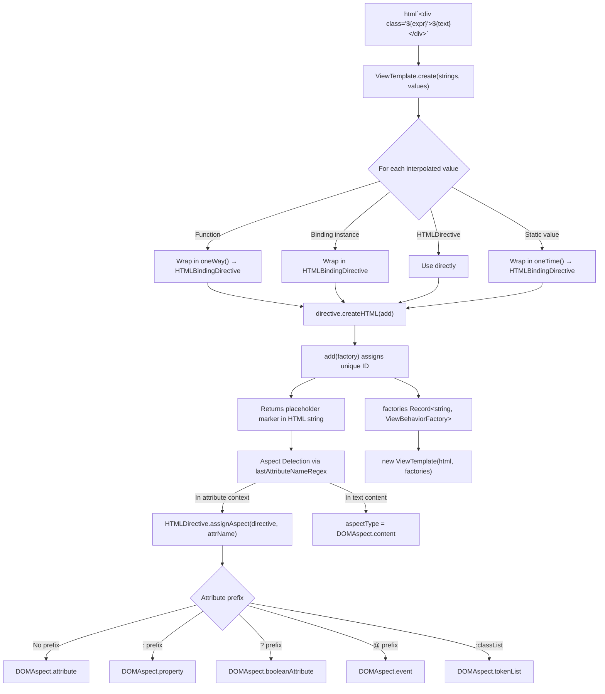

### 2. Compilation – Walking the DOM & Storing Target Locations

The compiler transforms the placeholder-laden HTML into a `DocumentFragment` and builds a prototype with lazy property descriptors that navigate to target nodes by child index.

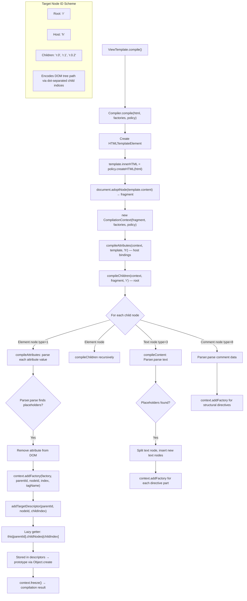

### 3. View Creation – Cloning the Fragment & Resolving Targets

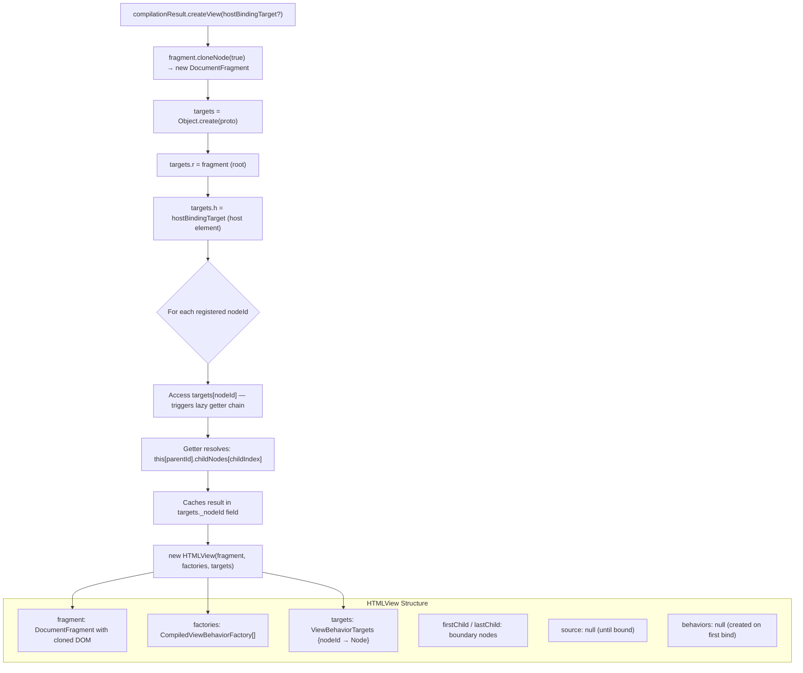

### 4. Binding – Attaching Behaviors to DOM Nodes

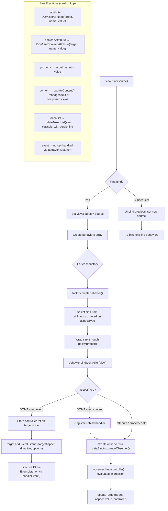

### 5. Reactive Update Cycle – Change Detection & DOM Updates

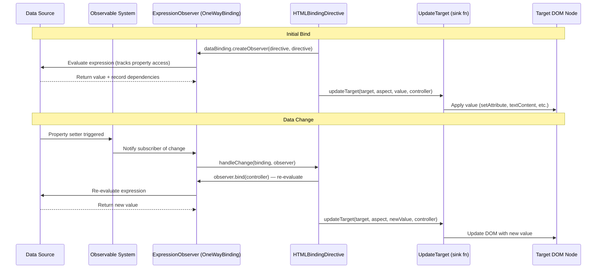

### 6. Event Handling – Click Events and Other DOM Events

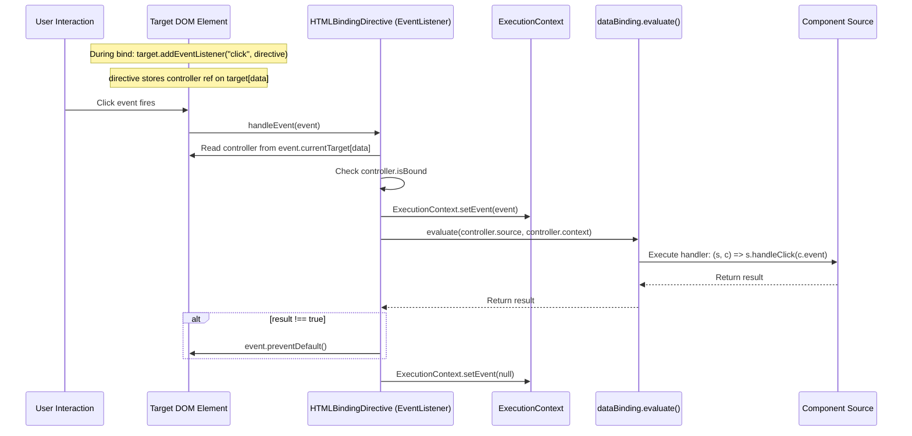

### 7. Content Binding – Template Composition

When a binding expression returns a `ContentTemplate` (e.g., another `ViewTemplate`), the content update sink composes a child view into the DOM.

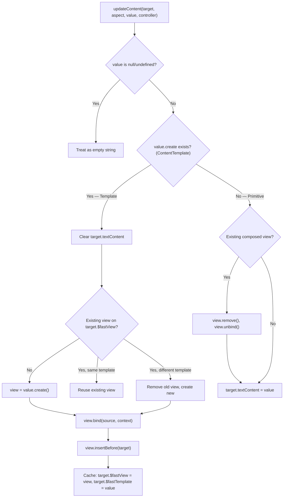

---

## Key Data Structures

| Structure | Location | Purpose |
|---|---|---|
| `ViewTemplate` | template.ts | Holds raw HTML + factories record. Entry point for compilation. |
| `factories: Record<string, ViewBehaviorFactory>` | template.ts | Maps unique IDs to binding factories (directives). |
| `CompilationContext` | compiler.ts | Accumulates factories and builds the target prototype during compilation. |
| `targets: ViewBehaviorTargets` | view.ts / html-directive.ts | Maps node IDs (e.g., `"r.0.2"`) to actual DOM nodes in a cloned fragment. |
| `HTMLView` | view.ts | The live view instance: holds the fragment, factories, targets, behaviors, and source. |
| `HTMLBindingDirective` | html-binding-directive.ts | The core binding: acts as factory, behavior, and event listener. |
| `sinkLookup` | html-binding-directive.ts | Maps `DOMAspect` types to DOM update functions. |
| `Binding` (abstract) | binding/binding.ts | Wraps an expression with policy, volatility, and observer creation. |
| `ExpressionObserver` | observation/observable.ts | Tracks dependencies during expression evaluation and notifies on change. |

## Binding Type Summary

| Markup Syntax | Aspect Type | Sink Function | Example |
|---|---|---|---|
| `attr="${x => x.val}"` | `attribute` | `DOM.setAttribute` | `class="${x => x.cls}"` |
| `?attr="${x => x.val}"` | `booleanAttribute` | `DOM.setBooleanAttribute` | `?disabled="${x => x.off}"` |
| `:prop="${x => x.val}"` | `property` | `target[prop] = value` | `:value="${x => x.name}"` |
| `:classList="${x => x.val}"` | `tokenList` | `updateTokenList` | `:classList="${x => x.classes}"` |
| `@event="${x => x.handler}"` | `event` | addEventListener | `@click="${(x,c) => x.onClick(c.event)}"` |
| `${x => x.val}` (in text) | `content` | `updateContent` | `<p>${x => x.msg}</p>` |

---

## Hydration: Attaching Bindings to Server-Rendered DOM

When a page is server-side rendered (SSR) with Declarative Shadow DOM, the HTML arrives in the browser fully formed. Instead of creating new DOM nodes, FAST's hydration system **reuses the existing DOM** and attaches reactive bindings to it. This section explains how hydration markers in the SSR output guide the client-side binding process.

### Enabling Hydration

Hydration is an opt-in, tree-shakeable feature. Importing `install-hydratable-view-templates.ts` patches `ViewTemplate.prototype` with:
1. A `Hydratable` symbol — marks the template as hydration-capable (checked via `isHydratable()`).
2. A `hydrate(firstChild, lastChild, hostBindingTarget?)` method — creates a `HydrationView` instead of an `HTMLView`.

```typescript
// This import enables hydration for all ViewTemplate instances
import "@microsoft/fast-element/install-hydratable-view-templates";
```

### Hydration Marker Format

The SSR renderer embeds comment nodes and data attributes into the HTML to mark where bindings should attach. These markers encode the **factory index** (position in the compiled factories array) so the client can map each marker back to its corresponding `ViewBehaviorFactory`.

#### Attribute Binding Markers

Elements with attribute/property/event bindings receive a `data-fe` attribute with the binding count:

```html
<!-- SSR output for: <div class="${x => x.cls}" :value="${x => x.val}"> -->
<div data-fe="2">server-rendered content</div>
```

The attribute marker format is:

| Attribute | Example | Description |
|---|---|---|
| `data-fe` | `data-fe="3"` | Binding count — the number of attribute bindings on the element |

#### Content Binding Markers

Text/template content bindings are wrapped in paired data-free comment nodes (matched by string equality, paired by balanced depth counting):

```html
<!--fe:b-->
Hello, World!
<!--fe:/b-->
```

#### Repeat Directive Markers

Each repeated item is bracketed by data-free repeat markers:

```html
<!--fe:r-->
<li>First item</li>
<!--fe:/r-->
<!--fe:r-->
<li>Second item</li>
<!--fe:/r-->
```

#### Element Boundary Markers

Nested custom elements that also need hydration are demarcated so the parent's walker can skip over them:

```html
<!--fe:e-->
<child-element>
  <template shadowrootmode="open">...child shadow DOM...</template>
</child-element>
<!--fe:/e-->
```

### Hydration Binding Flow

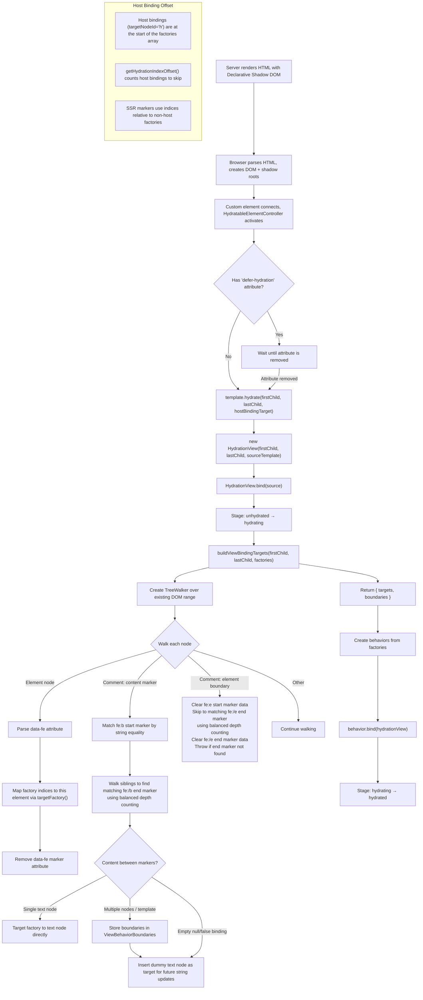

### HydrationView vs HTMLView

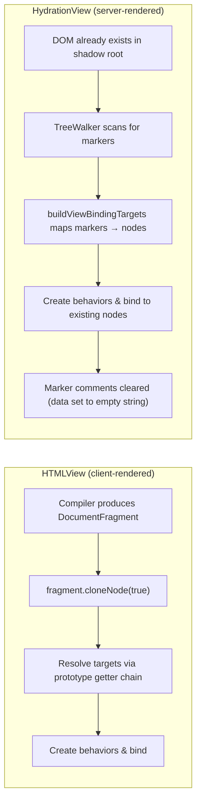

| Aspect | HTMLView | HydrationView |
|---|---|---|
| **DOM source** | Clones compiled DocumentFragment | Reuses server-rendered DOM in place |
| **Target resolution** | Prototype getters via childNodes indices | TreeWalker + hydration marker parsing |
| **Node creation** | Creates all DOM nodes from scratch | No node creation (reuses existing) |
| **Fragment** | Holds cloned fragment, moved into host | No fragment initially (created only on remove) |
| **Lifecycle** | Ready immediately after creation | Transitions through unhydrated → hydrating → hydrated |
| **Validation** | Compilation guarantees structure | Must validate markers match factories (throws HydrationBindingError) |
| **Boundaries** | Not needed (compiler tracks structure) | `bindingViewBoundaries` stores first/last node pairs for structural directives |

### Content Binding Hydration

When `HTMLBindingDirective.bind()` runs during hydration and the binding returns a `ContentTemplate`, the `updateContent` sink checks for pre-rendered boundaries:

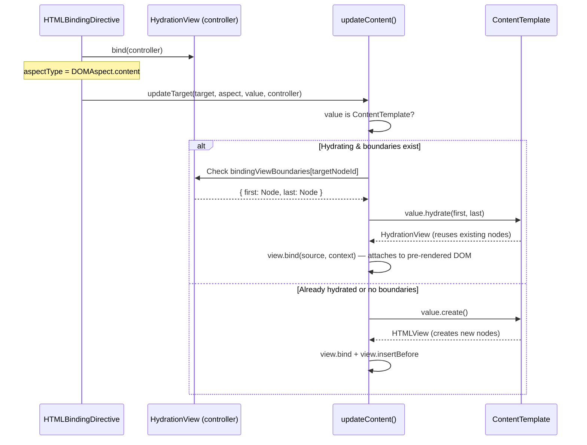

### Repeat Directive Hydration

The repeat directive hydrates by walking **backwards** from its location marker, finding paired repeat markers for each array item:

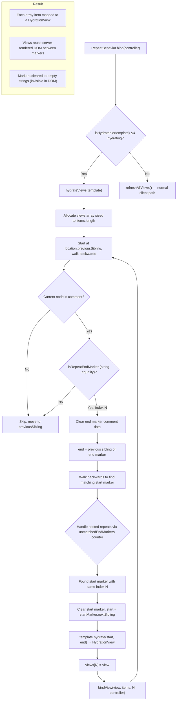

### Hydration Stage Lifecycle

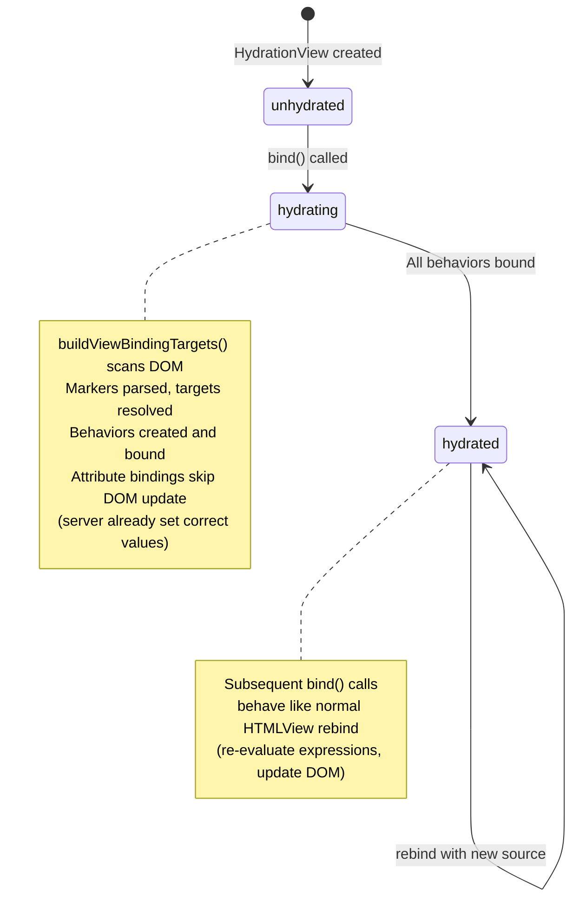

During the `hydrating` stage, attribute and boolean-attribute bindings **skip their initial DOM update** (the server already rendered the correct value). This avoids unnecessary DOM writes during hydration:

```typescript
// In HTMLBindingDirective.bind(), during hydration:
if (isHydrating && (this.aspectType === DOMAspect.attribute ||
                    this.aspectType === DOMAspect.booleanAttribute)) {
    observer.bind(controller);  // Set up observation only
    break;                      // Skip updateTarget — server value is current
}
```

### Error Handling

When the server-rendered DOM doesn't match the client template, hydration throws descriptive errors:

| Error | Cause | Contains |
|---|---|---|
| `HydrationTargetElementError` | `data-fe` specifies a binding count that cannot be satisfied, more content binding markers exist than factories, or an element boundary end marker is missing | Factory list, target node, template string |
| `HydrationBindingError` | A factory's `targetNodeId` has no matching entry in targets | Factory, cloned fragment, template string, available target IDs |
| `HydrationRepeatError` | Repeat hydration cannot match items while scanning backward through repeat markers with depth counting, or item count mismatches between SSR DOM and client data | Hydration stage, items length, view states |
| `FAST.error(1210)` | `data-fe` attribute contains a non-numeric or non-positive value | Attribute value |

These errors typically indicate a mismatch between the server-rendered HTML and the client-side template definition.
