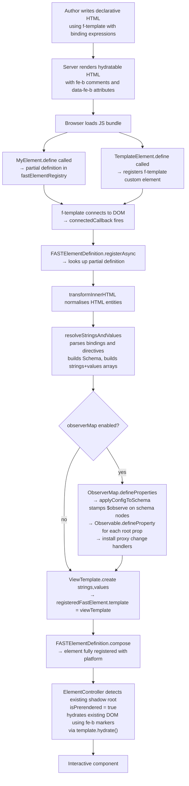
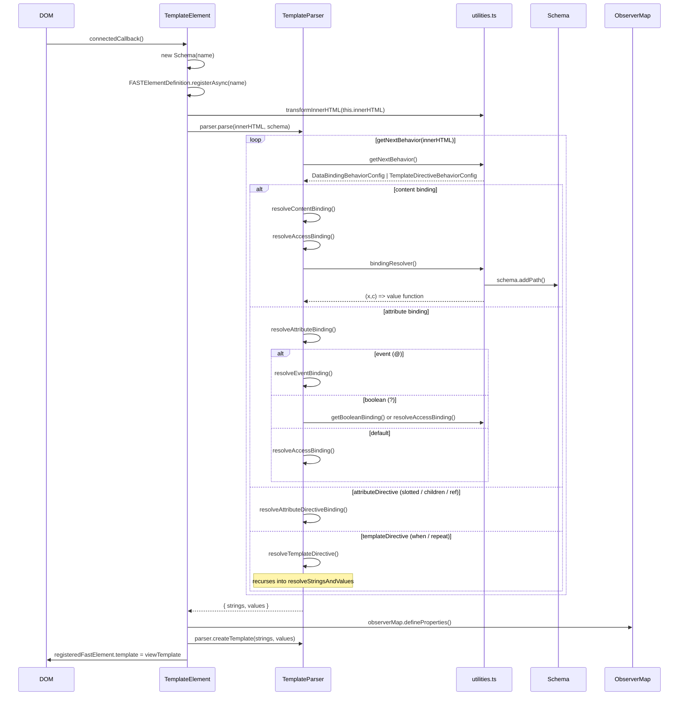
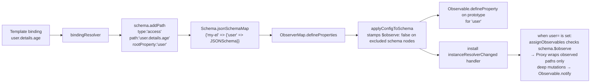
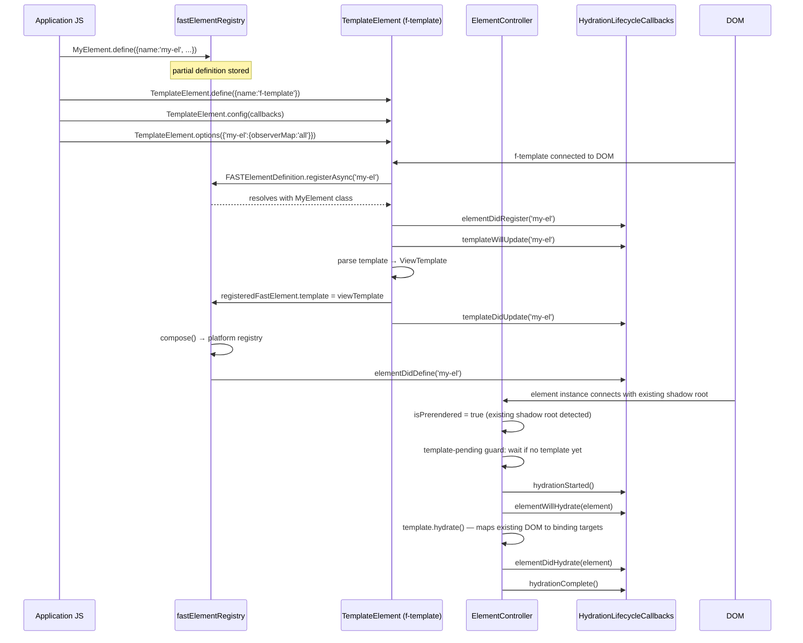

# fast-html Package Design

This document is intended for contributors who want to understand the internal architecture of `@microsoft/fast-html`. It covers the package's purpose, core concepts, data flow, and its integration with `@microsoft/fast-element`.

## Table of Contents

1. [Overview](#overview)
2. [Goals](#goals)
3. [Core Concepts](#core-concepts)
4. [Package Structure](#package-structure)
5. [Exports and Public API](#exports-and-public-api)
6. [Template Syntax](#template-syntax)
7. [Data Flow](#data-flow)
8. [Template Parsing Pipeline](#template-parsing-pipeline)
9. [Schema and Observer Map](#schema-and-observer-map)
10. [Lifecycle](#lifecycle)
11. [Integration with fast-element](#integration-with-fast-element)
12. [Hydration Model](#hydration-model)
13. [Conversion Rules (ast-grep)](#conversion-rules-ast-grep)
14. [Testing Architecture](#testing-architecture)
15. [Further Reading](#further-reading)

---

## Overview

`@microsoft/fast-html` is an **Alpha** declarative HTML parser that lets you write FAST Web Component templates as plain HTML rather than JavaScript `html` tagged template literals. The browser-side JS bundle includes the `<f-template>` custom element, which parses a declarative template at runtime and attaches it as a `ViewTemplate` to a waiting FAST element definition.

```html
<!-- Declarative template — stack-agnostic, no JS needed to render -->
<my-component greeting="Hello">
    <template shadowrootmode="open">
        <!--fe-b$$start$$0$$abc123$$fe-b-->Hello<!--fe-b$$end$$0$$abc123$$fe-b-->
    </template>
</my-component>

<!-- Template definition — parsed once by the browser bundle -->
<f-template name="my-component">
    <template>{{greeting}}</template>
</f-template>
```

---

## Goals

| Goal | Description |
|---|---|
| **Server-agnostic rendering** | Templates are plain HTML strings with no dependency on Node.js or any specific SSR framework. |
| **Progressive enhancement** | Components can be server-rendered and then hydrated client-side without a full re-render. |
| **FAST parity** | The declarative syntax maps 1-to-1 to `@microsoft/fast-element` directives (`repeat`, `when`, `slotted`, `children`, `ref`). |
| **Minimal authoring overhead** | Component authors write HTML, not tagged template strings, while retaining full reactive capabilities. |

---

## Core Concepts

### `<f-template>` — the template element

`<f-template>` is a custom element (class `TemplateElement`) that acts as the bridge between a declarative HTML template and the FAST element registry. When connected to the DOM it:

1. Looks up the element definition registered via `define()`.
2. Delegates parsing of the inner `<template>` tag to `TemplateParser`, which converts declarative bindings into FAST `ViewTemplate` strings and values.
3. Assigns the compiled `ViewTemplate` to the element definition.

### `TemplateParser` — declarative HTML parser

A standalone class that converts declarative HTML template markup into the `strings` and `values` arrays that `ViewTemplate.create()` consumes. It is used by `TemplateElement` internally but can also be used independently for programmatic template compilation. The parsing pipeline is fully synchronous — no promises are allocated during template resolution. A `StringsAccumulator` tracks the running concatenation of preceding HTML, eliminating repeated O(N) `join("")` calls at each binding site.

### `Schema` — JSON schema builder

Built during template parsing, one `Schema` instance per `<f-template>`. It records every binding path discovered in the template and constructs a JSON Schema-compatible data structure. This schema:

- Describes the shape of each root property referenced in the template.
- Tracks repeat context chains (parent/child array relationships).
- Is stored statically per element name so it can be shared across instances.

### `ObserverMap` — automatic observable setup

An optional layer that uses the `Schema` to automatically:

- Call `Observable.defineProperty()` for every root property on the element prototype.
- Install property-change handlers that wrap newly assigned objects/arrays in `Proxy` instances.
- Propagate deep property mutations back through FAST's observable system so bindings re-render.

Enabled via `TemplateElement.options({ "my-element": { observerMap: "all" } })` or by passing a configuration object `TemplateElement.options({ "my-element": { observerMap: {} } })`. Both forms are equivalent and observe all root properties.

#### Path-level observation control

The `ObserverMapConfig` interface accepts an optional `properties` key that maps root property names to a recursive path tree controlling observation granularity:

```typescript
TemplateElement.options({
    "my-element": {
        observerMap: {
            properties: {
                user: {
                    name: true,          // user.name — observed
                    details: {
                        age: true,       // user.details.age — observed
                        history: false,  // user.details.history — NOT observed
                    },
                },
                // root properties not listed here are skipped
            },
        },
    },
});
```

Each path entry can be:
- **`true`** — observe this path and all descendants (unless overridden deeper).
- **`false`** — skip this path and all descendants (unless overridden deeper).
- **`ObserverMapPathNode`** — an object with an optional `$observe` boolean and child property overrides, allowing alternating opt-in/opt-out to arbitrary depth.

When `properties` is omitted (`observerMap: {}` or `observerMap: "all"`), all root properties are observed. When `properties` is present but empty (`{ properties: {} }`), no root properties are observed.

The resolution algorithm walks the schema and configuration tree in parallel:
1. If `properties` is present and a root property is not listed, it is skipped.
2. `true`/`false` booleans apply to the entire subtree.
3. `$observe` on a node object controls the current level; children inherit when unspecified.
4. Paths in the config but not in the schema are silently ignored (forward-compatible).

### `AttributeMap` — automatic `@attr` definitions

An optional layer that uses the `Schema` to automatically register `@attr`-style reactive properties for every **leaf binding** in the template — i.e. simple expressions like `{{foo}}` or `id="{{foo-bar}}"` that have no nested properties, no explicit type, and no child element references.

- By default (`attribute-name-strategy: "none"`), the **attribute name** and **property name** are both the binding key exactly as written in the template (e.g. `{{foo-bar}}` → attribute `foo-bar`, property `foo-bar`). No normalization is applied.
- When `attribute-name-strategy` is `"camelCase"`, the binding key is treated as a camelCase property name and the HTML attribute name is derived by converting it to kebab-case (e.g. `{{fooBar}}` → property `fooBar`, attribute `foo-bar`). This matches the build-time `--attribute-name-strategy` option in `@microsoft/fast-build`.
- Because HTML attributes are case-insensitive, binding keys should use lowercase names (optionally dash-separated) when using the `"none"` strategy.
- Properties already decorated with `@attr` or `@observable` are left untouched.
- `FASTElementDefinition.attributeLookup` is keyed by the HTML attribute name, and `propertyLookup` is keyed by the JS property name so `attributeChangedCallback` correctly delegates to the new `AttributeDefinition`.

Enabled via `TemplateElement.options({ "my-element": { attributeMap: "all" } })` or by passing a configuration object `TemplateElement.options({ "my-element": { attributeMap: {} } })`. Both forms are equivalent and use the default `"none"` strategy. To use the `"camelCase"` strategy, pass `TemplateElement.options({ "my-element": { attributeMap: { "attribute-name-strategy": "camelCase" } } })`.

### Syntax constants (`syntax.ts`)

All delimiters used by the parser are defined in a single `Syntax` interface and exported as named constants from `syntax.ts`. This makes the syntax pluggable and easy to audit.

| Constant | Value | Use |
|---|---|---|
| `openExpression` / `closeExpression` | `{{` / `}}` | Default (SSR-compatible) binding |
| `unescapedOpenExpression` / `unescapedCloseExpression` | `{{{` / `}}}` | Raw HTML binding |
| `clientSideOpenExpression` / `clientSideCloseExpression` | `{` / `}` | Client-only (event / attribute directive) binding |
| `repeatDirectiveOpen` / `repeatDirectiveClose` | `<f-repeat` / `</f-repeat>` | Repeat directive |
| `whenDirectiveOpen` / `whenDirectiveClose` | `<f-when` / `</f-when>` | When directive |
| `attributeDirectivePrefix` | `f-` | Attribute directive prefix |
| `eventArgAccessor` | `$e` | DOM event argument |
| `deprecatedEventArgAccessor` | `e` | Deprecated DOM event argument (emits a deduplicated warning once per component) |
| `executionContextAccessor` | `$c` | Execution context argument |

---

## Package Structure

```
packages/fast-html/
├── src/
│   ├── index.ts               # Public barrel — re-exports from components/
│   ├── interfaces.ts          # Message enum (error codes)
│   ├── debug.ts               # Human-readable debug messages registered with FAST
│   └── components/
│       ├── index.ts           # Component barrel
│       ├── element.ts         # Element utilities
│       ├── template.ts        # TemplateElement (<f-template>), lifecycle orchestration, options
│       ├── template-parser.ts # TemplateParser — converts declarative HTML to ViewTemplate strings/values
│       ├── schema.ts          # Schema class — JSON schema builder
│       ├── observer-map.ts    # ObserverMap class — auto observable/proxy setup
│       ├── utilities.ts       # Parsing engine, binding resolvers, proxy system
│       └── syntax.ts          # Syntax delimiter constants
├── rules/                     # ast-grep YAML rules for converting html`` → declarative HTML
├── rule-tests/                # ast-grep rule test fixtures
├── scripts/
│   └── build-fixtures.js      # Builds pre-rendered test fixture HTML via @microsoft/fast-build config files
└── test/
    └── fixtures/              # One directory per feature, each with spec + index.html + main.ts
```

---

## Exports and Public API

```typescript
import {
    TemplateElement,
    TemplateParser,
    ObserverMap,
    type ObserverMapConfig,
    type ObserverMapPathEntry,
    type ObserverMapPathNode,
} from "@microsoft/fast-html";
```

Three primary exports are intended for application code:

| Export | Purpose |
|---|---|
| `TemplateElement` | Define the `<f-template>` element; configure callbacks and per-element options. |
| `TemplateParser` | Standalone parser that converts declarative HTML into `ViewTemplate` strings/values. Can be used independently of `<f-template>` for programmatic template compilation. |
| `ObserverMap` | Advanced: access the observer-map class directly if building tooling. |

Additionally, the following types are exported for use in `observerMap` configuration:

| Type | Purpose |
|---|---|
| `ObserverMapConfig` | Configuration object for the `observerMap` option; accepts optional `properties` key. |
| `ObserverMapPathEntry` | `boolean \| ObserverMapPathNode` — a node in the observation path tree. |
| `ObserverMapPathNode` | Object node with optional `$observe` and child property overrides. |

---

## Template Syntax

The declarative syntax is a superset of HTML with three binding delimiters:

| Syntax | Example | Behaviour |
|---|---|---|
| `{{expr}}` | `{{greeting}}` | SSR-compatible content / attribute binding |
| `{{{expr}}}` | `{{{rawHtml}}}` | Unescaped HTML (wraps in `<div :innerHTML>`) |
| `{expr}` | `@click="{handleClick($e)}"` | Client-only binding (events, attribute directives) |

### Directives

| Directive | Example |
|---|---|
| `<f-when value="{{expr}}">` | Conditional rendering |
| `<f-repeat value="{{item in list}}">` | List rendering |
| `f-slotted="{prop}"` | Slotted nodes attribute directive |
| `f-children="{prop}"` | Children attribute directive |
| `f-ref="{prop}"` | Element ref attribute directive |

For full syntax reference see [README.md](./README.md).

---

## Data Flow

The high-level data flow from authoring to interactive component:



---

## Template Parsing Pipeline

`TemplateElement.connectedCallback()` orchestrates the pipeline by creating a `TemplateParser` instance and delegating all parsing logic to it. The recursive parsing context is encapsulated in a `TemplateResolutionContext` object internal to the parser, keeping method signatures lean.

### Architecture

The parsing pipeline is split across two classes:

- **`TemplateElement`** (`template.ts`) — Custom element lifecycle: registration, options, callbacks, `ObserverMap`/`AttributeMap` wiring, and template assignment. ~120 lines.
- **`TemplateParser`** (`template-parser.ts`) — Synchronous template parser: converts declarative HTML into `strings`/`values` arrays for `ViewTemplate.create()`. Uses a `StringsAccumulator` to track the running previous-string in O(1) per binding site instead of O(N) `join("")` calls. Independently testable without DOM.



### TemplateParser method decomposition

| Method | Visibility | Role |
|---|---|---|
| `parse()` | public | Entry point: parses declarative HTML into `{ strings, values }`. |
| `createTemplate()` | public | Creates a `ViewTemplate` from resolved strings and values. |
| `hasDeprecatedEventSyntax` | public | Getter indicating whether the last parse encountered deprecated `e` event syntax. |
| `resolveStringsAndValues()` | private | Creates `strings`/`values` arrays and delegates to `resolveInnerHTML()`. |
| `resolveInnerHTML()` | private | Recursive HTML parser that dispatches to data binding or template directive handlers. |
| `resolveDataBinding()` | private | Thin dispatcher that routes to `resolveContentBinding()`, `resolveAttributeBinding()`, or `resolveAttributeDirectiveBinding()`. |
| `resolveContentBinding()` | private | Handles `{{expression}}` in text content. |
| `resolveAttributeBinding()` | private | Handles `{{expression}}` in HTML attributes; dispatches to `resolveEventBinding()` or `resolveAccessBinding()` based on aspect. |
| `resolveAttributeDirectiveBinding()` | private | Handles `f-children`, `f-slotted`, `f-ref` directives. |
| `resolveAccessBinding()` | private | Shared helper for access-type bindings (content, boolean-attribute fallback, default attribute). |
| `resolveEventBinding()` | private | Handles event bindings (`@event`), including arg parsing and owner resolution. |
| `resolveTemplateDirective()` | private | Handles `<f-when>` and `<f-repeat>` directives. |
| `resolveAttributeDirective()` | private | Creates FAST `children()`, `slotted()`, or `ref()` directives. |

### TemplateResolutionContext

The `TemplateResolutionContext` interface (internal to `TemplateParser`) groups the stable fields that flow through the recursive parsing pipeline:

```typescript
interface TemplateResolutionContext {
    parentContext: string | null;  // Current repeat item alias (e.g. "item")
    level: number;          // Nesting depth for repeat directives
    schema: Schema;         // JSON schema builder for property tracking
}
```

`rootPropertyName` is intentionally kept separate because it is selectively mutated per branch and must not leak across sibling binding resolutions.

### Key parsing functions (utilities.ts)

| Function | Role |
|---|---|
| `getNextBehavior(innerHTML)` | Top-level scanner: returns the next `DataBindingBehaviorConfig` or `TemplateDirectiveBehaviorConfig`, or `null` when done. |
| `getNextDataBindingBehavior(innerHTML)` | Identifies whether the next binding is `{{}}`, `{{{}}}`, or `{}` and classifies it as content/attribute/attributeDirective. |
| `getNextDirectiveBehavior(innerHTML)` | Finds the next `<f-when>` or `<f-repeat>` and its matching close tag. |
| `bindingResolver(...)` | Builds a `(x, c) => value` closure for a given path; also calls `schema.addPath()`. |
| `pathResolver(path, contextPath, level, schema)` | Returns a closure that traverses an object using dot-notation, handling repeat context levels. |
| `getBooleanBinding(...)` | Returns a `(x, c) => boolean` closure for `<f-when>` expressions. |
| `assignObservables(schema, rootSchema, data, target, rootProperty)` | Wraps objects/arrays in `Proxy` for deep observation. |
| `deepMerge(target, source)` | Merges source into an existing proxy, preserving proxy identity and triggering observable notifications. |
| `transformInnerHTML(html)` | Normalises HTML-encoded operator characters (`&gt;`, `&lt;`, etc.) used in `<f-when>` expressions. |

### Binding classification

```
innerHTML token
  ├── {{{ ... }}}  → unescaped content binding  (innerHTML div)
  ├── {{ ... }}    → default binding
  │     ├── attr="{{expr}}"    → attribute binding   (aspect: null / ":" / "?")
  │     └── {{expr}} in text  → content binding
  └── { ... }      → client-side binding
        ├── @event="{handler(...)}"  → event binding (aspect "@")
        └── f-dir="{prop}"           → attribute directive binding
```

---

## Schema and Observer Map

The `Schema` class accumulates all binding paths discovered during parsing into a static JSON Schema map indexed by `customElementName → rootPropertyName → JSONSchema`.



For a deep dive into the schema structure, context tracking, and proxy system see [SCHEMA_OBSERVER_MAP.md](./SCHEMA_OBSERVER_MAP.md).

### `$observe` flag on schema nodes

When an `ObserverMapConfig` with a `properties` key is provided, `ObserverMap.defineProperties()` calls `applyConfigToSchema()` to stamp `$observe: false` on excluded schema nodes **before** the proxy system runs. This is a one-time pre-processing pass that walks the config and schema trees in parallel:

- `false` in the config → `$observe: false` is stamped recursively on the node and all its descendants.
- `$observe: false` on a config node → the schema node is stamped, and unlisted children inherit the stamp.
- `true` in the config → no stamp needed (observed is the default).
- Config paths not in the schema are silently ignored.

**Convention: stamp-only-when-excluding.** The `$observe` flag is only ever set to `false` — it is never explicitly set to `true`. Absence of `$observe` (i.e. `undefined`) means the node is observed. This means:

- When `observerMap: "all"` or `observerMap: {}` is used, `applyConfigToSchema` is never called and no schema nodes are mutated — zero overhead for the common case.
- The proxy system uses `isSchemaExcluded(schema)` (checks `$observe === false` with no observed descendants) as the single predicate for all skip/suppress decisions.
- Schema nodes without `$observe` are always treated as observed.

### AttributeMap and leaf bindings

When `attributeMap` is enabled (via `"all"`, `{}`, or a configuration object), `AttributeMap.defineProperties()` is called after parsing. It iterates `Schema.getRootProperties()` and skips any property whose schema entry contains `properties`, `type`, or `anyOf` — keeping only plain leaf bindings. For each leaf:

1. The schema key is used as the **JS property name**.
2. The **HTML attribute name** depends on the `attribute-name-strategy`:
   - `"none"` (default): the attribute name equals the property name (e.g. `foo-bar` → `foo-bar`).
   - `"camelCase"`: the attribute name is derived by converting the camelCase property name to kebab-case (e.g. `fooBar` → `foo-bar`).
3. A new `AttributeDefinition` is registered via `Observable.defineProperty`.
4. `FASTElementDefinition.attributeLookup` is keyed by the HTML attribute name and `propertyLookup` is keyed by the JS property name so `attributeChangedCallback` can route attribute changes to the correct property.

When using the `"none"` strategy, property names may contain dashes and must be accessed via bracket notation (e.g. `element["foo-bar"]`). When using `"camelCase"`, property names are standard JS identifiers (e.g. `element.fooBar`).

---

## Lifecycle



### Lifecycle callback reference

| Callback | When |
|---|---|
| `elementDidRegister(name)` | `FASTElementDefinition.registerAsync` resolves |
| `templateWillUpdate(name)` | Just before template HTML is parsed |
| `templateDidUpdate(name)` | After `ViewTemplate` is assigned to the definition |
| `elementDidDefine(name)` | After `compose` completes |
| `hydrationStarted()` | Once, when the first prerendered element begins hydrating |
| `elementWillHydrate(source)` | Before `ElementController` hydrates a prerendered instance |
| `elementDidHydrate(source)` | After an instance is fully hydrated |
| `hydrationComplete()` | Once, after all prerendered elements have completed hydration |

For usage examples see [RENDERING_LIFECYCLE.md](./RENDERING_LIFECYCLE.md).

---

## Integration with fast-element

`@microsoft/fast-html` is a thin orchestration layer on top of `@microsoft/fast-element`. It does not re-implement any reactive primitives; it converts declarative HTML syntax into the same data structures that `html` tagged templates produce.

| fast-element primitive | How fast-html uses it |
|---|---|
| `FASTElement` | Base class for both `TemplateElement` and user components (components extend `FASTElement` directly) |
| `FASTElementDefinition.registerAsync()` | Deferred element registration — element waits for its template |
| `fastElementRegistry.getByType()` | Looks up a partial definition to attach the compiled template |
| `ViewTemplate.create(strings, values)` | Compiles the resolved strings/values arrays into a `ViewTemplate` |
| `ElementController` | Automatically detects prerendered content (`isPrerendered`) and hydrates server-rendered DOM using `fe-b` comment/dataset markers via `template.hydrate()` |
| `Observable.defineProperty()` | Defines observable root properties on element prototypes (ObserverMap) |
| `Observable.getNotifier()` | Triggers change notifications from proxy handlers |
| `when(expr, template)` | FAST directive used for `<f-when>` |
| `repeat(expr, template)` | FAST directive used for `<f-repeat>` |
| `slotted(options)` | FAST directive used for `f-slotted` |
| `children(prop)` | FAST directive used for `f-children` |
| `ref(prop)` | FAST directive used for `f-ref` |

### Deferred template attachment via define

Standard `FASTElement.define()` returns a `Promise` that resolves immediately when a template is provided at definition time. When `templateOptions` is `"defer-and-hydrate"` and no template is provided, the `Promise` resolves after a `<f-template>` supplies one via `registerAsync()`. This unified API replaces the previous `defineAsync()` / `composeAsync()` methods.

---

## Hydration Model

When `templateOptions: "defer-and-hydrate"` is used, the server must render:

1. The custom element tag with its attributes and initial state.
2. A `<template shadowrootmode="open">` containing pre-rendered HTML annotated with FAST's hydration markers.
3. An `<f-template>` element somewhere in the page that carries the template definition.

Connection gating is handled by the template-pending guard in `ElementController.connect()`. When `templateOptions` is `"defer-and-hydrate"` and no template is available yet, `connect()` returns early. An Observable subscription on `"template"` retriggers `connect()` when the template arrives. The `defer-hydration` and `needs-hydration` attributes are no longer needed in server-rendered markup.

### Hydration marker formats

**Content bindings** use HTML comments:

```
<!--fe-b$$start$$<index>$$<uuid>$$fe-b-->
<!--fe-b$$end$$<index>$$<uuid>$$fe-b-->
```

**Attribute bindings** use `data-fe-b` dataset attributes (three equivalent formats — all supported):

```html
<!-- space-separated -->  <el data-fe-b="0 1 2">
<!-- enumerated     -->  <el data-fe-b-0 data-fe-b-1 data-fe-b-2>
<!-- compact        -->  <el data-fe-c-0-3>
```

**Repeat directives** wrap each item in comment pairs:
```
<!--fe-repeat$$start$$<item-index>$$fe-repeat-->
...item DOM...
<!--fe-repeat$$end$$<item-index>$$fe-repeat-->
```

For detailed examples see [RENDERING.md](./RENDERING.md).

---

## Conversion Rules (ast-grep)

The `rules/` directory contains `.yml` rules for [ast-grep](https://ast-grep.github.io/) that partially automate converting `@microsoft/fast-element` tagged-template components to declarative HTML syntax.

| Rule file | Converts |
|---|---|
| `tag-function-to-template-literal.yml` | `` html`...` `` → plain template string |
| `member-expression.yml` | `${x => x.prop}` → `{{prop}}` |
| `attribute-directives.yml` | `${slotted("prop")}` → `f-slotted="{prop}"` |
| `call-expression-with-event-argument.yml` | `${(x,c) => x.handler(c.event)}` → `@event="{handler($e)}"` |

See [rules/README.md](./rules/README.md) for usage instructions.

---

## Testing Architecture

Each feature is verified by a **Playwright** integration test against a live Vite dev server. The `test/fixtures/` directory contains one subdirectory per feature:

```
test/fixtures/<feature>/
├── <feature>.spec.ts        # Playwright test
├── entry.html               # Entry template with root custom elements
├── fast-build.config.json   # Build configuration for @microsoft/fast-build
├── index.html               # Pre-rendered page (GENERATED by scripts/build-fixtures.js — do not edit)
├── main.ts                  # Component definition + TemplateElement setup
├── state.json               # Initial state for server-side rendering
└── templates.html           # Declarative <f-template> definitions
```

Fixtures are auto-discovered by scanning for directories that contain `entry.html`, `templates.html`, `state.json`, and `fast-build.config.json`. Both the build script and the Vite config pick up new fixtures automatically — no registration step is needed.

For fixtures that use SSR-style pre-rendered HTML, `scripts/build-fixtures.js` invokes `@microsoft/fast-build` with `--config` pointing to each fixture's `fast-build.config.json` to generate `index.html` from the configured source files.

### WebUI Integration Tests

A separate integration test suite validates that `@microsoft/webui` can build and render the same fixture templates that `@microsoft/fast-build` processes. This is split into two steps:

1. **Build** (`npm run build:fixtures:webui`) — runs `scripts/build-fixtures-with-webui.js`, which extracts `<f-template>` elements, builds each fixture with `webui build --plugin=fast`, renders the protocol with `state.json`, and writes the output alongside `main.ts` and assets to `temp/integrations/webui/fixtures/`.
2. **Test** (`npm run test:webui-integration`) — builds the fixtures, then runs the same Playwright specs against the webui-rendered output served by a Vite dev server on port 5174 (configured in `playwright.webui.config.ts`).

Run locally with `npm run test:webui-integration` or via the `ci-webui-integration.yml` GitHub Action on PRs and pushes to `main`.

#### Skipped tests

Some tests are conditionally skipped when running under the webui integration config. The `playwright.webui.config.ts` sets `process.env.FAST_WEBUI_INTEGRATION = "true"`, and individual tests check this variable with `test.skip()` to opt out of cases that exercise known differences between `fast-build` and `webui` rendering:

- **`errors.spec.ts` — "throws an error when no template element is present"**: webui does not render `<f-template>` elements that lack a `<template>` child, so the expected error is never thrown.

### Hydration readiness

Every fixture must wait for hydration to complete before running assertions. Each `main.ts` registers a `hydrationComplete()` callback via `TemplateElement.config()` that sets a global flag, and each spec file calls `page.waitForFunction()` after `page.goto()` to block until the flag is set. See [test/fixtures/README.md](./test/fixtures/README.md) for the implementation pattern.

See [test/fixtures/WRITING_FIXTURES.md](./test/fixtures/WRITING_FIXTURES.md) for the complete fixture authoring guide, [test/fixtures/README.md](./test/fixtures/README.md) for a quick reference, and [test/fixtures/deep-merge/README.md](./test/fixtures/deep-merge/README.md) for an example of a complex multi-feature fixture.

---

## Further Reading

| Document | Topic |
|---|---|
| [README.md](./README.md) | Installation, syntax reference, lifecycle callbacks, usage examples |
| [RENDERING.md](./RENDERING.md) | Hydratable HTML format: comment markers, dataset attributes, directive markers |
| [RENDERING_LIFECYCLE.md](./RENDERING_LIFECYCLE.md) | Phase-by-phase rendering lifecycle, callback ordering, performance notes |
| [SCHEMA_OBSERVER_MAP.md](./SCHEMA_OBSERVER_MAP.md) | Deep dive into Schema JSON structure, ObserverMap proxy system, debugging |
| [rules/README.md](./rules/README.md) | ast-grep conversion rules for migrating `html` tagged templates |
| [test/fixtures/README.md](./test/fixtures/README.md) | Quick reference for fixture structure |
| [test/fixtures/WRITING_FIXTURES.md](./test/fixtures/WRITING_FIXTURES.md) | Complete guide to writing new Playwright fixture tests |
| [test/fixtures/deep-merge/README.md](./test/fixtures/deep-merge/README.md) | Complex deep-merge fixture: observable arrays, nested repeats, conditionals |
