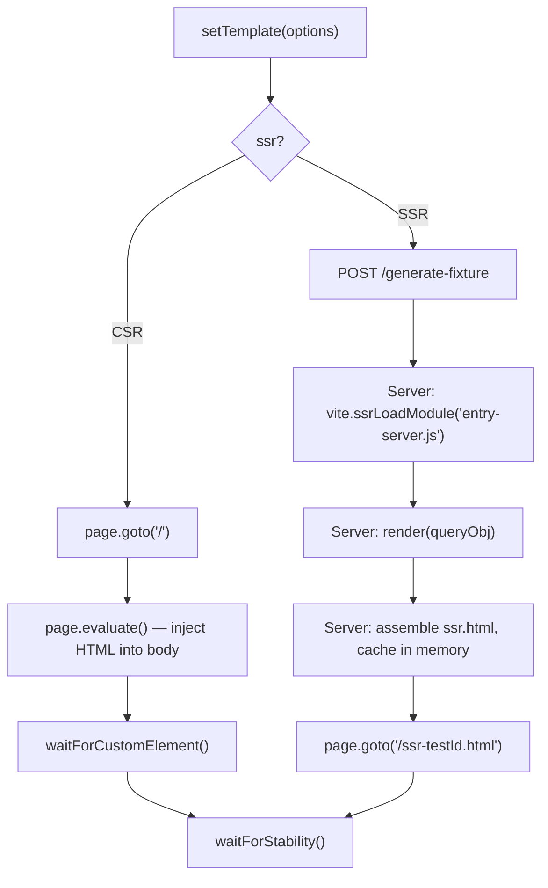
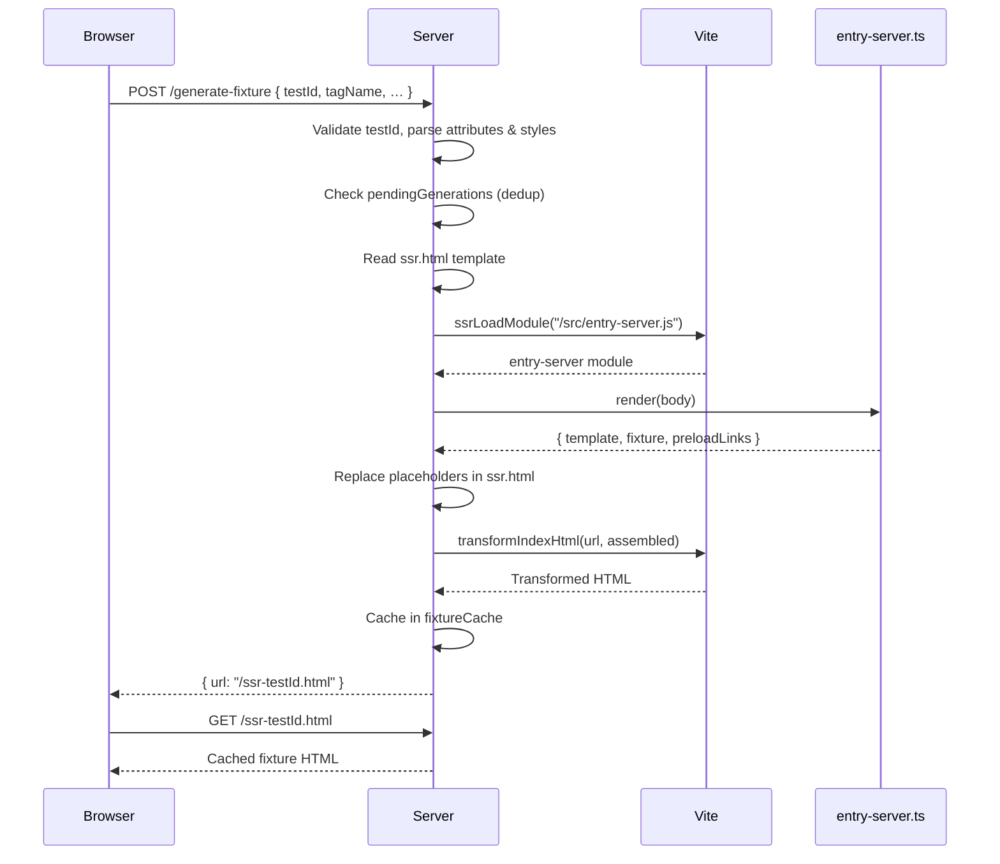

# Design — @microsoft/fast-test-harness

This document describes the internal architecture of the `@microsoft/fast-test-harness` package — a Playwright testing harness for FAST Element web components with CSR and SSR support.

---

## Table of Contents

1. [High-Level Overview](#high-level-overview)
2. [Module Map](#module-map)
3. [Fixture System](#fixture-system)
   - [FixtureOptions](#fixtureoptions)
   - [CSRFixture](#csrfixture)
   - [SSRFixture](#ssrfixture)
4. [Custom Assertions](#custom-assertions)
5. [Server](#server)
   - [CSR Request Flow](#csr-request-flow)
   - [SSR Request Flow](#ssr-request-flow)
   - [Caching and Deduplication](#caching-and-deduplication)
6. [SSR Rendering](#ssr-rendering)
7. [Configuration Files](#configuration-files)
   - [Playwright Configuration](#playwright-configuration)
   - [Vite Configuration](#vite-configuration)
8. [Exports](#exports)

---

## High-Level Overview

`@microsoft/fast-test-harness` provides a turnkey Playwright testing setup for FAST web components. It extends Playwright's `test` and `expect` with a `fastPage` fixture that manages page setup, template injection, and element stability checks. The harness supports two rendering modes:

- **CSR (Client-Side Rendering)** — navigates to a Vite-served `index.html`, then injects component HTML into the page body via `page.evaluate`.
- **SSR (Server-Side Rendering)** — posts template configuration to a `/generate-fixture` endpoint, which uses Vite's SSR module loading to render a complete HTML page with Declarative Shadow DOM, then navigates to the generated page.

The mode is selected per test via `test.use({ ssr: true })` or globally via the `PLAYWRIGHT_TEST_SSR=true` environment variable.

```ts
test("renders element", async ({ fastPage }) => {
    await fastPage.setTemplate({ attributes: { label: "Hello" } });
    await expect(fastPage.element).toBeVisible();
});
```

Both modes use the same test API. The fixture handles routing internally:



---

## Module Map

| File | Role |
|------|------|
| `src/index.ts` | Package barrel — re-exports fixtures, assertions, build utilities, and SSR renderer |
| `src/fixtures/index.ts` | Extends Playwright's `test` with `fastPage` fixture and `expect` with custom assertions |
| `src/fixtures/csr-fixture.ts` | `CSRFixture` class — client-side rendering fixture |
| `src/fixtures/ssr-fixture.ts` | `SSRFixture` class — server-side rendering fixture (extends `CSRFixture`) |
| `src/fixtures/assertions.ts` | Custom Playwright assertion `toHaveCustomState` |
| `src/build/dom-shim.ts` | Minimal DOM shim for running FAST Element's `css` and `html` tagged templates in Node.js |
| `src/build/generate-stylesheets.ts` | Extracts compiled FAST `ElementStyles` JS modules into plain `.css` files |
| `src/build/generate-templates.ts` | Converts compiled FAST `ViewTemplate` JS modules into declarative `<f-template>` HTML files |
| `src/build/generate-webui-templates.ts` | Converts compiled FAST `ViewTemplate` JS modules into WebUI-compatible declarative shadow DOM `<template>` HTML files |
| `src/ssr/render.ts` | `createSSRRenderer` factory — scans for component build artifacts and uses the `@microsoft/fast-build` WASM module to produce SSR output |
| `src/ssr/entry-client.ts` | SSR hydration entry point — defines `<f-template>` for the browser |
| `server.mjs` | Node.js HTTP server with Vite middleware — serves CSR pages and handles SSR fixture generation |
| `start.mjs` | CLI entry point (`fast-test-harness` bin) — supports subcommands (`serve`, `generate-templates`, `generate-stylesheets`, `generate-webui-templates`) and flags via `node:util` `parseArgs` |
| `playwright.config.mjs` | Shared Playwright configuration (browsers, web server, test matching) |
| `vite.config.mjs` | Shared Vite configuration (port, resolve conditions, build settings) |
| `public/styles.css` | Base CSS reset served as a Vite public asset |

---

## Fixture System

### FixtureOptions

The `test.extend` call in `src/fixtures/index.ts` adds four configurable options to every test:

| Option | Type | Default | Description |
|--------|------|---------|-------------|
| `tagName` | `string` | `""` | Custom element tag name used to build the default template and locate the element |
| `innerHTML` | `string` | `""` | Default inner HTML inserted into the element |
| `waitFor` | `string[]` | `[]` | Additional custom element tag names to wait for before the test runs |
| `ssr` | `boolean` | `false` (or `true` if `PLAYWRIGHT_TEST_SSR=true`) | Selects SSR mode |

These are configured per test suite with `test.use()`:

```ts
test.use({ tagName: "my-button", innerHTML: "Click me" });
```

The `fastPage` fixture factory reads these options and instantiates either `CSRFixture` or `SSRFixture`. For CSR, it also navigates to `/`, emulates reduced motion, and waits for custom element definitions before handing control to the test.

### CSRFixture

`CSRFixture` is the base class for interacting with a component on a Playwright page.

| Method | Description |
|--------|-------------|
| `goto(url)` | Navigates to a URL (defaults to `"/"`) |
| `setTemplate(templateOrOptions?)` | Injects HTML into `<body>`. Accepts a raw HTML string, an options object (`{ attributes, innerHTML }`), or no argument (uses defaults from `tagName`/`innerHTML`). Waits for stability after injection. |
| `updateTemplate(locator, options)` | Modifies attributes and/or innerHTML of an already-rendered element in place. Boolean `true` sets the attribute, `false` removes it, strings set the value. |
| `waitForCustomElement(...tagNames)` | Blocks until all specified elements are defined in `customElements` |
| `applyTokens(tokens)` | Sets CSS custom properties on `<body>` for design token theming |
| `addStyleTag(options)` | Delegates to `page.addStyleTag()` |

**Template generation** (`defaultTemplate`): When `setTemplate` receives an options object (or no argument), it builds an HTML string from the `tagName`, serialized attributes, and `innerHTML`. Boolean `true` attributes render as bare attributes (`disabled`), string values render as `key="value"`.

**Stability waiting** (`waitForStability`): After injecting HTML, the fixture waits for (1) all matching elements to be attached, (2) custom element definitions to be registered, and (3) the `<body>` to reach a "stable" state via Playwright's `waitForElementState("stable")`.

### SSRFixture

`SSRFixture` extends `CSRFixture` and overrides `setTemplate` and `addStyleTag` to work with server-side rendering.

| Override | Description |
|----------|-------------|
| `addStyleTag` | Buffers style options into `pendingStyles` until `setTemplate` is called. Only `{ content }` options are preserved — the content strings are serialized into the SSR generation request. Style options using `path` or `url` are not included in the SSR output. After `setTemplate`, calls pass through to the page directly. |
| `setTemplate` | Builds a request body from the template options, posts it to `/generate-fixture`, navigates to the returned URL, and waits for stability. |

**SSR request body construction**: The `setTemplate` override constructs a JSON body with these fields:

| Field | Source |
|-------|--------|
| `testId` | Derived from `testInfo.titlePath` — sanitized to `[a-z0-9_-]` |
| `testTitle` | Formatted from the test title path |
| `tagName` | From fixture options (when not using raw HTML) |
| `innerHTML` | From the template options or fixture default |
| `attributes` | JSON-stringified attribute map |
| `html` | Raw HTML string (when `templateOrOptions` is a string) |
| `styles` | JSON-stringified array of CSS content strings from buffered `addStyleTag` calls |

All string values are whitespace-collapsed before sending.

**Test title formatting** (`formatTestTitle`): Converts sanitized test IDs back into human-readable titles. If the ID matches the pattern `<filepath>-<sections>`, it splits sections by `-` and words by `_`, capitalizing each word, joining sections with ` › `, and appending the source file path in parentheses (e.g., `Section One › Section Two (path/to/file.ts)`). IDs that don't match the pattern are split on `_` and capitalized.

---

## Custom Assertions

The `toHaveCustomState` assertion checks whether an element matches the CSS `:state(<name>)` pseudo-class, which tests `ElementInternals` custom states:

```ts
await expect(element).toHaveCustomState("checked");
```

The assertion evaluates `el.matches(`:state(${state})`)` in the browser via `locator.evaluate` and returns a matcher result compatible with Playwright's `expect.extend` API. It supports `.not` negation.

> **Note:** This is a one-shot evaluation, not a polling/auto-retrying Playwright matcher. The `:state()` check runs once and returns the result immediately. If the state may be set asynchronously, wait for the expected condition before asserting.

---

## Server

The server (`server.mjs`) is a plain Node.js HTTP server (using `node:http`) with Vite running in middleware mode. It handles both CSR page serving and SSR fixture generation.

### Consumer-Owned SSR Contract

The harness does **not** contain the SSR entry files itself — they live in the consuming project's test directory. By default, `startServer` looks for files under `<cwd>/test/`:

| File | Owner | Purpose |
|------|-------|---------|
| `test/index.html` | Consumer | CSR entry page — loads the component registration script |
| `test/ssr.html` | Consumer | SSR template with comment placeholders (`<!--fixture-->`, `<!--templates-->`, etc.) |
| `test/src/entry-server.ts` | Consumer | Exports a `render(queryObj)` function that returns `{ template, fixture, preloadLinks }` |
| `test/src/entry-client.ts` | Consumer | Registers components for DSD hydration in the browser |
| `test/vite.config.ts` | Consumer | Vite configuration (can import the shared one from this package) |

The `startServer(cwd, root, configFile)` function accepts overrides for each path:

| Parameter | Default | Description |
|-----------|---------|-------------|
| `cwd` | `process.cwd()` | Static file serving root |
| `root` | `<cwd>/test` | Vite root (contains `index.html`, `ssr.html`) |
| `configFile` | Vite auto-discovery | Vite config path |

### Startup

`startServer(cwd, root, configFile, options)` accepts an `options` object with `port`, `base`, and `debug` properties (falling back to `PORT`, `BASE`, and `FAST_DEBUG` environment variables, then defaults). It initializes:

1. A Vite dev server in middleware mode, configured to ignore the temp directory and with a `fast-test-harness:resolve-css-links` plugin that resolves bare package CSS specifiers in `<link>` tags to `/@fs/` URLs
2. A Node.js HTTP server with this request handling order: route handlers (`/generate-fixture`, `/ssr-*.html`) → static file serving from `cwd` → Vite middleware → HTML catch-all
3. When `debug` is enabled: a `temp/` directory under `root` for writing SSR fixture HTML files (cleaned on startup, useful for post-failure inspection)

The server listens on `port` (default `3278`).

### CSR Request Flow

After Vite's middleware processes module transforms and HMR, a fallback handler serves the Vite-transformed `index.html` for navigation requests (those with `Accept: text/html`). The transformed HTML is cached after the first request. Non-HTML requests that Vite doesn't handle receive a 404.

```
Browser GET /
    → catch-all handler
    → fs.readFile("index.html")
    → vite.transformIndexHtml(url, html)
    → cache and respond with 200
```

### SSR Request Flow

The `/generate-fixture` POST endpoint handles SSR fixture generation:



When `debug` is enabled, the server also writes fixtures to `temp/ssr-<testId>.html` for post-failure inspection.

### Caching and Deduplication

| Cache | Purpose |
|-------|---------|
| `cachedIndexHtml` | Caches the Vite-transformed `index.html` for CSR — avoids re-reading and re-transforming on every navigation |
| `fixtureCache` | Maps SSR fixture URLs to their rendered HTML — serves fixtures from memory without filesystem reads |
| `pendingGenerations` | Deduplicates concurrent SSR generation requests for the same `testId` — if a generation is already in progress, subsequent requests await the same promise. This guards against retries of the same test dispatching overlapping requests before the first completes. |

---

## SSR Rendering

The `src/ssr/render.ts` module exports `createSSRRenderer`, a factory that scans for component build artifacts (f-templates, stylesheets) and returns a `{ render }` object compatible with the server's `entry-server.ts` contract. It uses the `@microsoft/fast-build` WASM module to render f-templates into declarative shadow DOM on each request, with full expression evaluation and nested component support.

### createSSRRenderer

`createSSRRenderer(options: SSRRendererOptions)` returns `{ render(queryObj) => RenderResult }`.

**Options:**

| Option | Type | Default | Description |
|--------|------|---------|-------------|
| `tagPrefix` | `string` | — | Tag name prefix for custom elements (e.g., `"fluent"`, `"mai"`) |
| `packageName` | `string?` | — | Monolithic package name — scans subdirectories for component artifacts. Mutually exclusive with `components`. |
| `components` | `ComponentRegistration[]?` | — | Explicit list of per-component packages. Mutually exclusive with `packageName`. |
| `distDir` | `string?` | `"dist/esm"` | Artifact directory relative to the package root. Only used with `packageName`. |
| `themeStylesheet` | `string?` | — | Stylesheet URL or server-relative path for a global theme stylesheet included in every SSR fixture. Used directly as the `<link>` tag's `href`. |

**Supported layouts:**

- **Monolithic package** (`packageName`): Scans `<packageRoot>/<distDir>` for `**/*.template.html` files, treating each parent directory as a component name. Resolves `<packageName>/<componentDir>/template.html` and `<packageName>/<componentDir>/styles.css` via the package's exports map.
- **Per-component packages** (`components`): Uses an explicit `ComponentRegistration[]` array. Each entry maps a component name to an npm package, and resolves `<packageName>/template.html` and `<packageName>/styles.css`.

**Initialization flow:**

1. Validates that `packageName` and `components` are not both provided (throws if so).
2. Loads the `@microsoft/fast-build` WASM module (throws if not installed).
3. Collects f-template and stylesheet artifacts for all components.
4. Injects stylesheet `<link>` tags into f-templates (replaces `{{styles}}` placeholder or strips the marker when styles URL is empty).
5. Parses f-templates into the WASM templates map (`tagName → inner template content`).
6. Loads CEM default state per-package, keyed by tag name.
7. Concatenates all styled f-templates for client hydration.

**Per-request `render(queryObj)` flow:**

1. Builds entry HTML from `queryObj` — either raw HTML (`queryObj.html`) or a constructed element (`queryObj.tagName`, `queryObj.attributes`, `queryObj.innerHTML`). Attributes with `false`, `null`, or `undefined` values are omitted; other values are HTML-escaped.
2. Builds state JSON from attributes (including hyphen-stripped variants for camelCase bindings).
3. Calls the WASM `render_entry_with_templates()` to produce full HTML with declarative shadow DOM.
4. Extracts `<body>` content from the rendered document.
5. Returns `{ template, fixture, preloadLinks }`.

---

## Configuration Files

### Playwright Configuration

`playwright.config.ts` provides a shared Playwright configuration for consumers:

| Setting | Value |
|---------|-------|
| `retries` | `3` in CI, `1` locally |
| `timeout` | `10_000` in CI, `5_000` locally |
| `fullyParallel` | `true` locally, `false` in CI |
| `use.contextOptions.reducedMotion` | `"reduce"` |
| `testMatch` | `**/*.pw.spec.ts` |
| `reporter` | `"list"` |
| `webServer.command` | `fast-test-harness` |
| `webServer.port` | `3278` (configurable via `PORT` env var) |
| `projects` | Chromium, Firefox, WebKit (Safari with `deviceScaleFactor: 1`) |

### Vite Configuration

`vite.config.mjs` provides a shared Vite configuration:

| Setting | Value |
|---------|-------|
| `clearScreen` | `false` |
| `resolve.conditions` | `["test"]` — enables the `test` condition in `package.json` exports maps, allowing packages to expose source files (`.ts`) directly to Vite instead of compiled output |
| `server.port` | `3278` (from `PORT` env var) |
| `server.strictPort` | `true` |
| `build.minify` | `false` |
| `build.sourcemap` | `true` |

---

## Exports

| Specifier | Contents |
|-----------|----------|
| `@microsoft/fast-test-harness` | `test`, `expect`, `CSRFixture`, `SSRFixture`, `createSSRRenderer`, `ComponentRegistration`, `RenderResult`, `SSRRendererOptions`, build utilities (`installDomShim`, `generateStylesheets`, `generateFTemplates`, `generateWebuiTemplates`) |
| `@microsoft/fast-test-harness/server.mjs` | `startServer` |
| `@microsoft/fast-test-harness/ssr/render.js` | `createSSRRenderer`, `ComponentRegistration`, `RenderResult`, `SSRRendererOptions`, `renderTemplate`, `buildEntryHtml`, `buildState`, `parseDefaultValue` |
| `@microsoft/fast-test-harness/build/*.js` | Build utilities: `installDomShim`, `generateStylesheets`, `generateFTemplates`, `generateWebuiTemplates` |
| `@microsoft/fast-test-harness/playwright.config.mjs` | Shared Playwright configuration |
| `@microsoft/fast-test-harness/vite.config.mjs` | Shared Vite configuration |
| `@microsoft/fast-test-harness/public/*` | Static assets (base CSS reset) |
