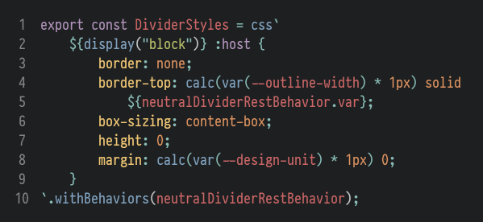
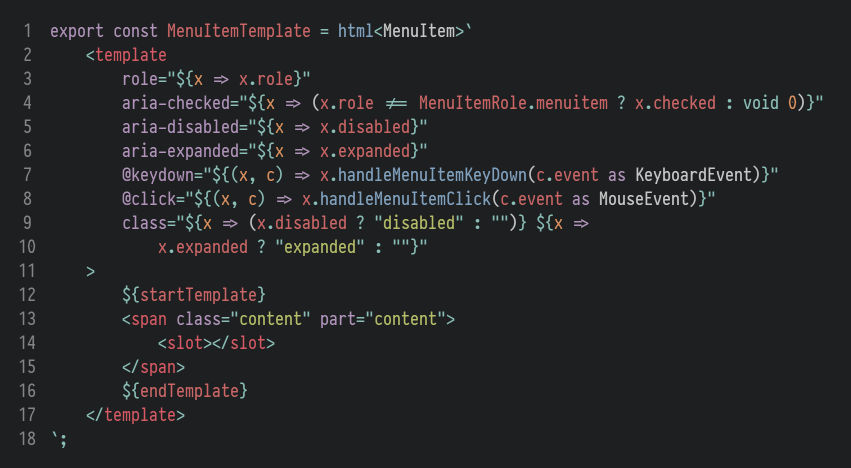

# FAST Tagged Template Literals

[](https://opensource.org/licenses/MIT)

`fast-tagged-templates` is a Visual Studio Code extension which enables syntax highlighting for `css` and `html` tagged template literals in JavaScript and TypeScript files.

## Screenshots

### CSS Tagged Templates

Both tagged template literals (``css`.style {}`;``) and comment-style untagged template literals (``/* css */`.style {}`;``) are supported.



### HTML Tagged Templates

In addition to the standard styles, the `html` syntax highlighting also allows for optional generics in Typescript (``html<any>`<div></div>`;`` and ``/* html<Generic> */`<div></div>`;``).



The theme used in the screenshots is [Boxy Tomorrow](https://marketplace.visualstudio.com/items?itemName=trongthanh.theme-boxythemekit#boxy-tomorrow).

## Installation

### Extension Marketplace

Coming soon!

### Manual installation

To install the extension manually, copy or symlink the `fast-tagged-templates` directory to your [extensions folder](https://code.visualstudio.com/docs/editor/extension-gallery#_where-are-extensions-installed).

## Recommendations

### Adjust existing themes

Some theme extensions may need minor adjustments, depending on how their scopes are maintained. To override certain scopes, you may need to add `textMateRules` to your user settings. For example:

```json
"editor.tokenColorCustomizations": {
  // Fix parentheses on functions and expressions in strings for this particular theme
  "[Boxy Tomorrow]": {
    "textMateRules": [
      { "settings": { "foreground": "#8ABEB7" }, "scope": "meta.brace.round.ts"}
      { "settings": { "foreground": "#C5C8C6" }, "scope": "meta.template.expression.ts"}
    ]
  }
}
```
