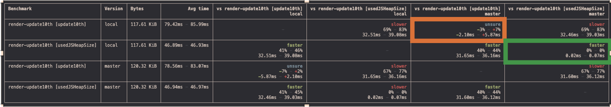

# FAST Benchmarks

This is utility library for creating and running benchmarks for FAST libraries.

Benchmarks from this library are run with the [polymer/tachometer](https://github.com/Polymer/tachometer) package.

## Install

```bash
$ yarn install
```

## Running a Benchmark

You can start by running some benchmarks that are set under the `package.json` file. Or if you are already familiar with running benchmarks, jump straight to [arguments](#arguments).

Let's start by running the **Render** benchmark, and from here we can play with some combination of arugments to statisfy different needs.
```bash
$ yarn run benchmark:fast-element:render
```

This particular script maps to:
```bash
$ yarn run benchmark --library=fast-element --benchmark=render --versions local master --localBenchFile=index2 --operations=update10th
```
This means we are running the **Render** benchmark under the **fast-element** library. 

Then we passed in 2 versions: **local** and **master**. Let's see what these keywords under [Versions](#versions) refer to and other values we can pass in, the _localBenchFile_ argument will also be explained in this section. 

Lastly, we are running the benchmark with the **update10th** operation, jump to [Operations](#operations) to learn more.

### Arguments

| Argument               | Example                                                         | Description                                                                                                                                                                                                                                                                                                                            | Required |
| ---------------------- | --------------------------------------------------------------- | -------------------------------------------------------------------------------------------------------------------------------------------------------------------------------------------------------------------------------------------------------------------------------------------------------------------------------------- | -------- |
| `--library/-l`         | `--library=fast-element`                                        | The Fast library you want to run benchmarks in                                                                                                                                                                                                                                                                                       | Yes      |
| `--benchmark/-b`       | `--benchmark=test`                                              | Benchmark name                                                                                                                                                                                                                                                                                                                         | Yes      |
| `--versions/-v`        | `--versions 1.9.0 master features/feature-1` `--versions=1.9.0` | Supply versions of the library, check available [versions](#versions). Multiple options have to be **delimited by spaces**.| Yes      |
| `--localBenchFile/-lb` | `--localBenchFile=index2`                                       | Name of the local benchmark file **don't include the extension**. This option is only turned on if you've supplied 'local' as one of the versions, check details in [Local Version](#local-version).                                           | No       |
| `--branchName/-bn`     | `--branchName=archives/fast-element-1`                          | Name of the branch name. This option is only turned on if you've supplied 'local' as one of the versions, check details in [Local Version](#local-version).                                           | No       |
| `--operations/-o`      | `--operations=create10k` `--operations create10k update10th`    | Name of operation(s) to run benchmarks against, **don't include the extension**. Multiple options have to be **delimited by spaces**. Defaults to run all possible operations if this argument is not supplied.                                                                                                                                                    | No       |
| `--debug/-d`          | `-d`                                                       | Turn on debug mode. This will not run the benchmarks.                                                                                                                                                                                                                                                                                                | No       |

> Note: Running all possible operations will take an extremely long time. During local development, it is recommend to run one operation at a time to get faster results.


### Versions

Under the versions argument, you can pass in the following values:
1. **Github Branch Name** - these can be any branch that is pushed to Github, including your development branch and the master branch.

   For example:
   ```
   --versions master feature/fast-element-1 users/wendy/test-1
   ```
   The tool will make a reference to the last commit from the branch you passed in. 
   
   This is a screenshot of what that looks like when you run a benchmark:
   

2. **Published library version** - any version that is available for the library you are benchmarking.
    
    [fast-element versions](https://www.npmjs.com/package/@microsoft/fast-element)

    For example:
    ```
    --versions 1.6.0 1.10.0
    ```
3. **Local** - this is a special keyword that allows you to pass in supporting arguments, specifically _--localBenchFile_ and _--branchName_.
   
   For example: 
   ```
   --versions local --localBenchFile=index2 --branchName=users/wendy/test-1
   ```
   
   Since this is a jam packed keyword, I'll give it its own section: [Local Version](#local-version).

### Local Version

   As mentioned above, **local** is a special keyword you can pass into the _--versions_ argument.
   
   By default, it would compile to the current branch you are in. 
   > If your current branch has not been pushed to Github, the test will not be able to run. 
   
   :crystal_ball: Use Case: you want to compare **master** branch with implementation from _index.ts_ and your current branch with same implementation from _index.ts_
      
   To run this, just using the **local** keyword in the versions argument will be sufficient:
   ```bash
   $ yarn run benchmark --library=fast-element --benchmark=render --versions local master --operations=update10th
   ```
   
   
   The _--localBenchFile_ and _--branchName_ are optional arguments you can pass in with the **local** version.
    
   1. **--localBenchFile** - you can pass in a different implementation from the main benchmark file _index.ts_. 
 
      :crystal_ball: Use Case: you want to compare **master** branch with implementation from _index.ts_ and your branch with implementation from _index2.ts_
      ```text
         benchmarks/
         └─ fast-element/
            └─ render/
               └─ index.ts
               └─ index2.ts
      ```
      
      To run this, pass in the name of the file without the .ts extension to the _--localBenchFile_ argument:
      ```bash
      $ yarn run benchmark --library=fast-element --benchmark=render --versions local master --localBenchFile=index2 --operations=update10th
      ```

   2. **--branchName** - you can pass in any branch that has been pushed to Github.

      :crystal_ball: Use Case: you want to compare **master** branch with implementation from _index.ts_ and **archives/fast-element-1** branch with same implementation from _index.ts_
      
      To run this, pass in the name of the specific branch name to the _--branchName_ argument:
      ```bash
      $ yarn run benchmark --library=fast-element --benchmark=render --versions local master --branchName=archives/fast-element-1 --operations=update10th
      ```

### Operations
   
   All available operations can be found under the _src_ folder. This is where the benchmarks are measured using the _Performance API_ for Javascript execution time and _memoery.usedJSHeapSize_ for memory consumption. 

To run this, pass in the name of the operation file without the .js extension to the _--operations_ argument:
   ```bash
   $ yarn run benchmark --library=fast-element --benchmark=render --versions local master --operations=create10k
   ```

## Interpreting Results

We have gone over some combination of benchmarks we can run in [Running a Benchmark](#running-a-benchmark). Let's take a look at how to read these results.

The screenshot below is the result of running this benchmark:

 ```bash
 $ yarn run benchmark --library=fast-element --benchmark=render --versions local master --branchName=archives/fast-element-1 --operations=update10th
 ```



Notice there are 4 rows under **Benchmark**, 2 belong to results from the **local** version and the rest belongs to **master** version. 

1. For the results in [update10th], these show the _Javascript execution time_ it took to run the **render** benchmark with the **update10th** operation.
2. For the results in [usedJSHeadSize], these show the _total memory consumption_ it took to run the **render** benchmark with the **update10th** operation
3. The 3rd column **Bytes** show the total bundle size of the _fast-element_ library for each version.
4. The block that is highlighted with the orange border is where you would look to compare the **local** version _Javascript execution time_ with the **master** version _Javascript execution time_.
     > Detailed Interpretation: **unsure** means there is no significant statistical difference. The next line tells us that the **local** version could be as much as 3% faster, or as much as 7% slower. And the line after that gives a similar analysis but in _ms_ units, that the **local** version could be as much as 2.10ms faster, or as much as 5.87 slower.
5. The block that is highlighted with the green border is where you would look to compare the **local** version _total memory consumption_ with the **master** version _total memory consumption_.
      > Detailed Interpretation: **faster** means there is significant statistical difference. The next couple of lines tell us that the **local** version could be 0% or 0.02ms - 0.07ms faster. 


You can refer to [Interpreting tachometer table results](https://github.com/Polymer/tachometer/blob/main/README.md#interpreting-results) for more information.

## Adding a Benchmark

To add a benchmark, navigate to`/benchmarks` and create a new directory under an existing FAST library folder with the name of your benchmark.

Next, create an `index.ts` file under `/my-benchmark`.

```text
benchmarks/
└─ fast-element/
   └─ my-benchmark/
      └─ index.ts
```

You can use the below template to get started, make sure a custom element named `x-app` is available when you are finished (the generated template will look for `x-app` when compiling the benchmark).

#### index.ts

```ts
import {
    attr,
    customElement,
    FASTElement,
    html,
    observable,
    repeat,
} from "@microsoft/fast-element";
import { data, RandomItem } from "../../../utils/index.js";

@customElement({
    name: "x-item",
    template: html`
        <span>${x => x.value}</span>
    `,
    shadowOptions: {
        delegatesFocus: true,
    },
})
export class XItem extends FASTElement {
    @attr value: string = "";
}

const template = html<XApp>`
    <div>
        ${repeat(
            x => x.items,
            html`
                <x-item :value=${x => x.label}>${x => x.label}</x-item>
            `
        )}
    </div>
`;

@customElement({
    name: "x-app",
    template,
})
class XApp extends FASTElement {
    @observable items: RandomItem[] = data;
}
```

### Available variables from Utils

There is a utility folder called `./utils`, where you have access to the `data` variable, this is an array of _RandomItem_ objects. And `nestedData`, this is an array of _NestedRandomData_ objects. 

#### utils.ts

Some variables you can import into your benchmark.
```ts
...
const itemCount = 1000;
...
export const data: RandomItem[] = generateData(itemCount);
export const nestedData: NestedRandomData[] = generateNestedData(itemCount);

...
```


#### Running tachometer config file manually

To run tachometer manually, you have to generate a tachometer config json file.

Follow the tachometer defined [schema](#https://raw.githubusercontent.com/Polymer/tachometer/master/config.schema.json) and generate a `tachometer.json` in `/fast-element/my-benchmark/`

There is an existing example under `/fast-element/methods/append` that is run manually.

#### tachometer.json

```json
{
    "$schema": "https://raw.githubusercontent.com/Polymer/tachometer/master/config.schema.json",
    "timeout": 0,
    "benchmarks": [
        {
            "name": "my-benchmark",
            "browser": {
                "name": "chrome",
                "headless": true,
                "addArguments": ["--js-flags=--expose-gc", "--enable-precise-memory-info"]
            },
            "measurement": [
                {
                    "name": "usedJSHeapSize",
                    "mode": "expression",
                    "expression": "window.usedJSHeapSize"
                }
            ],

            "expand": [
                {
                    "name": "previous-version",
                    "url": "benchmarks/my-library/my-benchmark/index.html",
                    "packageVersions": {
                        "label": "1.4.0",
                        "dependencies": {
                            "my-library": "1.0.0"
                        }
                    }
                },
                {
                    "name": "local-version",
                    "url": "benchmarks/my-library/my-benchmark/index2.html",
                    "packageVersions": {
                        "label": "local",
                        "dependencies": {
                            "@microsoft/my-library": {
                                "kind": "git",
                                "repo": "https://github.com/microsoft/fast.git",
                                "ref": "my-local-branch",
                                "subdir": "packages/web-components/my-library",
                                "setupCommands": [
                                    "yarn install",
                                    "yarn --cwd ./packages/web-components/my-library build"
                                ]
                            }
                        }
                    }
                }
            ]
        }
    ]
}
```

To run the benchmark, run the command `npx tach --config benchmarks/fast-element/my-benchmark/tachometer.json`


> Note: only the @microsoft/fast-element is supported at this time
