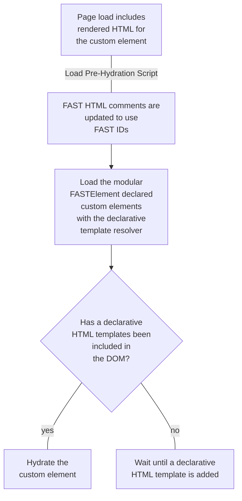

# FAST BTR

[](https://opensource.org/licenses/MIT)

The `@microsoft/fast-btr` package contains a pre-hydration script for HTML rendered in a non-browser environment.

## Requirements

- [NodeJS ^16.0.0](https://nodejs.org)
- [`@microsoft/fast-element@^2.0.0`](https://www.npmjs.com/package/@microsoft/fast-element)

## Design Philosophy

The primary focus of this package is facilitating BTR (Build Time Rendering). This approach does not assume server technology or build time environments and will provide scripts that perform any necessary JavaScript to pre-hydrate the page before JavaScript containing `@microsoft/fast-element` and the definitions of the necessary FAST-based custom elements is loaded.

This approach should focus on flexibility for webapp/website developers and gives them scripts and tools to create rendered HTML. This package will supply a Rust script and template syntax for declarative HTML. One of the goals is to make the `html` tagged template literal an optional inclusion when bundling JavaScript.

## Goals

- Provide a script that resolves a declarative HTML template to a `ViewTemplate`
- Provide a Rust script that will take the declarative HTML syntax and uninitialized custom elements and render them as HTML
- Provide a pre-hydration script that will hydrate comments with proper IDs so that FAST will hydrate the custom elements properly

## Usage

### Initial Rendering

The rendering using the Rust script could look as follows:
```html
<my-custom-element greeting="Hello world" disabled>
    <template shadowrootmode="open">
        <button disabled>
            <!--f-start-->Hello world<!--f-end-->
        </button>
        <input
            value="42"
        >
        <!--f-start-->
        <ul>
            <!--f-start--><li>First</li><!--f-end-->
            <!--f-start--><li>Second</li><!--f-end-->
        </ul>
        <!--f-end-->
        <slot>items 1</slot>
    </template>
</my-custom-element>
```

At some point before the prehydration script and the definition of the custom element is added the following declarative HTML template should be inserted:
```html
<f-template name="my-custom-element">
    <template>
        <button @click="x.handleClick()" ?disabled="x.disabled">
            ${x.greeting}
        </button>
        <input
            :value="x.value"
        >
        <f-when condition="x.hasFriends()">
            <ul>
                <f-repeat items="x.friends">
                    <li>${x.friend}</li>
                </f-repeat>
            </ul>
        </f-when>
        <slot>
            <f-slotted :items="x.items"></f-slotted>
        </slot>
    </template>
</f-template>
```

### Pre-hydration

After the pre-hydration script is loaded in, the comments should update (using the previous example in the initial render) as follows:

```html
<my-custom-element greeting="Hello world" disabled>
    <template shadowrootmode="open">
        <button disabled>
            <!--fe-b$$start$$0$$QYOGJbAbyI$$fe-b-->Hello world<!--fe-b$$end$$0$$QYOGJbAbyI$$fe-b-->
        </button>
        <input
            value="42"
        >
        <!--fe-b$$start$$0$$QYOGJbAbym$$fe-b-->
        <ul>
            <!--fe-b$$start$$0$$QYOGJbAbyn$$fe-b--><li>First</li><!--fe-b$$end$$0$$QYOGJbAbyn$$fe-b-->
            <!--fe-b$$start$$0$$QYOGJbAbyo$$fe-b--><li>Second</li><!--fe-b$$end$$0$$QYOGJbAbyo$$fe-b-->
        </ul>
        <!--fe-b$$end$$0$$QYOGJbAbym$$fe-b-->
        <slot>items 1</slot>
    </template>
</my-custom-element>
```

## FAST Custom Element Lifecycle



### Writing Components

When writing components for BTR or SSR, it is imperative that components are written with styling and rendering of the component to be less reliant on any JavaScript state management. An example of this is relying on `elementInterals` state to style a component. Components should be written with BTR in mind from the beginning.
