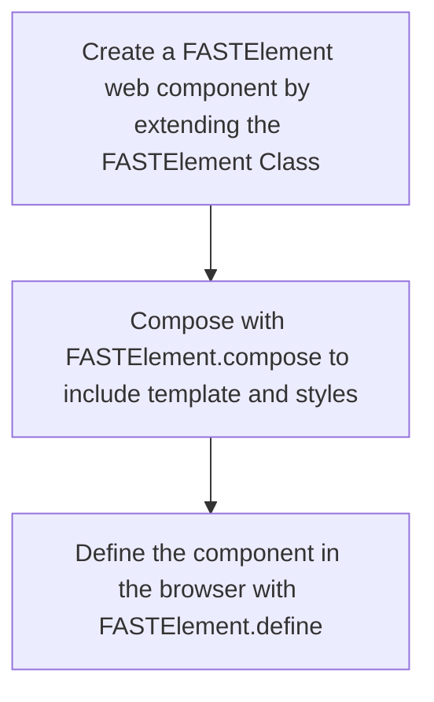
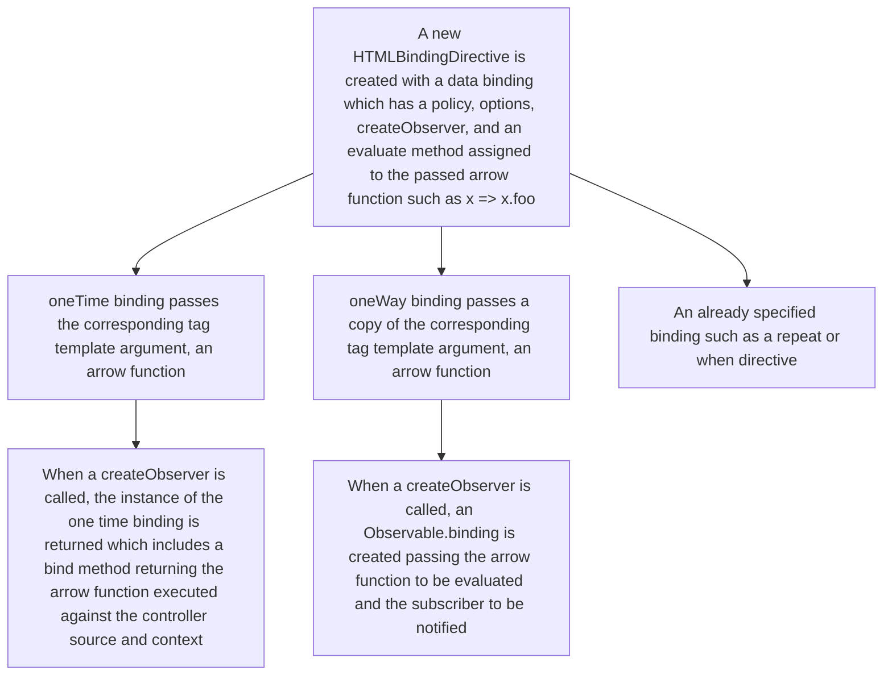
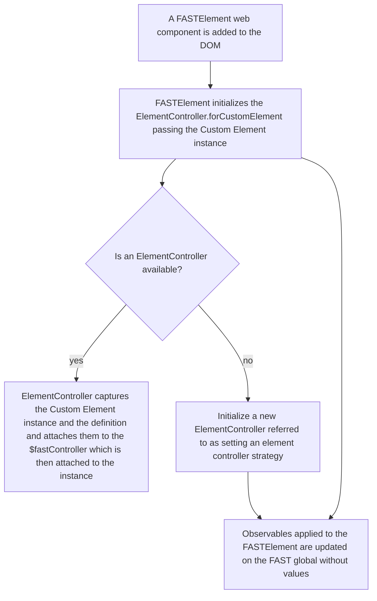
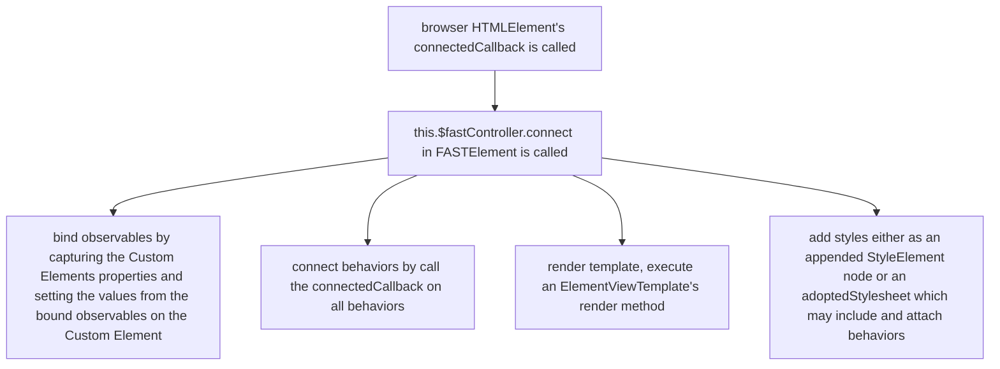
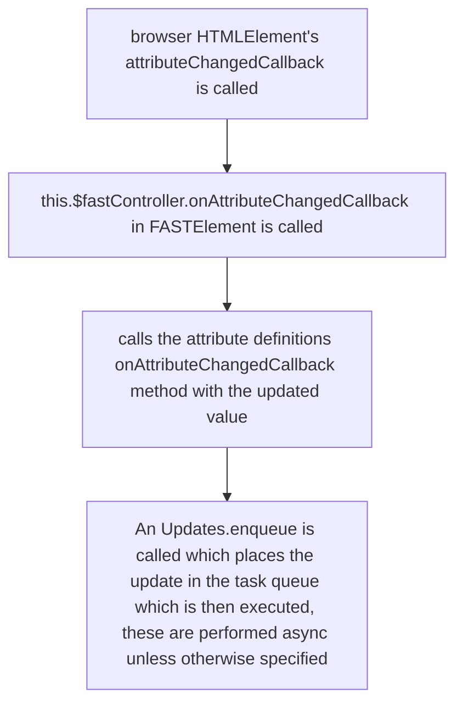

# Architecture

This document explains varous logical flows for how a `FASTElement` is composed, defined, rendered, and updated.

## What is FASTElement?

`FASTElement` is an extension of `HTMLElement` which makes use of Custom Element APIs native to the browser. It also supplies the following methods `compose`, `define`, and `from`.

- The `compose` method combines the Custom Element name, template, style, and other options to create the definition for the Custom Element.
- The `define` method makes use of the native Custom Element `define` to register the Custom Element with a Custom Element Registry.
- The `from` method allows the use of Custom Built-Ins so that a user does not need to define a template but can specify a native `HTMLElement` such as `HTMLButtonElement`.

## Creating a Custom Element from FASTElement

A basic developer flow for defining a custom element looks like this:

Let's take a close look at the compose and define steps to see what the FAST architecture is doing.

## Composing a Custom Element

Using `FASTElement.compose` this creates a new `FASTElementDefinition` which includes all metadata needed for the element such as templates, attributes, styles, etc. this then registers the element with the global FAST for re-use and returns the `FASTElementDefinition` which can be referenced by `ElementController.definition`.

## A Custom Element in JavaScript sent to the Browser

Let's step back from defining the Custom Element and consider what is happening when we import from the `@microsoft/fast-element` package.

First, a global `FAST` property will be created if one does not already exist, typically in browser on the `window`.

Additionally, when Custom Elements are included in a script a few things might happen even before a Custom Element gets detected by the browser. First, there are initial side effects caused by the use of decorators. These include the `attr` and `observable` decorators made available by the `@microsoft/fast-element` package.

### Pre-render Template

The `html` tag template is typically used to create a `ViewTemplate` using the `ViewTemplate.create` method. This is executed and passed during the `compose` step and before `FASTElement` is instantiated.

During the `ViewTemplate.create` step, the following happens for each string:
- Factories with unique IDs are created for each tag template literal argument (or `TemplateValue`) which matches with the corresponding string
- A binding is created from the `TemplateValue`

A resulting string using `createHTML` function is created using the `HTMLDirective`, the previous string from the `html` tag template which determines the aspect if one exists, these aspects are the `@`, `:`, or other binding aspect attached to attributes. The `createHTML` returns a `Markup` attribute using the factory that has a unique ID. This is all concatenated as a string and passed to a new `ViewTemplate` with all the factories (empty until one is assigned) that act as a dictionary with the unique IDs as the key to look up each factory once it has been created.

#### HTML Binding Directives

The `HTMLBindingDirective` applies bindings to items identified as various `TemplateValue` within the `html` tag template. The `createHTML` step uses the factory associated with the binding to create strings in the markup using the factory's ID.

## A Custom Element is Detected by the Browser

Because the `FASTElement` is an extension of the `HTMLElement`, it makes use of the same lifecycle hooks and extends them with `$fastController`. It also initializes using another class `ElementController`, the methods this are called during the custom elements native `constructor`, `connectedCallback`, `disconnectedCallback`, and `attributeChangedCallback` lifecycle hooks.

### 🔄 **Lifecycle**: Initialization

### 🔄 **Lifecycle**: Component is connected

#### Render Template

The rendering of the template on the `ElementController` is by the `renderTemplate` method which is called during the `ElementController.connect` method which is triggered by `HTMLElement`s `connectedCallback` lifecycle.

The `renderTemplate` identifies the Custom Element, and the shadow root associated with the Custom Element. This then places a rendering of the template (an `ElementView`) onto the internal `view` of the controller. When creating the `ElementView`/`HTMLView` using the `ViewTemplate.render`, the `Compile.compile` identifies a `DocumentFragment` either by using an existing `<template>` tag, or creating one to wrap the contents of the shadow root. A new `CompilationContext` is created and the `compileAttributes` function is called, this results in the replacement of the placeholder attributes initally set-up during the pre-render step with their values if a value has been assigned. The factories with the associated nodes identified are then passed to the context. The view then binds all behaviors to the source element. The `CompilationContext.createView` is executed with the `DocumentFragment` as the root, and returns an `HTMLView`. This `HTMLView` includes an `appendTo` method to attach the fragment to the host element, which it then does. It should be noted that the compiled HTML is a `string`, which when set on the `DocumentFragment` as `innerHTML`, this allows the browser to dictate the creation of HTML nodes.

### 🔄 **Lifecycle**: Component is disconnected

When a component is disconnected, a cleanup step is created to remove associated behaviors.

### 🔄 **Lifecycle**: Attribute has been changed

Attributes have an `AttributeDefinition` which allows for converters, attachment of the `<attributName>Changed` aspect of the `@attr` decorator among other capabilities.

These changes are observed and similar to the way `Observables` work, they utilize an `Accessor` pattern which has a `getValue` and `setValue` in which DOM updates are applied.

### Observables are updated

The `Reflect` API is used to override `defineProperty` in order to observe a property on an Custom Element, this overrides the getter and setter, which allows subscribers to be notified of changes. Any changes which `set` the value are passed to the `Updates` queue which has been added to the FAST Global.