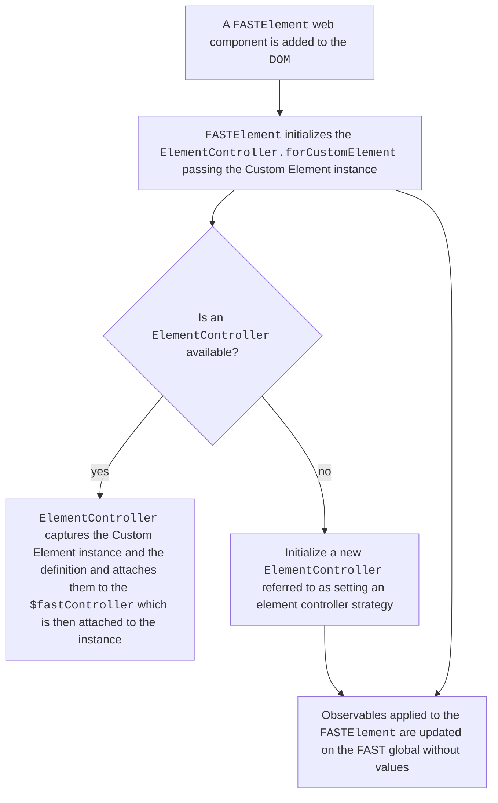
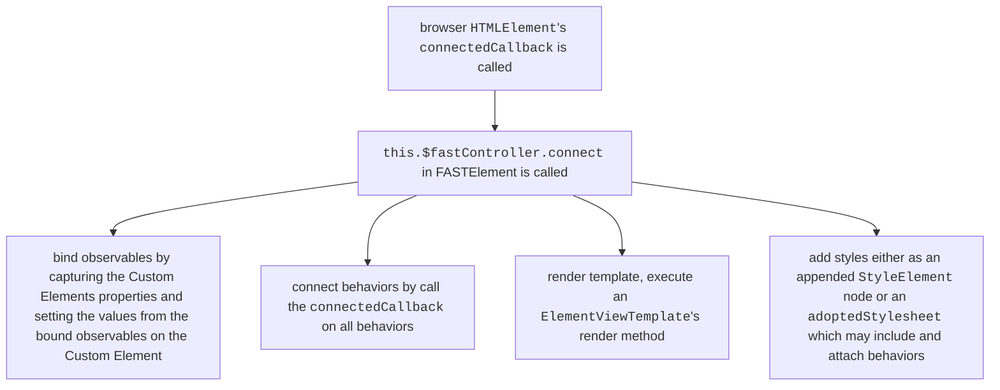
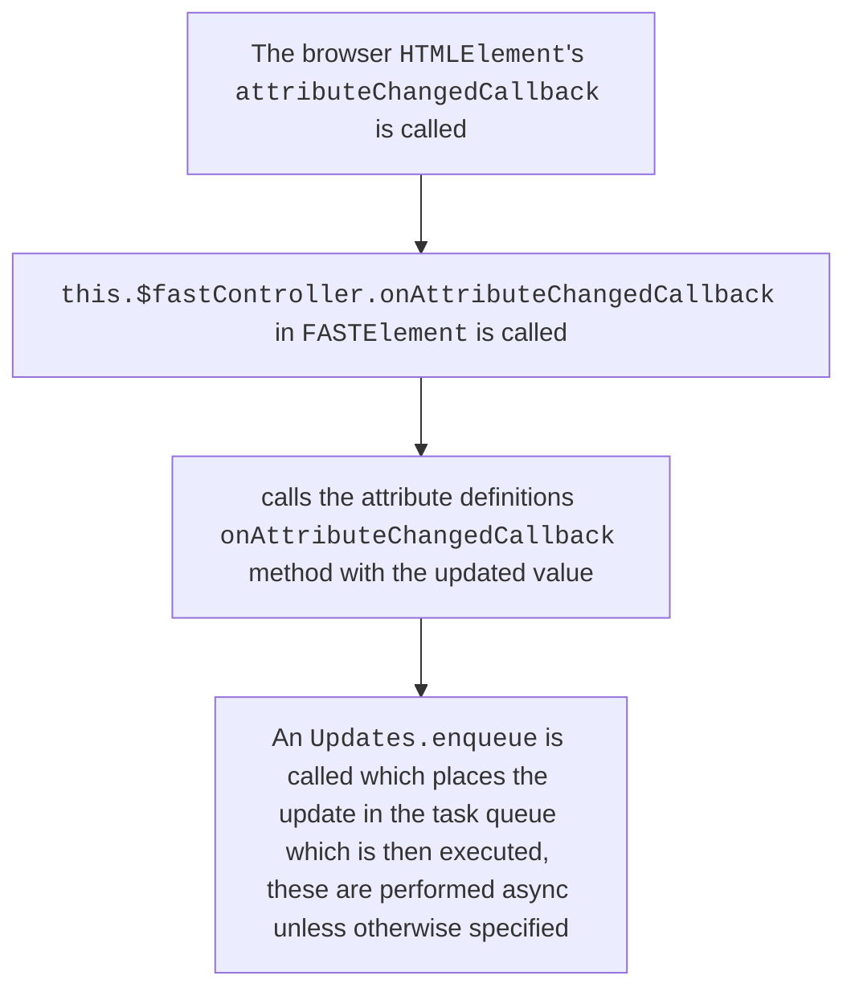

# FASTElement

The `FASTElement` is our extension of the `HTMLElement`. As such it leverages the lifecycles but also requires additional setup before before the class `constructor` or the `connectedCallback` method is executed which are explained in the [overview](./ARCHITECTURE_OVERVIEW.md). This document explains specifically what `FASTElement` leverages inside the `HTMLElement`s lifecycle hooks.

For an explanation into `HTMLElement` lifecycle hooks refer to the [MDN documentation](https://developer.mozilla.org/en-US/docs/Web/API/Web_components/Using_custom_elements#custom_element_lifecycle_callbacks).

## A Custom Element is Detected by the Browser

Because the `FASTElement` is an extension of the `HTMLElement`, it makes use of the same lifecycle hooks and extends them with `$fastController`. It also initializes using another class `ElementController`, the methods this are called during the custom elements native `constructor`, `connectedCallback`, `disconnectedCallback`, and `attributeChangedCallback` lifecycle hooks.

### 🔄 **Lifecycle**: Initialization

### 🔄 **Lifecycle**: Component is connected

#### Render Template

The rendering of the template on the `ElementController` is by the `renderTemplate` method which is called during the `ElementController.connect` method which is triggered by `HTMLElement`s `connectedCallback` lifecycle.

The `renderTemplate` identifies the Custom Element, and the shadow root associated with the Custom Element. This then places a rendering of the template (an `ElementView`) onto the internal `view` of the controller. When creating the `ElementView`/`HTMLView` using the `ViewTemplate.render`, the `Compile.compile()` method identifies a `DocumentFragment` either by using an existing `<template>` tag, or creating one to wrap the contents of the shadow root. A new `CompilationContext` is created and the `compileAttributes` function is called, this results in the replacement of the placeholder attributes initally set-up during the pre-render step with their values if a value has been assigned. The factories with the associated nodes identified are then passed to the context. The view then binds all behaviors to the source element. The `CompilationContext.createView` is executed with the `DocumentFragment` as the root, and returns an `HTMLView`. This `HTMLView` includes an `appendTo` method to attach the fragment to the host element, which it then does. It should be noted that the compiled HTML is a `string`, which when set on the `DocumentFragment` as `innerHTML`, this allows the browser to dictate the creation of HTML nodes.

### 🔄 **Lifecycle**: Component is disconnected

When a component is disconnected, a cleanup step is created to remove associated behaviors.

### 🔄 **Lifecycle**: Attribute has been changed

Attributes have an `AttributeDefinition` which allows for converters, attachment of the `<attributName>Changed` aspect of the `@attr` decorator among other capabilities.

These changes are observed and similar to the way `Observables` work, they utilize an `Accessor` pattern which has a `getValue` and `setValue` in which DOM updates are applied.