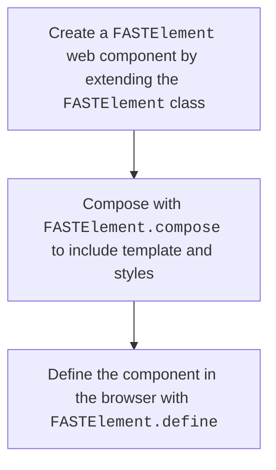
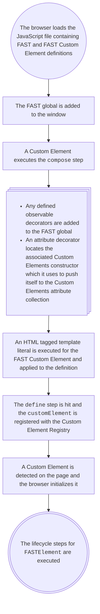

# General FAST usage

`FASTElement` is an extension of `HTMLElement` which makes use of Custom Element APIs native to the browser. It also supplies the following methods:

- The `compose` method combines the Custom Element name, template, style, and other options to create the definition for the Custom Element.
- The `define` method makes use of the native Custom Element [`define()`](https://developer.mozilla.org/en-US/docs/Web/API/CustomElementRegistry/define) to register the Custom Element with a Custom Element Registry.
- The `from` method allows the use of Customized Built-in elements, which extend from native elements such as `HTMLButtonElement`.

### Creating a Custom Element from FASTElement

A basic developer flow for defining a custom element looks like this:

Let's take a look at the compose step to see what the FAST architecture is doing at this stage.

### Composing a Custom Element

The `FASTElement.compose()` function creates a new `FASTElementDefinition`, which includes all metadata needed for the element (such as templates, attributes, and styles). The element definition is registered with the global `FAST` for re-use, and the `FASTElementDefinition` is returned. The resulting object can be retrieved via `ElementController.definition`.

## A Custom Element in JavaScript is sent to the Browser

Let's step back from defining the Custom Element and consider what is happening when we import from the `@microsoft/fast-element` package.

First, a global `FAST` property will be created if one does not already exist, typically in browser on the `window`.

Additionally, when Custom Elements are included in a script a few things might happen even before a Custom Element gets detected by the browser. First, there are initial side effects caused by the use of decorators. These include the `attr` and `observable` decorators made available by the `@microsoft/fast-element` package.

Here is a basic flow of what code is executed and when during initial load of a script that contains a FAST defined Custom Element:

