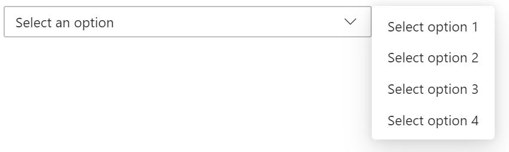

# Anchored region

## Overview

An *anchored region* is a container component which enables authors to create layouts where the contents of the anchored region can be positioned relative to another "anchor" element.  Additionally, the *anchored region* can react to the available space between the anchor and a parent ["viewport"](https://developer.mozilla.org/en-US/docs/Glossary/viewport) element such that the region is placed on the side of the anchor with the most available space, or even resize itself based on that space.

### Use Cases

It is envisioned that this component would be used as a building block for other components in this library that need to position elements relative to another HTMLElement(select, flyout, tooltip, etc) as well as being available for standalone use in responsive layouts.

### Features

- **Relative positioning:** 
Authors can use it to position an element relative to another another element, like enabling a menu to open above or below a trigger button. Additionally, the same anchored region can change which element it is anchored to dynamically, for example a single tooltip instance in a page could be positioned next to any other element on the page by switching the anchor property of the anchored region that contains it.

- **Responsive positioning:** 
Authors can use it to position an element relative to another element based on available space, for example a menu could open upwards if the trigger button is near the bottom of the page, and downwards if it is nearer the top.  Authors can call the component's update() function to reevaluate positioning.

- **Responsive scaling:** 
Authors can use it to create a layout region that dynamically sizes depending on space between the anchor and the viewport elements.

- **Auto updating**
Authors can control when the component updates its position after the initial render.

For a more in-depth understanding of how this component works under the covers please refer to the [intersection observer api](https://developer.mozilla.org/en-US/docs/Web/API/Intersection_Observer_API). 


### Risks and Challenges
- must keep an eye on performance

---

## Design

### Relative placement: 'Inset' vs 'Adjacent';
By default the anchored region is positioned adjacent to the element it is anchored to, but if the "horizontal-inset" or "vertical-inset" attributes are set then the region will be 'inset' and overlap the anchor on that axis.  Various combinations of these attributes can enable some commonly desired layouts.  In the following images the menu would be considered to be the *anchored region* and the "Select an option" button the anchor.

| State | Image |
| ----- | ----- |
| Adjacent vertically and inset horizontally can be used for a typical drop down menu: |  |
| Inset vertically and adjacent horizontally positions the region to the side of the anchor button: |  |
| Inset on both axis positions the region so that it overlaps the anchor: |  |
| Adjacent on both axis positions the region diagonally to the anchor: | |


### Markup Examples
(note: examples are for the vertical axis, equivalent is true for horizontal)

A region that always renders above the anchor element.
```
<div id="viewport">
    ...stuff...
    <button id="anchor">
        Button is an anchor
    </button>
    <fast-anchored-region
        anchor="anchor"
        vertical-positioning-mode="locktodefault"
        vertical-default-position="top"
    >
      This shows up above the button
    </fast-anchored-region>
    ...stuff...
</div>

```

A region that renders above or below the anchor depending on available space.
```
<div id="viewport">
    ...stuff...
    <button id="anchor">
        Button is an anchor
    </button>
    <fast-anchored-region
        anchor="anchor"
        vertical-positioning-mode="dynamic"
    >
      This shows up above or below the anchor depending on available space
    </fast-anchored-region>
    ...stuff...
</div>

```

A region that renders above or below the anchor depending on available space but only on initial layout.
```
<div id="viewport">
    ...stuff...
    <button id="anchor">
        Button is an anchor
    </button>
    <fast-anchored-region
        anchor="anchor"
        vertical-positioning-mode="onetime"
    >
      This shows up above or below the anchor depending on available space
    </fast-anchored-region>
    ...stuff...
</div>

```

A region that overlaps the anchor and renders above or below it depending on available space.

```
<div id="viewport">
    ...stuff...
    <button id="anchor">
        Button is an anchor
    </button>
    <fast-anchored-region
        anchor="anchor"
        vertical-positioning-mode="dynamic"
        vertical-inset="true"
    >
      This overlaps the anchor and extends above or below it depending on available space.
    </fast-anchored-region>
    ...stuff...
</div>

```

A region renders above or below the anchor based on available space and is sized to match the available.

```
<div id="viewport">
    ...stuff...
    <button id="anchor">
        Button is an anchor
    </button>
    <fast-anchored-region
        anchor="anchor"
        vertical-positioning-mode="dynamic"
        vertical-scaling-enabled="true"
    >
       This region renders above or below the anchor based on available space and sizes itself to match.
    </fast-anchored-region>
    ...stuff...
</div>

```

A region that renders below the anchor until that space is less than 100px.
```
<div id="viewport">
    ...stuff...
    <button id="anchor">
        Button is an anchor
    </button>
    <fast-anchored-region
        anchor="anchor"
        vertical-positioning-mode="dynamic"
        vertical-default-position="below"
        vertical-threshold="100"
    >
      This shows renders below the anchor as long as there is at least 100px available there.
    </fast-anchored-region>
    ...stuff...
</div>
```

The anchored region can be configured to scale to either the size of the content in its slot, to the size of the element it is anchored to, or the available space between the anchor and the edge of the viewport element by setting the vertical/horizontal scaling attribute:
- "anchor" - size to match anchor
- "fill" - size to match space between the anchor and the viewport edge.  When the region is centered it will scale to remain centered on the anchor but remain inside the viewport, when centered with viewport lock the region will fill the viewport on that axis.
- "content" - the default, matches the size of the content in the region's slot. 

The dimensions of the anchored region will match the dimensions of the content unless scaling is enabled on a particular axis (verticalscalingenabled & horizontalscalingenabled) in which case it will fill all available space between the anchor and viewport.

The component allows users to set a "Positioning Mode" on each axis which defines how the component will behave:
- 'uncontrolled':  The anchored region will appear as it normally would in document flow.
- 'locktodefault': The anchored region will always be placed in the specified default position regardless of available space.  For example a menu that always opens upwards.
- 'dynamic': The anchored region is placed relative to the anchor element based on how much space is available between it and the viewport.  For example a menu that opens opens upwards when it is near the bottom of the page, and downwards when near the top.  When the region's default position is set to 'center' dynamic positioning mode has no effect (ie. the region is always centered).

### API

NOTE: this component api will not be exposed outside of the fast-components package until we are satisfied that we have the correct implementation for this functionality.  

*Component name:*
- `fast-anchored-region`

*Attributes:*
- anchor - The html id of the HTMLElement used as the anchor around which the positioning region is placed.  This must be set for the component's positioning logic to be active. The component will first check for the element id in the local shadow DOM followed by the document light DOM.

- viewport - The ID of the HTMLElement to be used as the viewport used to determine available layout space around the anchor element.  If unset the parent element of the anchored region is used.

- horizontal-positioning-mode - Can be 'uncontrolled', 'locktodefault' or 'dynamic'.  Default is 'uncontrolled'.
- horizontal-default-position - Can be 'start', 'end', 'left', 'right', 'center' or 'unset'.  Default is 'unset'. When default position is set to 'center' the 'dynamic' positioning mode has no effect.
- horizontal-inset - Boolean that indicates whether the region should overlap the anchor on the horizontal axis. Default is false which places the region adjacent to the anchor element.
- horizontal-threshold - Numeric value that defines how small in pixels the region must be to the edge of the viewport to switch to the opposite side of the anchor. The component favors the default position until this value is crossed.  When there is not enough space on either side or the value is unset the side with the most space is chosen.
- horizontal-scaling - Can be "anchor", "fill" or "content". Default is "content" 

- vertical-positioning-mode - Can be 'uncontrolled', 'locktodefault' or 'dynamic'.  Default is 'uncontrolled'.
- vertical-default-position - Can be 'top', 'bottom', 'center' or 'unset'. Default is unset.  When default position is set to 'center' the 'dynamic' positioning mode has no effect.
- vertical-inset - Boolean that indicates whether the region should overlap the anchor on the vertical axis. Default is false which places the region adjacent to the anchor element.
- vertical-threshold - Numeric value that defines how small the region must be to the edge of the viewport to switch to the opposite side of the anchor. The component favors the default position until this value is crossed.  When there is not enough space on either side or the value is unset the side with the most space is chosen.
- vertical-scaling - Can be 'anchor', 'fill' or 'content'. Default is 'content' 
- auto-update-mode - Can be 'anchor' or 'auto'. Default is 'anchor'. In 'anchor' mode only anchor resizes and attribute changes will provoke an update.  In 'auto' mode the component also updates because of - any scroll event on the document, window resizes and viewport resizes. Authors can always provoke an update via the 'update()' function.

*Properties:*
- anchorElement - Holds a reference to the HTMLElement currently being used as the anchor.  Can be set directly or be populated by setting the anchor attribute.

- viewportElement - Holds a reference to the HTMLElement currently being used as the viewport.  Can be set directly or be populated by setting the anchor attribute.

*Slots:*
- default slot for content

*functions:*
- updateAnchorOffset = (
    horizontalOffsetDelta: number,
    verticalOffsetDelta: number
) 

*Events:*
- loaded - The contents of the anchored region are loaded into the DOM.
- positionchange - The positioning of the anchored region has changed.


Enables developers to update the offset between the anchor and the region as it changes,  for example to promt layout recalculations as a result of scrolling so a scaling region tracks the viewport boundary.  


### Anatomy and Appearance
**Structure:**

The anchored region is essentially a container around the slotted items.

```
    <template>
        ${when(
            x => x.initialLayoutComplete,
            html<AnchoredRegion>`
                <slot></slot>
            `
        )}
    </template>
```

## Implementation

### States
Positioning update checks in the component happen when:
- an attribute or property is changed on the component
- the component's "update()" function is called
- resize observer reports a resize event on the anchor or the component itself.

These layout checks analyse the DOM geometry based on callbacks and repositions the anchored region appropriately: top/bottom/unset for the vertical axis and left/right/unset for the horizontal axis. 

The component will have an initialization state to determine placement where the instantiation of content will be delayed by one frame to give the component a chance to get placed correctly.  This is to avoid content triggering the browser's scroll into view behavior prematurely if a contained element gains focus immediately.

### Accessibility
None required.  Basically a positioned div that authors can decorate for accessibility if required.

### Globalization
Authors may want to change default position from left to right or vice versa based on rtl settings, but that can't be predicted by the component itself.

### Performance
The component uses [IntersectionObserver](https://developer.mozilla.org/en-US/docs/Web/API/IntersectionObserver) events to determine positioning rather than more demanding calls to getBoundingClientRect.  Further performance improvements, like perhaps sharing a singleton intersection observer instance across anchored regions, should be considered.

### Dependencies
[IntersectionObserver api](https://developer.mozilla.org/en-US/docs/Web/API/IntersectionObserver) is unsupported on IE, and [ResizeObserver](https://developer.mozilla.org/en-US/docs/Web/API/ResizeObserver) is unsupported on IE, Safari and Firefox.  Both are required by the component.  Authors who wish to use this component on these platforms will need to use polyfills.


### Test Plan
TBD

## Next Steps
- investigate perf improvements
