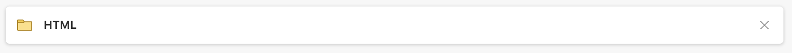
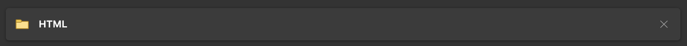
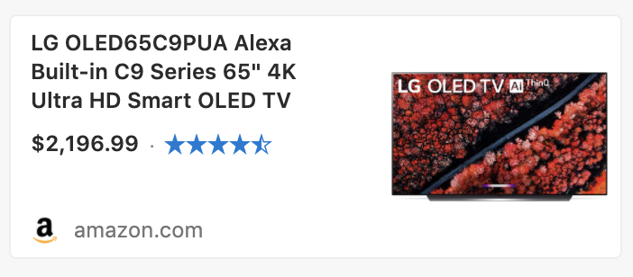
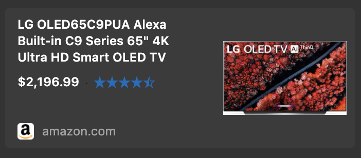

# Card

## Overview

*Cards* are snapshots of content that are typically used in a group to present collections of related information. They can represent any quickly consumable information.

### Features

- **Sizing:** Users want to be able to set the width and height of a single card or a set of cards.

- **Elevation:** Users may want to set different elevations of a single card or a set of cards based on context, state (such as hover), etc.

### Prior Art/Examples
- [FAST (React)](https://explore.fast.design/components/card)

**Cards are a building block used to compose examples like those below:

| Examples | light | dark |
| ----- | ----- | ----- |
| favorite |  | 
| content |  |  |
| shopping |  |  |

---

## Design

### API

*Component name:*
- `fast-card`

*Attributes:*
- none

*CSS custom properties:*
- width
- height
- elevation

*Slots:*
- default slot for content

### Anatomy and Appearance
**Structure:**
```
<div class="root">
    <slot></slot>
</div>
```

**Appearance:**

Parts:
- root - the root of the card

---

## Implementation

### Accessibility

There are currently no accessibility requirements for the card.

### Globalization

The component visuals should not change when in RTL scenarios.

### Test Plan

While testing is still TBD for our web components, I would expect this to align with the testing strategy and not require any additional test support.
