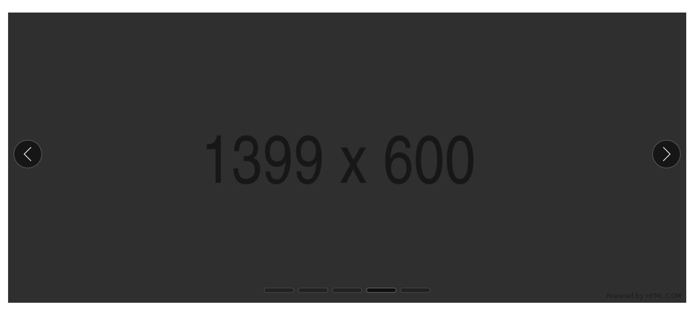

# Carousel

## Overview

As defined by the W3C:
> A carousel [aka Slideshow, Image Rotator] presents a set of items, referred to as slides, by sequentially displaying a subset of one or more slides. Typically, one slide is displayed at a time, and users can activate a next or previous slide control that hides the current slide and "rotates" the next or previous slide into view. In some implementations, rotation automatically starts when the page loads, and it may also automatically stop once all the slides have been displayed. While a slide may contain any type of content, image carousels where each slide contains nothing more than a single image are common.
>


### Use Cases

- Jeff is looking for an apartment and wants to see what the apartment looks like, so he clicks on the main image and a carousel appears allowing him to rotate through the images of the apartment.

- Jess is checking out the latest news from her favorite website and quickly sees the main headlines of the day at the top of the webpage as they rotate headline by headline across the page.

### Features

- **Next and Previous Controls:** Simple buttons [aka flippers] that allow for control of displaying the next and previous slides.

- **Rotation COntrol:** Simple button controlling the start and stop of automatic slide rotation.

- **Slide Picker:** A control or group of controls that allows the specific choice of slide to display, labeled as the tab list. The default for this can be generated using the `slotted` and `repeater` directives.

- **Autoplay:** Allows the carousel to begin rotating through slides automatically after the carousel loads. Autoplay can be toggled on/off with a button, and automatically stops when any element in the carousel receives keyboard focus or is hovered over.

- **Looping:** Allows the user to navigate from the first slide to the last if the previous button is activated. If on the last slide the user can navigate from the last slide to the first when the next button is activated.

- **CarouselElement:** Provides a reference to the currently active slide from the `change` event.

- **ActiveSlideId:** Provides a way to set the active slide.


### Prior Art/Examples
- [FAST Carousel (React)](https://www.npmjs.com/package/@microsoft/fast-components-react-msft)
- [W3C](https://w3c.github.io/aria-practices/examples/carousel/carousel-1.html)

---

## Design

### API

*Component name:*
- `fast-carousel`

*Attributes & Properties:*
- `autoplay` - boolean value to toggle if the carousel plays on load or not (defaults to false)
- `autoplay-interval` - a number representing the autoplay interval in milliseconds
- `loop` - boolean value to toggle if the carousel loops slides at the beginning or end (defaults to true)
- `aria-labelledby` - optional based on implementation**
- `aria-label` - optional, based on implementation**
- `paused` - boolean whether the rotation is paused or not
- `activeslideid` - string
- `basicpattern` - boolean whether or not the carousel follows the basic or tabbed pattern per ARIA spec, defaults to tabbed when basicpattern is false

** See the [W3C Specification](https://w3c.github.io/aria-practices/#wai-aria-roles-states-and-properties-4) for requirements and details.


*Slots:*
- `items` - slot for slide content for basic pattern
- `play-toggle` - the control to toggle if the slides rotate or not
- `next-button` - the control used to rotate to the next slide
- `previous-button` - the control used to rotate to the previous slide
- `tab` - slot used for tabs of tabbed pattern
- `tabpanel` - slot used for tabpanels of tabbed pattern

*Events*
- `change` - callback fired when the slide changes. Passes a reference to the carousel, which allows the play/pause state and `activeslideid` to be read by the author from the reference element, e.g. event.target.paused, event.target.activeslideid

### Anatomy and Appearance
**Structure:**

Note: The template will use the *when* directive to switch between Basic and Tabbed patterns, patterns per ARIA spec.
```html
<!-- basic shadow dom -->
<div
    class="carousel"
    aria-roledescription="carousel"
    tabindex="-1"
>
    <slot name="previous-button">
        <fast-flipper direction={FlipperDirection.previous} />
    </slot>
    <slot name="next-button">
        <fast-flipper direction={FlipperDirection.next} />
    </slot>
    <slot name="rotation-control"> Default Play Toggle </slot>
    <slot name="items">Slide content / items go here. Use multiple item slots to add multiple slides.</slot>
</div>
<!-- basic shadow dom -->

<!-- tabbed shadow dom -->
<div
    class="carousel"
    aria-roledescription="carousel"
    tabindex="-1"
>
    <slot name="previous-button">
        <fast-flipper direction={FlipperDirection.previous} />
    </slot>
    <slot name="next-button">
        <fast-flipper direction={FlipperDirection.next} />
    </slot>
    <slot name="rotation-control"> Default Play Toggle </slot>
    <slot name="tab">Tabs go here</slot>
    <slot name="tabpanel">Tabpanels with *Slide Content* go here</slot>
</div>
<!-- tabbed shadow dom -->
```

**Implementation**
Note: Next and previous buttons will use the fast-flipper as default so the slots will not be required unless a custom one is passed. This example shows custom simple buttons being used.

```html
<!-- basic implementation -->
    <fast-carousel
        autoplay="true"
        autoplay-interval="6500"
        paused
        aria-labelledby="some element id"
        aria-label="some label"
        basic-pattern
    >
        
        <p slot="item"> Lorem ipsum... </p> 
        <div slot="item"> some elements... </div>

        <button
            slot="next-button"
            class="next-button"
        >
            <svg class="flipper-svg">
                <path d="example path..." />
            </svg>
        </button>

        <button
            slot="previous-button"
            class="previous-button"
        >
            <svg class="flipper-svg">
                <path d="example path..."></path>
            </svg>
        </button>

        <button
            slot="rotation-control"
            class="previous-button"
        >
            <svg class="play-svg">
            <path d="example path..."></path>
            </svg>
        </button>
    </fast-carousel>
<!-- basic implementation -->

<!-- tabbed implementation -->
    <fast-carousel
        autoplay="true"
        autoplay-interval="6500"
        loop="true"
        paused
        aria-labelledby="some element id"
        aria-label="some label"
    >
        <fast-tab></fast-tab>
        <fast-tab></fast-tab>
        <fast-tab></fast-tab>
        <fast-tab-panel>
            
        </fast-tab-panel>
        <fast-tab-panel>
            <p slot="item"> Lorem ipsum... </p> 
        </fast-tab-panel>
        <fast-tab-panel>
            <div slot="item"> some elements... </div>
        </fast-tab-panel>
        <button
            slot="next-button"
            class="next-button"
        >
            <svg class="flipper-svg">
                <path d="example path..." />
            </svg>
        </button>

        <button
            slot="previous-button"
            class="previous-button"
        >
            <svg class="flipper-svg">
                <path d="example path..."></path>
            </svg>
        </button>

        <button
            slot="rotation-control"
            class="previous-button"
        >
            <svg class="play-svg">
            <path d="example path..."></path>
            </svg>
        </button>
    </fast-carousel>
<!-- tabbed implementation -->


```

**Appearance:**
| State | Image |
| ----- | ----- |
| default |  |
| dark mode |  |

Parts:
- carousel - the container for all the elements
- carousel-item - the container for an item as content
- play-toggle
- next-button
- previous-button
- tab-list - control to select specific slides


---

## Implementation

### States

- `paused` - if the carousel slide rotation is paused
- `carouselElement` - Holds a reference to the HTMLElement that is the carousel for paused, activeslideid to be referenced.
- `activeslideid` - the active slide id, can be passed by author to take control of the focused slide.

### Accessibility

The carousel should align to the basic and tabbed design patterns and interaction models provided by the W3C: https://w3c.github.io/aria-practices/#carousel

### Globalization

The component may have to change the order of rotation for slides as an RTL users sequence expectations is reversed from LTR. This would require that the next and previous buttons and tab-list be functionally reversed. The tab-list would also have to be visually reversed with the first tab item starting on the right of the tab-list.

### Test Plan


### Documentation

This will most likely require some extra documentation to make the implementation clear for the developer.

---

## Resources

[W3C Spec](https://w3c.github.io/aria-practices/#carousel)

[W3C Accessible Carousel Example](https://w3c.github.io/aria-practices/examples/carousel/carousel-1.html)

[MDN Web Components Editable List Example](https://github.com/mdn/web-components-examples/tree/master/editable-list)
