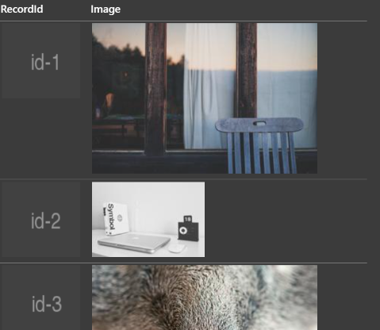
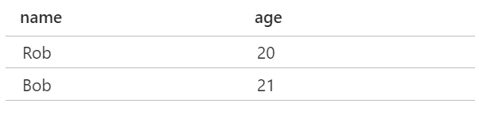
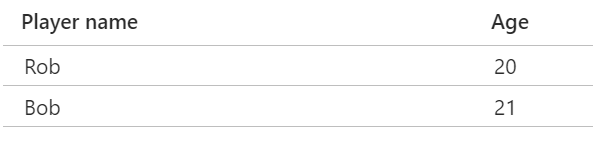

# Data Grid

## Overview

The `data grid` component enables authors to display an array of data in a tabular layout.  The layout can include a "header" region where a title can be displayed for each column.  



`Data grid` actually consists of a number of components that work together:
- `<data-grid>`:  The top level container element
- `<data-grid-header>`: Displays column titles
- `<data-grid-header-cell>`: Displays the title for a single column of cells
- `<data-grid-row>`: Displays a single row of data associated with a single record
- `<data-grid-cell>`: Displays a single cell of data within a row

### Use Cases
Any time an author wants to display tabular data.

### Non-goals
- The initial version of the component will not support virtualization or pagination to display large data sets but should be architected to support both in the future.
  
### Features
- Generate a data grid layout based on provided data.
- Authors can take advantage of multiple customization points to control the grid display.
- Manage keyboard navigation across the grid.

### Risks and Challenges
- It is not yet clear how cells with focusable children work.
- Unique identifiers are not required per row/data item, this may cause an unstable relationships between data rows and component representations.

### Prior Art/Examples

[FAST React](https://github.com/microsoft/fast-react/tree/master/packages/react/fast-components-react-msft/src/data-grid)

[Infragistics](https://www.infragistics.com/products/ignite-ui-web-components/web-components/components/data-grid.html#:~:text=%20Data%20Grid%20Overview%20%201%20Demo.%20,Components%20data%20grid%20to%20the%20above...%20More%20)

[Smart](https://www.htmlelements.com/docs/grid/)

[Vaadin](https://vaadin.com/components/vaadin-grid)

[Open UI](https://open-ui.org/components/table)


---

## Design

The Fast **data grid** enables a high degree of customizability. In addition to the base css styling that can be applied to the grid and its sub-components, authors can choose the templates applied to grid and header cells on a per column basis using the properties of `DataGridColumn`. Additionally, authors can specify the templates used during the creation of rows and cells from data sources through the item template properties of the grid and row components (`rowItemTemplate` and `cellItemTemplate`).  Finally, authors can add elements they create and manage themselves through the various element slots.

### API

#### The DataGridColumn interface

Most **data grid** components use the `DataGridColumn` interface.  A `DataGridColumn` is an object that describes the properties of a single column in the grid as follows:

- `columnDataKey`: A string that identifies which data item should be shown in the column.  For example, if the source data had a field called "Name" the `columnDataKey` for the column that displays the values for "Name" would be "Name".

- `title`:  The title of the column, if not provided the `columnDataKey` is used instead.

- `columnWidth`:  The width of the column as they would be expressed for a [CSS grid-template-columns](https://developer.mozilla.org/en-US/docs/Web/CSS/grid-template-columns).  Under the covers `data-grid` uses these values to construct the rows using css grid layout.

- `headerCellTemplate`:  Custom [template](https://fast.design/docs/fast-element/declaring-templates) to use for header cells of this column.

- `cellTemplate`:  Custom [template](https://fast.design/docs/fast-element/declaring-templates) to use for data cells of this column.

Authors can hook up custom events to html elements within cell templates in order to enable user interaction with grid data.

For example a button handler on a `cellTemplate` could be implemented with a click event that calls back to the author's own function:

```html
    <template>
        <button @click="${x => myCustomHandler()}">
            ${x =>
                x.rowData === null ||
                x.columnData === null ||
                x.columnData.columnDataKey === null
                    ? null
                    : x.rowData[x.columnData.columnDataKey]}
        </button>
    </template>
```

**Data grid**
- `<fast-data-grid>`

*Attributes:*
- `generateHeader`  
Boolean.  Automatically generate a header element based on provided columns. Default is true.  Authors who wish to not have a header row or wish to generate their own can set this to false.

*properties:*
- `rowsData`  
An array of objects that contain the data to be displayed.  Each object corresponds to one row.

- `columnsData`  
An array of `DataGridColumn` objects that define what columns will be displayed in the grid.  The order of the columns determines their order in the grid.

- `rowItemTemplate`  
Custom [template](https://fast.design/docs/fast-element/declaring-templates) to use when generating rows by iterating over data.  The default template uses `fast-data-grid-row`, this is where authors change that.

- `focusRowIndex`
The index of the row that will receive focus the next time the grid is focused. This value changes as focus moves to different rows within the grid.  Changing this value when focus is already within the grid moves focus to the specified row.  

- `focusColumnIndex`
The index of the column that will receive focus the next time the grid is focused. This value changes as focus moves to different rows within the grid.  Changing this value when focus is already within the grid moves focus to the specified column.

*Slots:*
- `default`  
Custom generated rows can be placed here

- `header`
Items added here are added to the header region of the component.

*Functions:*
- `generateColumns(object): DataGridColumn`   
Static function that creates a basic set of columns from an object representing a row.  

*Events*
- none

*parts:*
- `headerSlot`

- `rowsSlot`


**Data grid header**
- `<fast-data-grid-header>`

*Attributes:*
- none

*properties:*
- `columnsData`  
An array of `DataGridColumn` objects that define what columns will be displayed in the grid.  The order of the columns determines their order in the grid.

- `headerCellItemTemplate`  
Custom [template](https://fast.design/docs/fast-element/declaring-templates) to use when generating header cells by iterating over data.  The default template uses `fast-data-grid-header-cell`, this is where authors change that.

*Slots:*
- `default`  
Default slot for items

*Events*
- none

*parts:*
- `headerCellsSlot`


**Data grid header cell**
- `<fast-data-grid-header-cell>`

*Attributes:*
- extends HTML Element attributes

*properties:*
- `columnData`  
The `DataGridColumn` this column header represents.

*Slots:*
- `default`  
Default slot for items

*Events*
- none

*parts:*
- `headerCellsSlot`


**Data grid row**
- `<fast-data-grid-row>`

*Attributes:*
- `gridTemplateColumns`  
String that gets applied to the the css `gridTemplateColumns` attribute for the row.

*properties:*
- `rowData`  
The objects that contains the data to be displayed in this row.

- `columnsData`  
An array of `DataGridColumn` objects that define what columns will be displayed in the grid.  The order of the columns determines their order in the grid.

- `cellItemTemplate`  
Custom [template](https://fast.design/docs/fast-element/declaring-templates) to use when generating cells by iterating over data.  The default template uses `fast-data-grid-cell`, this is where authors change that.

*Slots:*
- `default`  
Default slot for items

*Events*
- `row-focused` - Event triggered when a row or one of its internal elements is focused.

*parts:*
- `cellsSlot`

**Data grid cell**
- `<fast-data-grid-cell>`

*Attributes:*
- `gridColumnIndex`  
The grid column this cell appears in.

*properties:*
- `rowData`  
The object that contains the data to be displayed in this row.

- `columnData`  
The `DataGridColumn` this cell represents.

*Slots:*
- `default`  
Default slot for items

*Events*
- `cell-focused` - Event triggered when a cell or one of its internal elements is focused.

*parts:*
- `cellSlot`

## Implementation

The most basic use case for this component would be to just pass it an array of objects for it to render.  

For example given a grid component:
```html
 <fast-data-grid id="defaultGrid"></fast-data-grid>
 ```

 And some data:
 ```js
const baseRows: object[] = [
    { name: "Rob", age: "19" },
    { name: "Bob", age: "20" },
];
 ```

 An author could pass the data to the component from a javascript function:

```js
onLoad(): void {
   const defaultGrid: DataGrid | null = document.getElementById(
        "defaultGrid"
    ) as DataGrid;
    if (defaultGrid !== null) {
        defaultGrid.rowsData = baseRows;
    }
}
```

This renders a basic grid with a column titled "name" and another titled "age".  In addition to the title row there would be two rows of data populated with the values for name and age.  Note that data



The next level of customization involves changing the default columns that are created by the component when none are provided.

And author would define the columns by providing an array of `DataGridColumn` objects to the component's `columnsData` property:

```js
const baseColumns: DataGridColumn[] = [
    { columnDataKey: "name", title:"Player name", columnWidth: "1fr" },
    { columnDataKey: "age", title:"Age", columnWidth: "80px" },
];

...
    defaultGrid.columnsData = baseColumns;
...
```

Applying these columns to our previous example results in our columns having the new titles applied as well as having a fixed width for the "Player age" column.



- Programmatically generated rows/cells will will be created using [repeat directives](https://fast.design/docs/fast-element/using-directives#the-repeat-directive).

- Individual cells can be customized using by passing a custom ViewTemplate through the `DataGridColumn` interface for the column in question. These templates are rendered in the light DOM within the cell so that authors can create custom cells with interactive elements.

### Accessibility

The `data grid` should align to the interaction model provided by the [W3C](https://w3c.github.io/aria-practices/#grid).

### Globalization

The order of grid columns is inverted in RTL layouts.

### Security

NA

### Performance

We want to take full advantage of fast-element templating and directives for fast rendering.

### Dependencies

None

### Test Plan
This component should have component testing in the @microsoft/fast-foundation package.

## Next Steps

- Virtualization and/or Pagination for large data sets.
