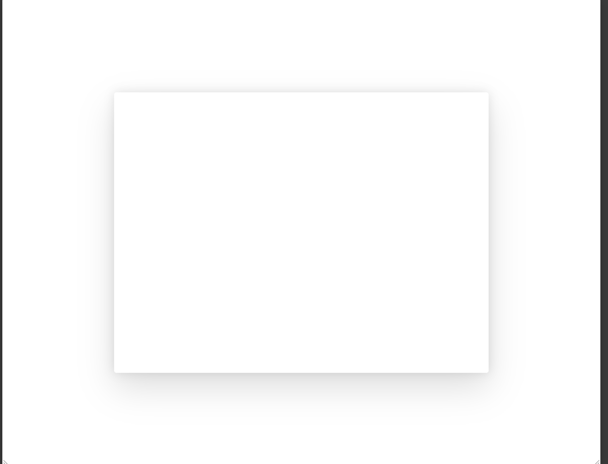
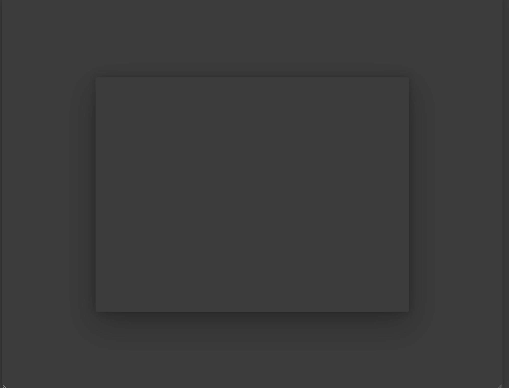

# Dialog

## Overview

As defined by the W3C:
> A dialog is a window overlaid on either the primary window or another dialog window. Windows under a modal dialog are inert. That is, users cannot interact with content outside an active dialog window. Inert content outside an active dialog is typically visually obscured or dimmed so it is difficult to discern, and in some implementations, attempts to interact with the inert content cause the dialog to close.
>
> Like non-modal dialogs, modal dialogs contain their tab sequence. That is, Tab and Shift + Tab do not move focus outside the dialog. However, unlike most non-modal dialogs, modal dialogs do not provide means for moving keyboard focus outside the dialog window without closing the dialog.

### Use Cases

- Joanna has some friends coming over and is searching online for some adult beverage ideas. She visits a website of a local distillery and a form overlays the screen asking her to confirm she is over 21 years of age by entering her birthday.

- Harold is in the process of removing old data sets from his company's content management system. He selects a group of data and clicks delete. A popup appears asking him to confirm that he wants to delete the selected files permanently.

- Meredith is browsing news articles online and clicks a link to a local newspaper story about an upcoming heat wave in the region. She is informed that she has read through an allotted number of free articles for the month and must either login or become a subscriber of the news site to continue. Meredith tries to continue interacting with the web page, but she's unable to. Meredith decides to subscribe to the online newspaper because they are running a special.

### Features

- **Soft dismiss (light dismiss):** In certain implementations, app authors want a dialog to close when a user clicks outside the content region or presses the `esc` key with their keyboard.

- **Focus management:** In all circumstances, focus should move to an element contained in the dialog. Per the W3C, "Unless a condition where doing otherwise is advisable, focus is initially set on the *first* focusable element" (emphasis mine). If an element within the dialog is set to be focused by an app author, our control should not override that behavior. In both modal and non-modal dialogs, tab focus should remain within the dialog content region and not move outside it. When the dialog is closed, users may also want a way to return focus to the element which invoked the dialog.

### Prior Art/Examples
- [FAST-DNA (React)](https://explore.fast.design/components/dialog)
- [Material UI](https://material-ui.com/components/dialogs/)
- [Lightning Design](https://www.lightningdesignsystem.com/components/modals/)
- [Carbon Design](https://www.carbondesignsystem.com/components/modal/code/)
- [Ant Design](https://ant.design/components/modal/)
- [Atlassian](https://atlaskit.atlassian.com/packages/core/modal-dialog)
- [Office Fabric](https://developer.microsoft.com/en-us/fabric#/controls/web/dialog)
- [Windows (UWP)](https://docs.microsoft.com/en-us/windows/uwp/design/controls-and-patterns/dialogs-and-flyouts/dialogs)

---

## Design

### API

*Component name:*
- `fast-dialog`

*Attributes:*
- `modal` - boolean value for modal functionality. Sets aria-modal to true (defaults to true).
- `hidden` - boolean value to toggle the visibility of the dialog (defaults to false).
- `aria-labelledby` - optional based on implementation**
- `aria-describedby` - optional based on implementation**
- `aria-label` - optional, based on implementation**

** See the [W3C Specification](https://w3c.github.io/aria-practices/#dialog_roles_states_props) for requirements and details.

*CSS custom properties:*
- width
- height

*Slots:*
- default slot for content

*Events*
- dismiss - event fired when a user presses escape or clicks outside the dialog content

### Anatomy and Appearance
**Structure:**
```
<div class="root">
    <div class="positioning-region">
        <div class="overlay">
        <div
            role="dialog"
            aria-modal="true"
            tabindex="-1"
            class="content-region"
            aria-describedby="foo"
            aria-labelledby="bar"
            aria-label="baz"
        >
            <slot></slot>
        </div>
    </div>
</div>
```

**Appearance:**
| State | Image |
| ----- | ----- |
| default |  |
| dark mode |  |

Parts:
- root - the root of the dialog
- positioning-region - ensuring the dialog is centered correctly requires a certain structure. Centering with absolute positioning can cause blurry content within the dialg itself. After investigating several implementations, the best and most common way of ensuring the dialog can be centered is to include a div to position the actual dialog itself using something like flexbox or css-grid. This ensures that the blurry content issue does not happen and the dialog centers easily within the screen.
- modal-overlay - the modal overlay
- content-region - the region where content is actually rendered. This part is where the `role="dialog"` will actually exist

Animation:
The current working model (assumption) is that animation will be taken up as part of the adaptive ui story in the design system at some point. This will provide configurability to users. From a dialog standpoint, I think we'll have a default animation baked in, though this would be configurable through the design system.

If we compose our dialog with two sets of styles, one for the dialog itself and another for the animation, that would also provide an easy way for users to create a new instance:

```js
@customElement({
    name: "my-dialog",
    template,
    styles: css`${dialogBaseStyles}${myAnimationStyles}`
})
```
---

## Implementation

### States

Hidden - The dialog is hidden. This state is managed solely by the app author via the hidden attribute. The default for this is `false`.

### Accessibility

The tree view should align to the interaction model provided by the W3C: https://w3c.github.io/aria-practices/#keyboard-interaction-7

### Globalization

The component visuals should not change when in RTL scenarios as the component is centered visually on the screen and has no LTR/RTL specific visuals or positioning.

### Test Plan

While testing is still TBD for our web components, I would expect this to align with the testing strategy and not require any additional test support.
