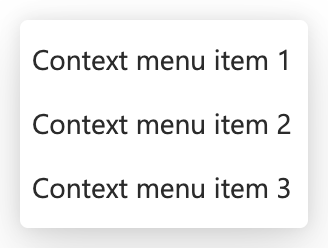
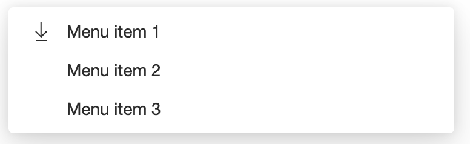
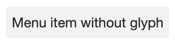
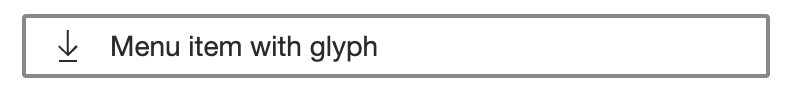
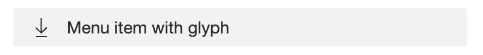

# Menu + Menu Item

## Overview

There are two components being presented as part of this specification - menu, and menu item.

As defined by the W3C:
> A menu is a widget that offers a list of choices to the user, such as a set of actions or functions. Menu widgets behave like native operating system menus, such as the menus that pull down from the menubars commonly found at the top of many desktop application windows. A menu is usually opened, or made visible, by activating a menu button, choosing an item in a menu that opens a sub menu, or by invoking a command, such as Shift + F10 in Windows, that opens a context specific menu. When a user activates a choice in a menu, the menu usually closes unless the choice opened a submenu.

### Use Cases

1. Paired with a persistent [menu button](https://w3c.github.io/aria-practices/#menubutton) to create a dropdown menu control. An example of this might be the common `...` overflow menu patterns where the menus visual state is toggled when the menu button is clicked.

2. A contextual menu triggered via right click, not paired with a menu button.

3. A less common, but still conventional pattern would be a visually persistent menu docked to the side of a screen, such as the example docked to the left (ltr) in this [Microsoft store example](https://www.microsoft.com/en-us/store/top-free/apps/pc).

### Non-goals

The horizontal menu bar is not currently part of the proposed control, nor is the menu button itself. 

This control is also not intended to be a "one size fits all" approach for controls which have menu-like behavior. While there are commonalities across different menu or list-like controls in terms of keyboarding behavior, those commonalities should be abstracted once we understand the nuance and deltas between the controls. This control is meant to be a semantic menu. While it may someday utilize some future abstracted utility, the control itself is not meant to be the abstract utility.

### Risks and Challenges

#### Icon support:

Consider a scenario where we have the following menu - some menu items have glyphs, others do not:
```html
<fast-menu>
    <fast-menu-item>Menu item one</fast-menu-item>
    <fast-menu-item>Menu item two</fast-menu-item>
    <fast-menu-item>
        <fancy-icon slot="before"></fany-icon>
        Menu item three
    </fast-menu-item>
</fast-context-menu>
```
The third item in the menu has a glyph, which would inset the text from the other menu items. To ensure that the content of this menu item aligns with the rest of the items, all items need to visually shift to ensure alignment of the menu content. This presents an interesting challenge for how we will communicate these changes to ensure the styling is appropriately applied. Ultimately, the parent just needs to know that *one* of the items below has a menu item with the glyph.

### Prior Art/Examples
- [FAST Context Menu (React)](https://www.npmjs.com/package/@microsoft/fast-components-react-msft)
- [Material UI](https://material-ui.com/components/menus/)
- [Lightning Design](https://www.lightningdesignsystem.com/components/menus/)
- [Ant Design - menu](https://ant.design/components/menu/)
- [Ant Design - dropdown](https://ant.design/components/menu/)
- [Atlassian - menu](https://atlaskit.atlassian.com/packages/core/menu)
- [Atlassian - dropdown menu](https://atlaskit.atlassian.com/packages/core/dropdown-menu)
- [Windows (UWP)](https://docs.microsoft.com/en-us/windows/uwp/design/controls-and-patterns/tree-view)

---

## Design

### API

*The key elements of the component's public API surface:*

**Menu**
*Component name:*
- `fast-menu`

*Attributes:*
- extends HTML Element attributes

*Slots:*
- default slot for items

*Events*
- none

**Menu Item**
*Component name:*
- `fast-menu-item`

*Attributes:*
- role - an enum representing the menu items' role
    - menuitem
    - menuitemcheckbox
    - menuitemradio
- disabled - the menu item is disabled
- checked - sets the checked value for menuitemcheckbox or menuitemradio items

*Slots:*
- before - slot which precedes content
- default - slot for the content (the default slot for the item)
- after - slot which comes after content
- submenu - the slot used to generate a submenu
- radio-indicator - slot for radio item selection indicator
- checkbox-indicator - slot for the checkbox selection indicator
- expand-collapse-glyph - slot for the expand/collapse glyph for nested menus

*CSS Parts*
- before
- content
- after
- submenu-region
- checkbox
- checkbox-indicator
- radio
- radio-indicator
- expand-collapse
- expand-collapse-glyph

*Events:*
- click (event) - event for when the item has been clicked or invoked via keyboard
- change (event) - event for when the item has been clicked or invoked via keyboard, and will be prevented if the menu item is disabled
- expanded-change (event) - event for when the item has been expanded or collapsed

### Anatomy and Appearance

**Menu**

| State | Image |
| ----- | ----- |
| default | 
| with glyph | 

The menu has no named slots or parts - it has a default slot for menu items.

Flat menu:
```html
<fast-menu>
    <fast-menu-item>Root node one</fast-menu-item>
    <fast-menu-item>Root node two</fast-menu-item>
    <fast-menu-item>Root node three</fast-menu-item>
    <fast-menu-item>Root node four</fast-menu-item>
</fast-menu>
```

Nested menu:
```html
<fast-menu>
    <fast-menu-item>Menu item one</fast-menu-item>
    <fast-menu-item>Menu item two</fast-menu-item>
    <fast-menu-item>
        Menu item three
        <fast-menu slot="submenu">
            <fast-menu-item>Nested item one</fast-menu-item>
            <fast-menu-item>Nested item two</fast-menu-item>
            <fast-menu-item>
                Nested item three
                <fast-menu slot="submenu">
                    <fast-menu-item>Nested item one</fast-menu-item>
                    <fast-menu-item>Nested item two</fast-menu-item>
                </fast-menu>
            </fast-menu-item>
        </fast-menu>
    </fast-menu-item>
    <fast-menu-item>Menu item four</fast-menu-item>
</fast-context-menu>
```

**Menu item**

| State | Image |
| ----- | ----- |
| default | 
| default (glyph) | 
| disabled | 
| focus | 
| hover | 
| focus (glyph) | 
| hover (glyph) | 

---

## Implementation

### States

**Menu Item**

Checked:

 A menu with menuitemcheckbox or menuitemradio roles can be "checked".

 - the control may be initialized in the checked state
 - clicking on the control or using enter/spacebar would set the item as checked

Disabled:
- disabled menu items are focusable but cannot be activated.

### Accessibility

The menu should align to the interaction model provided by the [W3C](https://w3c.github.io/aria-practices/#menu)

### Globalization

The component visuals should support RTL scenarios (per below):


### Test Plan

While testing is still TBD for our web components, I would expect this to align with the testing strategy and not require any additional test support.
