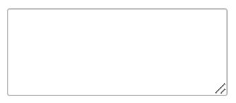
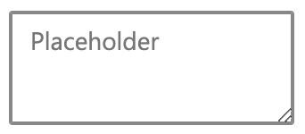
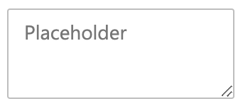
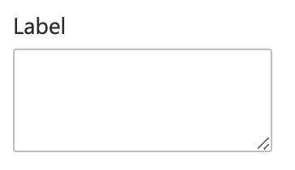

# Text Area

## Overview

An implementation of an html textarea.

### Use Cases

Used anywhere an author might otherwise use `<textarea></textarea>`.

### Features

1. Focus Delegation

### Risks and Challenges

We want general feature-parity between this component and the typical corresponding element. Most of these concerns are addressed by https://github.com/microsoft/fast/pull/2723, but some stateful nuance will need to be handled by this component.

### Prior Art/Examples

- [FAST (React)](https://explore.fast.design/components/text-area)
- [Lightning Design](https://www.lightningdesignsystem.com/components/textarea/)
- [Atlassian](https://atlaskit.atlassian.com/packages/core/textarea)
- [Evergreen](https://evergreen.segment.com/components/textarea/)

---

### API

*Component Name*
- `fast-text-area`

*Attrs* - Adapted from [MDN](https://developer.mozilla.org/en-US/docs/Web/HTML/Element/textarea)
- `appearance` - enum
  - outline (default)
  - filled
- `autofocus` -  Boolean attribute lets you specify that a form control should have input focus when the page loads
- `cols` - visible width of the text control, in average character widths. If it is specified, it must be a positive integer. If it is not specified, the default value is 20
- `disabled` - disables the control
- `form` - form element that the `<textarea>` element is associated with (its "form owner"). The value of the attribute must be the id of a form element in the same document. If this attribute is not specified, the `<textarea>` element must be a descendant of a form element. This attribute enables you to place `<textarea>` elements anywhere within a document, not just as descendants of form elements
- `list` - the id of the `<datalist>` element that contains the optional pre-defined autocomplete options
- `maxlength`	- the maximum number of characters the input should accept
- `minlength` -	the minimum number of characters long the input can be and still be considered valid
- `name` - the name of the control
- `placeholder` - an exemplar value to display in the `<textarea>` whenever it is empty
- `readonly` - the `<textarea>` should be submitted with the form but should not be editable.
- `required` - boolean value that sets the `<textarea>` as required
- `resize` - enum value to set the resize behavior for the textarea. Defaults to both. While this is not a standard attribute, I think it's a value-add to be able to set an attribute here rather than manage this from a stylesheet.
  - none
  - both
  - horizontal
  - vertical
- `rows` - the number of visible text lines
- `spellcheck` - controls whether or not to enable spell checking for the `<textarea>`, or if the default spell checking configuration should be used
- `value` - the value (content) of the textarea. While the textarea element supports content being supplied as content within its opening and closing tags, it does not support slot projection. Value will be used instead.

*Events*
- `change: CustomEvent`
  - no custom data
  - bubbles

### Anatomy and Appearance

```HTML
<!-- shadow root -->
<label part="label">
    <slot></slot>
</label>
<textarea
    part="control"
    $autofocus="${x => x.autofocus}"
    $cols="${x => x.cols}"
    $disabled="${x => x.disabled}"
    $form="${x => x.form}"
    $list="${x => x.list}"
    $maxlength="${x => x.maxlength}"
    $minlength="${x => x.minlength}"
    $name="${x => x.name}"
    $placeholder="${x => x.placeholder}"
    $readonly="${x => x.readonly}"
    $required="${x => x.required}"
    $rows="${x => x.rows}"
    $spellcheck="${x => x.spellcheck}"
></textarea>
<!-- end shadow root -->
```


*Screenshots below are of the basic appearance of the component and are not exhaustive.*

| State | Image |
| ----- | ----- |
| default |  |
| focus | 
| placeholder | 
| with label | 

*Slot Names*
- default - The label content

*Host Classes*
- disabled
- required
- readonly

*CSS Parts*
- label
- control

---

## Implementation

### States

**disabled**: `true` or `false` - when disabled, the value will not be changeable through user interaction. It should also not expose it's value to a form submission.

**readonly**: `true` or `false` - when readonly, the value will not be changeable through user interaction. The value will still be exposed to forms on submission.

### Accessibility

The input element inside the shadow-dom of the checkbox will be a focusable element. With this in mind, so long as the textarea recieves focus, assistive technology should treat it as such.

### Globalization
N/A

### Test Plan

While testing is still TBD for our web components, I would expect this to align with the testing strategy and not require any additional test support.

---

## Next Steps
N/A
