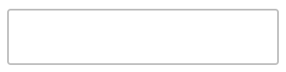
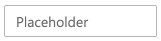
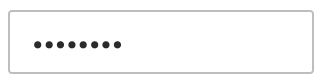
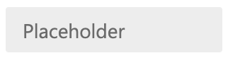

# Text Field

## Overview

An implementation of a generic input for textual values as a form-connected web-component.

### Use Cases

Used anywhere an author might otherwise use:
- input[type="text"]
- input[type="email"]
- input[type="password"]
- input[type="tel"]
- input[type="url"]

### Features

1. Focus Delegation

### Risks and Challenges

We want general feature-parity between this component and the typical corresponding inputs. Most of these concerns are addressed by https://github.com/microsoft/fast/pull/2723, but some stateful nuance will need to be handled by this component.

### Prior Art/Examples

- [FAST Text Field (React)](https://www.npmjs.com/package/@microsoft/fast-components-react-msft)
- [Material UI](https://material-ui.com/components/text-fields/)
- [Lightning Design](https://www.lightningdesignsystem.com/components/input/)
- [Carbon Design](https://www.carbondesignsystem.com/components/text-input/code)
- [Ant Design](https://ant.design/components/input/)
- [Atlassian](https://atlaskit.atlassian.com/packages/core/textfield)
- [Office Fabric](https://developer.microsoft.com/en-us/fabric#/controls/web/textfield)
- [Windows (UWP)](https://docs.microsoft.com/en-us/windows/uwp/design/controls-and-patterns/text-box)

---

### API

Extends FAST Element

*Component Name*
- `fast-text-field`

*Attrs* - Adapted from [MDN](https://developer.mozilla.org/en-US/docs/Web/HTML/Element/input/text)
- `autofocus` - automatically focuses the control
- `readonly` - the text field should be submitted with the form but should not be editable.
- `placeholder` - an exemplar value to display in the input field whenever it is empty
- `required` - boolean value that sets the field as required
- `value` - string value of the text field, can be an empty string
- `disabled` - disables the control
- `list` - the id of the `<datalist>` element that contains the optional pre-defined autocomplete options
- `maxlength`	- the maximum number of characters the input should accept
- `minlength` -	the minimum number of characters long the input can be and still be considered valid
- `name` - the name of the control
- `pattern` - a regular expression the input's contents must match in order to be valid
- `size` - a number indicating how many characters wide the input field should be
- `spellcheck` - controls whether or not to enable spell checking for the input field, or if the default spell checking configuration should be used
- `type` - enum
  - text
  - email
  - password
  - tel
  - url
- `appearance` - enum
  - outline (default)
  - filled

*Events*
- `change: CustomEvent`
  - no custom data
  - bubbles

### Anatomy and Appearance

```HTML
<!-- shadow root -->
<label part="label"><slot></slot></label>
<div part="root">
  <slot name="before-content" part="before-content"></slot>
  <input type="${x => x.type}" part="control" />
  <slot name="after-content" part="after-content"></slot>
</div>
<!-- end shadow root -->
```


*Screenshots below are of the basic appearance of the component and are not exhaustive.*

| State | Image |
| ----- | ----- |
| default |  |
| focus | 
| placeholder | 
| password (filled) | 
| filled | 

*Slot Names*
- default - the label content
- before-content - often times a glyph, icon, or button precedes input
- after-content - often times a glyph, icon, or button follows the input

*Host Classes*
- disabled
- required
- readonly

*CSS Parts*
- label
- root
- before-content
- after-content
- control

---

## Implementation

### States

**disabled**: `true` or `false` - when disabled, the value will not be changeable through user interaction. It should also not expose it's value to a form submission.

**readonly**: `true` or `false` - when readonly, the value will not be changeable through user interaction. The value will still be exposed to forms on submission.

### Accessibility

The input element inside the shadow-dom of the checkbox will be a focusable element. With this in mind, so long as the text field receives focus, assistive technology should treat it as such.

### Globalization

Before and after content should swap in LTR presentations.

### Test Plan

While testing is still TBD for our web components, I would expect this to align with the testing strategy and not require any additional test support.

---

## Next Steps
Adding mechanisms, slots, and data for surfacing validation error messages.
