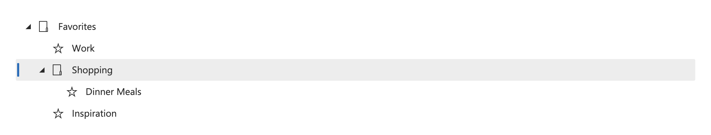
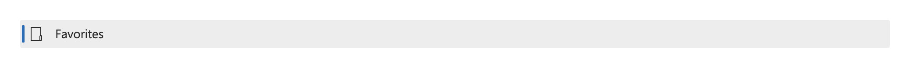
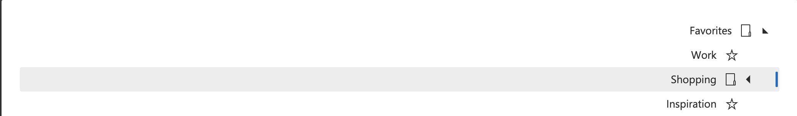

# Tree View + Tree View Item

## Overview

There are two components being presented as part of this specification - tree view, and tree view item. 

As defined by the W3C:
> A tree view widget presents a hierarchical list. Any item in the hierarchy may have child items, and items that have children may be expanded or collapsed to show or hide the children. For example, in a file system navigator that uses a tree view to display folders and files, an item representing a folder can be expanded to reveal the contents of the folder, which may be files, folders, or both.

### Background

Currently, a react implementation exists which supports a `defaultExpanded` value which sets the default expanded or collapsed state. In the event that the `defaultExpanded` value is false, but there is a selected child the tree will expand automatically. [Issue #2597](https://github.com/microsoft/fast/issues/2597) requests an expanded prop to fully control the expanded/collapsed state.

### Use Cases

Primarily used to present a hierarchical list such as a file system. A tree view can also be served as a flat list.
  
### Features

- **Selection:** A tree view can support either single select or multi-select behavior for nodes. **I would propose that for the initial spec we start with supporting single select only.*


- **Drag & Drop support:** Often, as is in the case of a "file system" example, drag and drop support is desired. This does present [challenges](#drag-&-drop).

### Risks and Challenges

#### Nesting:

Infinite nesting combined with the current visual design presents a styling challenge. Consider a scenario where we have the following tree:
```html
<fast-tree-view>
    <fast-tree-item>Root node one</fast-tree-item>
    <fast-tree-item>Root node two</fast-tree-item>
    <fast-tree-item>
        Parent Node && Root node
        <fast-tree-item slot="item">Nested node one</fast-tree-item>
        <fast-tree-item slot="item">Nested node two</fast-tree-item>
    </fast-tree-item>
    <fast-tree-item>Root node three</fast-tree-item>
</fast-tree-view>
```
In this scenario, there is no root node with an expand/collapse glyph. The third item in the tree view is a parent node, which *would* have an expand/collapse glyph to the right. To ensure that the content of the parent node align with the rest of the root nodes, the entire tree will need to visually shift to ensure alignmnet of the tree content. This presents an interesting challenge for how we will communicate these changes to the parent to ensure the styling is appropriately applied. Ultimately, the parent just needs to know that *one* of the items below has child nodes.

#### Drag & Drop

Drag & Drop support poses a unique set of challenges, especially if our goal is to provide out of the box support via the [HTML Drag and Drop API](https://developer.mozilla.org/en-US/docs/Web/API/HTML_Drag_and_Drop_API). Alternatively, those using our components with React, Vue, Angular, etc may want to use libraries built to work with their specific framework flavor. 

**Considering the challenge that drag & drop would present for any given component, I think it's worth holding on that feature, and taking it up seperately.*

### Prior Art/Examples
- [FAST Tree View (React)](https://www.npmjs.com/package/@microsoft/fast-components-react-msft)
- [Material UI](https://material-ui.com/components/tree-view/)
- [Lightning Design](https://www.lightningdesignsystem.com/components/trees/)
- [Ant Design](https://ant.design/components/tree/)
- [Atlassian](https://atlaskit.atlassian.com/packages/core/tree/example/static-tree)
- [Windows (UWP)](https://docs.microsoft.com/en-us/windows/uwp/design/controls-and-patterns/tree-view)

---

## Design

### API

*The key elements of the component's public API surface:*

**Tree View**
*Component name:*
- `fast-tree-view`

*Attributes:*
- extends HTML Element attributes

*Slots:*
- default slot for items

*Custom properties*
- custom CSS property for `depth` to support the infinite nesting scenario

*Events*
- none

**Tree View Item**
*Component name:*
- `fast-tree-item`

*Attributes:*
- expanded - nodes with child nodes (tree items) can either be expanded or collapsed. 
- selected - the node is selected

*Slots:*
- content - slot for the content (the default slot for the item)
- item - the optional child node(s)
- before-content - slot which precedes content, often a glyph or icon
- after-content - slot which follows content, often a glyph or icon
- expand-collapse-glyph - slot for svg, will include a default svg
    - You could use a single glyph and rotate using CSS which would be the default. 
    - With the expanded callback an implementor knows when a tree item is expanded or not. The glyph provided could be updated based on the expanded/collapsed state of the control.
    - The glyph could be overridden with CSS using the named :part. This can change based on the expanded state as well.\

*Events:*
- expanded-change (event) - event for when the expanded state has changed
- selected-change (event) - event for when an item has been selected

### Anatomy and Appearance

**Tree View**



The tree view has no named slots or parts - it has a default slot for tree items.

Flat tree:
```html
<fast-tree-view>
    <fast-tree-item>Root node one</fast-tree-item>
    <fast-tree-item>Root node two</fast-tree-item>
    <fast-tree-item>Root node three</fast-tree-item>
    <fast-tree-item>Root node four</fast-tree-item>
</fast-tree-view>
```

Nested tree:
```html
<fast-tree-view>
    <fast-tree-item>Root node one</fast-tree-item>
    <fast-tree-item>Root node two</fast-tree-item>
    <fast-tree-item>
        <fast-tree-item slot="item">Nested node one</fast-tree-item>
        <fast-tree-item slot="item">Nested node two</fast-tree-item>
    </fast-tree-item>
    <fast-tree-item>Root node three</fast-tree-item>
</fast-tree-view>
```

**Tree view item**

| State | Image |
| ----- | ----- |
| default |  |
| selected | 
| expanded | 
| collapsed | 
| selected/expanded | 
| selected/collapsed | 

Tree view item has a named slot for tree items (tree-item) and a default slot for content.

Slots:
- `content` - the default slot.
- `item` - named slot for child node(s).
- `before-content` - named slot to optionally include content (often a glyph) before the `content` slot
- `after-content` - named slot to optionally include content (often a glyph) after the `content` slot
- `expand-collapse-glyph` - named slot which can be used to provide an element which will serve as the expand/collapse glyph

Parts:
- root
- content
- before-content
- after-content
- expand-collapse-glyph
- item
- expanded
- selected

---

## Implementation

### States

**Tree View Item**

Expanded:

 A parent node with child nodes can be either expanded or collapsed (not expanded). The following state transitions or interactions are all valid:

 - the control may be initialized with no parent nodes expanded
 - the control may be initialized with all or some parent nodes expanded
 - clicking on the expand/collapse button will expand or collapse a parent node
 - in a vertical tree, when a parent node has focus, right arrow expands and left arrow collapses the parent node.
 - in a vertical tree, when a parent node has focus, space bar expands and collapses the tree.

Selected:

In a single select tree, only one item may be selected at a time. Selection should not follow focus. The following state transitions or interactions are all valid:

- if none of the nodes are selected before the tree receives focus, focus is set on the first node.
- if a node is selected before the tree receives focus, focus is set on the selected node.
- clicking on a node selects it
- clicking on the expand/collapse button selects and performs the expand/collapse behavior
- when focus is on a node, enter selects the node

### Accessibility

The tree view should align to the interaction model provided by the W3C: https://w3c.github.io/aria-practices/#TreeView

### Globalization

The component visuals should support RTL scenarios (per below):


### Test Plan

While testing is still TBD for our web components, I would expect this to align with the testing strategy and not require any additional test support.
