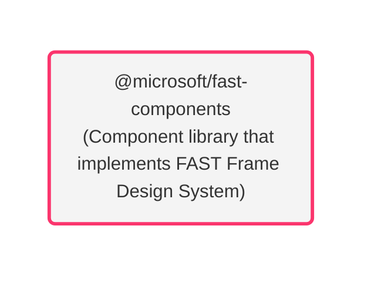
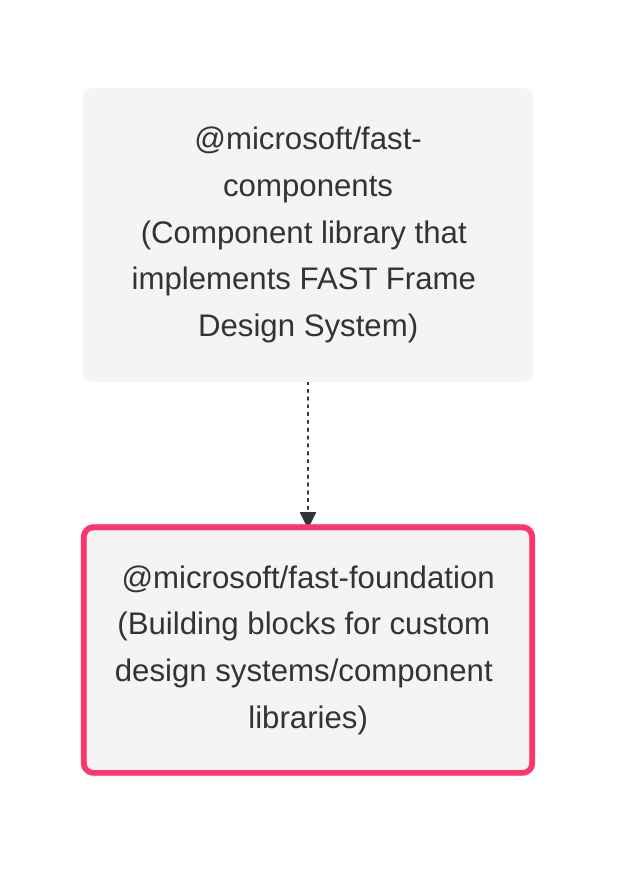
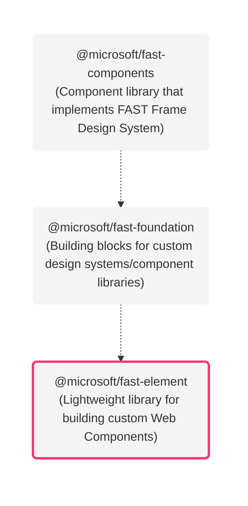

import logo from "../../site-utilities/statics/assets/fast-logo.png";
import { DocCardList, DocCardItem } from "@site/src/custom-components/CustomDocCard";

    

    <h2>
        Welcome to the <i>FAST</i> documentation!
    </h2>

## Where should I start?

Pick the statement you most identify with, and follow the links where they lead. Come back and explore another topic at any time. Or, [click here](#what-is-fast) to learn more about FAST.

<DocCardList>
  <DocCardItem
    href="./components/getting-started"
    title="I want ready-made components"
    description="The @microsoft/fast-components library contains Web Components built on top of our standard component and design system foundation. Jump to the component docs."
  />
  <DocCardItem
    href="./fast-element/getting-started"
    title="I want to build my own components"
    description="The fast-element library is a lightweight means to easily build performant, memory-efficient, standards-compliant Web Components. Jump to the fast-element docs."
  />
  <DocCardItem
    href="./design-systems/overview"
    title="I want to build my own design system"
    description="FAST Frame is the name of our highly configurable design system. It is made up of a set of Web Components and accompanying design tokens. Jump to the design system docs."
  />
  <DocCardItem
    href="./integrations/introduction"
    title="I want to integrate FAST"
    description="FAST libraries can be used on their own to build modern web sites and apps, but they can also be used with a wide variety of existing technologies. Jump to the integration docs."
  />
  <DocCardItem
    href="./resources/cheat-sheet"
    title="I want to look at a quick reference"
    description="A quick reference for FAST packages, using/building components, design systems/tokens, and how to make contributions to FAST. Jump to the cheat sheet doc."
  />
  <DocCardItem
    href="./community/contributor-guide"
    title="I want to contribute to FAST"
    description="To get started as a contributor, read our code of conduct and contributor guides. Join our Discord server and look at good first issues. Jump to the contributor guide docs."
  />
</DocCardList>

## What is FAST?

FAST is a collection of technologies built on Web Components and modern Web Standards, designed to help you efficiently tackle some of the most common challenges in website and application design and development.

### What are Web Components?

"Web Components" is an umbrella term that refers to a collection of web standards focused on enabling the creation of custom HTML elements. Some of the standards that are under the umbrella include the ability to define new HTML tags, plug into a standard component lifecycle, encapsulate HTML rendering and CSS, parameterize CSS, skin components, and more. Each of these platform features is defined by the W3C and has shipped in every major browser today.

### How does FAST leverage Web Components?

One of FAST's driving principals is "strive to adopt open, web standards-based approaches as much as possible." To that end, FAST is built directly on the W3C Web Component standards mentioned above, and does not create its own component model. This allows components built with FAST to function the same as built-in, native HTML elements. You do not need a framework to use FAST components, but you can use them in combination with any framework or library of your choice.

### How can FAST help me?

To understand how FAST can help you, let's take a look at the **FAST tech stack from top to bottom**. 

At the top of the stack, FAST provides a set of Web Components: **`@microsoft/fast-components`**. This library includes a common set of components found in many websites and apps.

Example components include button, card, modal, menu, tab, tree-view, and more. `@microsoft/fast-components` provides an industry-focused design system, which we call "FAST Frame". If you're looking to integrate FAST components into an existing site or app, or if you need more control over the theme of the components, this is the option you'll want to start with.

**What if you're not just looking for a set of components to use, but you also need to implement a custom *design system*?** 

This is where the second level of the stack comes into play. **`@microsoft/fast-foundation`** provides foundational building blocks that can be assembled to create new design systems and component libraries. 

For example, if you wanted to implement Google's Material Design, you could do that using `@microsoft/fast-foundation`; you could also implement something like Twitter Bootstrap. `@microsoft/fast-components` assemble the building blocks of `@microsoft/fast-foundation` to create its component sets. 

**What types of building blocks are we talking about though?** 

Perhaps the most valuable feature of the foundation is that it provides base component behaviors and templates for the standard components. So, if you want to implement a tree-view in your design system, for example, you would use the foundation base component behavior and template, but combine it with your own styles. 

The foundation components implement the state management, accessibility, keyboard navigation, and extensibility/composition model so you don't have to write that code. Additionally, foundation provides facilities for dynamic style behaviors, CSS property management, algorithmic color, RTL, high contrast, and more. You don't have to write any of that. Just assemble the building blocks and add your styles to create your own component library, expressing your own design system. So far we've talked about using existing components and creating new design systems and component libraries from existing pieces. But FAST enables you to create completely new Web Components as well. 

Enter **`@microsoft/fast-element`**, the lowest level part of the FAST tech stack. This is a lightweight library for building performant, memory-efficient, standards-compliant Web Components.

`@microsoft/fast-element` provides a thin layer of opinion on top of Web Components, lifting the level of abstraction just enough to make it easier and faster to build components. `@microsoft/fast-element` helps by providing attribute/property syncing, rich Model-View-ViewModel (MVVM), efficient template rendering/update, style composition, and much more. The entire `@microsoft/fast-element` library, *without* tree-shaking, is around 10kb minified and GZipped. It was designed for tree-shaking from the beginning, so any feature you don't use when building a component will be removed during build, allowing for highly efficient optimized payloads as small as 4.5k.

<DocCardList>
  <DocCardItem
    href="./resources/glossary"
    title="Glossary"
    description="A glossary of terms, which includes Design System, Design Token, ES2015, Evergreen Browser, Houdini, Polyfill, Time to Interactive (TTI), Transpiler, and Web Components."
  />
  <DocCardItem
    href="./resources/faq"
    title="FAQ"
    description="A list of frequently asked questions (e.g. What are Web Components, Why should I choose Web Components over [other JavaScript framework], etc)."
  />
</DocCardList>

## Joining the community

We look forward to building an amazing open source community with you.

<DocCardList>
  <DocCardItem
    href="https://discord.gg/FcSNfg4"
    title="Discord"
    description="Join our active community on Discord. Follow the latest updates and contributions, ask questions, give feedback, or keep up on our reading list."
  />
  <DocCardItem
    href="https://github.com/Microsoft/fast/issues/new/choose"
    title="GitHub"
    description="Explore the FAST repository on GitHub and try out our components, utilities, and tools. Or, mix-and-match with your own solutions."
  />
  <DocCardItem
    href="https://twitter.com/FAST_UI"
    title="Twitter"
    description="Follow along as we share out the latest happenings on Twitter. You will find important updates, announcements, and sneak peeks."
  />
    <DocCardItem
    href="https://medium.com/fast-design"
    title="Medium"
    description="Read articles published on our official FAST blog. Like, comment, share, and bookmark content. Sign up for our monthly newsletter, FAST Monthly."
  />
</DocCardList>
