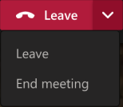
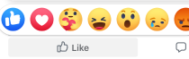

# Split Button

This is the working branch for the `split-button` component spec. It is still in development and implementation details are rough but should be ready for high-level feedback and discussion.

## Overview

A `fast-split-button` is a primary action button and a collection of related action buttons. The primary button is shown and the related buttons are hidden in a menu. It takes takes two forms:

 1. **Stateless split-button**: a primary action button paired with a menu-button which shows or hides a dropdown collection of related buttons, as seen here in Teams:



 2. **Stateful split button**: a button and popover as seen here in Facebook's "Like" button:




### Background

The split button is a UI pattern that has been around a long time. It is a common in Fluent UI and in reaction buttons like Facebook's "Like/Love/Care.." buttons

### Use Cases

Use `fast-split-button` where you need instant access to a default action and a submenu of a few related actions. The split button can be stateful (a reaction button similar to Facebook's "Like") or it can be stateless like the Fluent-style  "Reply | Reply All | Forward" button. Non-modal is the default.
- (Stateless) Brian wants to reply to an email. He can click the reply button to immediately reply or choose one of several reply-related options (reply all, forward) from the dropdown which will immediately create the reply/reply all/forward email for editing. (This is the non-modal interaction pattern)
- (Stateful) Brianna wants to "love" an item in her feed. She can click the like button or can hover it and/or click the down arrow and the "Like" submenu appears with actions for "Love", "Laugh", "Surprise", "Sad", and "Angry". (This is the modal/stateful interaction)
- (Stateful) Brinn is using an app that has a set of related tools, for drawing straight lines or boxes. When she wants to draw a line, she clicks the line tool. When she wants the rectangle tool, she chooses the dropdown from the split button and selects Rectangle from the menu. (This is the tool-style, modal split-button)

### Non-goals

- This relies on but does not contain the popover/flyout menu of buttons
- This is NOT a navigation menu, select or listbox
- There is no second level nesting of menus

### Features

- A basic, Fluent-style split-button is visually similar to a select component or combobox but it has unique behaviors, in that--unlike a selectbox--the default button is immediately clickable. 
- In a stateful split button, the Primary Action button changes depending on which button clicked. 
- In a stateful split button, clicking a selected primary action button (say, "Loved") resets the button to its default state (an unclicked "Like" button).
- The menu should allow for horizontal or vertical layout
- Works with mouse, touch or keyboard navigation
- Mouse: 
  - Hover on `split-button` container  **may** show the related actions or may show a Down Arrow
  - Click on Primary Action Button initates action
  - Hover or click on down arrow shows menu of related action buttons
  - Click on button in the dropdown initiates the action (non-modal)
  - In modal/stateful `split-button`, a click on a button and sets the primary action button to a "checked" state
- Keyboard: 
  - Tab to the button and Enter to click the button
  - Tab again to the dropdown button and hit Enter, Space, or Down Arrow to open menu and focus first item
  - Navigate through related actions menu using Up/Down Arrows or Space Bar. Hit Enter to click focused button
  - Tab out of menu to dismiss

Keyboard operation is very similar to the [WAI-ARIA example of MenuButton](https://www.w3.org/TR/wai-aria-practices/examples/menu-button/menu-button-actions-active-descendant.html)

### Risks and Challenges

- It depends on fast-button and fast-popover.

- Because the  collection of related action buttons are displayed in a separate popover/flyout/listbox, a developer must know whether and how to use a stateful split button or standard split button and all the extra properties needed for the stateful one. 

Much of the interaction is handled not by the base split button, but by the popover/flyout/menu:
  - Should the menu of buttons should be in the DOM once, no matter how many split buttons are in the page?

Accessibility - it is important that the split button is two tab stops: one for the default button and one for the related actions in its menu.

### Prior Art/Examples

Split buttons:
- [Fluent UI](https://developer.microsoft.com/en-us/fluentui#/controls/web/button)
- [Bootstrap](https://getbootstrap.com/docs/4.3/components/dropdowns/#split-button)
- [Microsoft UWP](https://docs.microsoft.com/en-us/windows/uwp/design/controls-and-patterns/buttons#create-a-split-button)
- [Semantic UI](https://semantic-ui.com/modules/dropdown.html#floating)
- [Telerik]( https://demos.telerik.com/aspnet-ajax/button/examples/splitbutton/defaultcs.aspx)

Similar:
- [Salesforce Lightning - button group with overflow](https://www.lightningdesignsystem.com/components/button-groups/#With-Overflow-Menu-2)
- [Material Design - exposed dropdown](https://material.io/components/menus#exposed-dropdown-menu)
- [w3c - menu action button](https://w3c.github.io/aria-practices/examples/menu-button/menu-button-actions-active-descendant.html)

---

## Design

### API

*Component Name:*

- `fast-split-button`

*Properties:*

- `relatedButtons` - collection of buttons to be displayed in the popover
- `relatedPopoverMenu` - a fast-popover used in the slotted directive for the flyout and related secondary actions
- `stateful` - boolean. False (default) when it is a Fluent-style split button. True it is "like"-style split button
- `has-divider` - boolean. True (default) shows the divider between primary-action-button and the menu-button. False if there is no divider, like the Teams example above.
- `disabled` - boolean. Disables entire split button
- `primary-disabled` - boolean. Disables just the primary action button, but leaves menu-button and menuitems enabled. For Fluent parity
- `aria-haspopup` - true
- `aria-controls` - reference to popover
- `aria-expanded` - true when the popover is open

*Slots:*
- `primary-button` - the primary action button
- `expand-glyph` - glyph that indicates the select is expandable, often a downward chevron
- `related-buttons` - collection of buttons that will be displayed in the popover menu


*Events:*
 - `change` - In stateful split button, fired when a button is clicked and updates the button to be shown as "selected" in the primary action slot.


### Anatomy and Appearance

Split button is 2 major components: 
1. Split button "base": the Primary action button and a menubutton
2. The listbox/menu/popover with the related action buttons

#### Structure:

```html
<template>
    <div 
      class="split-button-container"
      stateful="false"
    >
        <button 
            slot="primary-button"
            class="primary-button"
        >
        </button>

        <button 
          slot="menu-button" 
          class="primary-button"
        >
        </button>

        <span slot="divider"></span>
        <slot name="related-buttons">
          <button 
            class="related-button"
          >
        </slot>
    </div>
</template>
```

---

## Implementation

```html
<fast-split-button>
  <fast-button slot="primary-button">Reply</fast-button>
</fast-split-button>
<fast-popover>
  <fast-button>Reply All</fast-button>
  <fast-button>Forward</fast-button>
</fast-popover>
```

### States

**open**: `true` or `false` - this state is applied to the secondary actions container (`fast-listbox`? `fast-popover`?) when the user hovers or clicks on the menubutton.
**disabled**: `true` or `false` - when disabled, the value will not be changeable through user interaction.
**primaryDisabled**:  `true` or `false` - the primary action button is disabled but the related menu and actions are still available. I can't see this getting used, but it provides parity w/Fluent.

### Accessibility

Split-button's menubutton and flyout should follow the (W3C recommendation for menu button)[https://www.w3.org/TR/wai-aria-practices/examples/menu-button/menu-button-actions-active-descendant.html] for flyout, keyboard, tab stop, and focus behavior. All the other buttons should follow all the rules for buttons.

The base `split-button` should have an aria-role of split button, as well as attributes of aria-has-popup, aria-controls, and aria-expanded.

### Globalization

- The primary action and menu-buttons will change places and tab order in an RTL scenario.

### Security

No security implications

### Performance

If multiple identical split-buttons are used in a feed scenario, the submenu should be loaded only once and then shown and hidden as a user mouses or focuses on each button.

### Dependencies

- If composed, `fast-split-button` would take dependencies on `fast-button` and then on either `fast-menu`, and `fast-menu-item`; or maybe `fast-popover` or `fast-listbox`. although `listbox` techically doesn't allow anything but text options. 

*Do any of these dependencies bring along an associated timeline?*
Don't know

### Test Plan

Split button should not require any thing beyond our normal test support.

### Tooling

*Are there any special considerations for tooling? Will tooling changes need to be made? Is there a special way to light up this component in our tooling that would be compelling for developers/designers?*
No new tooling needed.

### Documentation

*What additions or changes are needed for user documentation and demos? Are there any architectural/engineering docs we should create as well, perhaps due to some interesting technical challenge or design decisions related to this component?*
Hopefully we can figure that out as we refine the spec.

---

## Resources

*Any related resource links such as web standards, discussion threads, diagrams, etc.*
- (W3C menu button)[https://www.w3.org/TR/wai-aria-practices/examples/menu-button/menu-button-actions-active-descendant.html]
- (Fluent split button)[https://developer.microsoft.com/en-us/fluentui#/controls/web/button] NOTE that while Fluent's split-button is currently a type of button, their plan is to move it to a separate component to simplify the button component.
- (Bootstrap split buttons)[https://getbootstrap.com/2.3.2/components.html#buttonDropdowns] - built out of their button group and dropdown button.
- (MS News React Social Bar)[https://microsoft.visualstudio.com/ICE/_git/msnews-experiences?path=%2Fcomponents%2Fsocial-bar%2Fsrc%2FSocialBar.tsx]
- (MS News React Content Card reactions)[https://microsoft.visualstudio.com/ICE/_git/msnews-experiences?path=%2Fcomponents%2Fcontent-card-reactions] 

## Next Steps

Lots of feedback and help ironing out implementation details.