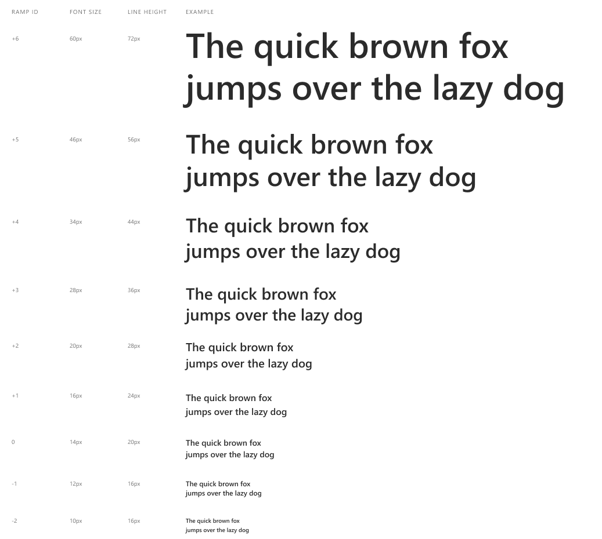
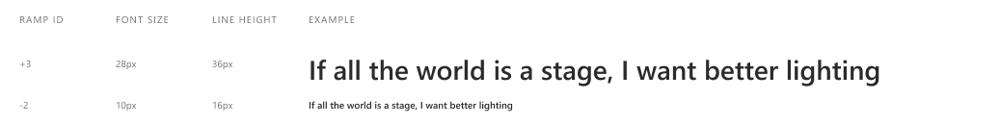
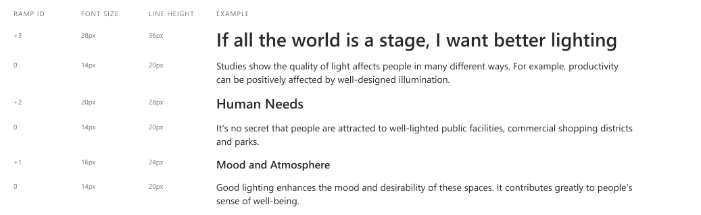
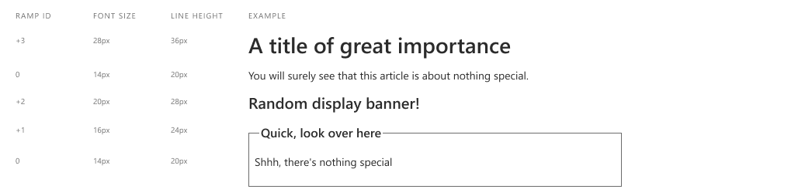

# Heading

## Overview

*Heading* provides a consistent and customizable way of applying base [typography](./typography.md) sizes to convey progression and information hierarchy in your content.

### Background

Headings are commonly used to provide structure and scanability. Often they follow a size ramp where the top level or title is the largest and each subsection gets smaller. This may be combined with variations in other formatting treatments like weight or rule lines.

While primarily relevant to proper accessibility, it's important to consider the difference between a heading from a content hierarchy perspective compared to a block of text that simply needs to be a certain size. This spec will address both areas with a perspective on making *anything* possible while making it easy to inherit default accessible patterns.

Standard html elements exist for six levels of headings, ```<h1>``` through ```<h6>```. Page and app authors are familiar with using these elements for their semantic purpose as well as abusing them only to make text larger or smaller. All browsers share a default opinion that ```<h1>``` is the largest, ramping down to ```<h6>```, and provide default sizes for each element.

### Use Cases

1. Applying systematic formatting to non-semantic text
2. Defining accessible page hierarchy through one or more sequences of ```<h1>```, ```<h2>```, ```<h3>```, etc. elements
3. Formatting heading elements off-ramp, i.e. a smaller ```<h2>``` that groups a section and larger ```<h3>``` for main topics within that section
 
### Features

1. Ability to use any size in the type ramp as a heading
2. A default mapping of systematic styles to standard elements
3. Use of a contiguous ramp sequence to create intentional rhythm
4. A set of semantically named styles based on the underlying type ramp

### Risks and Challenges

It's possible that styles alone (not components) will be harder to implement consistently. We may want to consider simple custom elements that consistently apply the same underlying styles as well as any necessary aria tags.

### Prior Art / Examples

- FAST-DNA (React): [Heading](https://explore.fast.design/components/heading), [Subeading](https://explore.fast.design/components/subheading)
- [Material Design](https://material.io/design/typography/the-type-system.html)
- [Bootstrap](https://getbootstrap.com/docs/4.4/content/typography)
- [Ant Design](https://ant.design/components/typography)
- [Mineral UI](https://mineral-ui.netlify.app/typography#display-text)
- [Semantic UI](https://semantic-ui.com/elements/header.html)
- [Fluent UI](https://fluentsite.z22.web.core.windows.net/components/header/definition)

---

## Design

A heading can be made from any size in the type ramp.



### API

Pseudo interfaces: (*Could be functions, decorators, design system properties, or otherwise*)

#### Basic heading style map

Bare-bones styles applied manually.

```TypeScript
headingStyles.basicRamp()
```

Produces css classes that can be applied to any text elements. The classes are consistently named for relation to the raw type ramp.

*Supports use cases 1 & 3, feature 1*

```CSS
.fast-heading-minus-2 ...

.fast-heading-minus-1 ...

.fast-heading-base {
    font-size: var(--fast-type-ramp-base-size);
    line-height: var(--fast-type-ramp-base-height);
    font-weight: var(--fast-heading-font-weight);
}

.fast-heading-plus-1 ...

...
```

Usage:

```HTML
<h1 class="fast-heading-plus-3">If all the world is a stage, I want better lighting</h1>

<span class="fast-heading-minus-2">If all the world is a stage, I want better lighting</span>
```



#### Scoped standard heading element map

The easiest option for accessible content when you know how many levels you have.

```TypeScript
headingStyles.standardElementMap(levels: 3, includeBase: false)
```

Applies the styles to the standard heading elements for the desired number of levels so the adaptive styling is used without needing to add and maintain class names. Starts directly above the base type ramp size or optionally includes that size depending on stylistic preference.

*Supports use case 2, features 2 & 3*

```CSS
h1, h2, h3, h4, h5, h6 {
    font-weight: var(--fast-heading-font-weight);
}

body {
    font-size: var(--fast-type-ramp-base-size);
    line-height: var(--fast-type-ramp-base-height);
}

/* Three levels, above base */

h1 {
    font-size: var(--fast-type-ramp-plus-3-size);
    line-height: var(--fast-type-ramp-plus-3-height);
}

h2 {
    font-size: var(--fast-type-ramp-plus-2-size);
    line-height: var(--fast-type-ramp-plus-2-height);
}

h3 {
    font-size: var(--fast-type-ramp-plus-1-size);
    line-height: var(--fast-type-ramp-plus-1-height);
}

h4, h5, h6 { /* This rule may not be necessary, but it helps identify usage or config issues. */
    font-size: var(--fast-type-ramp-base-size);
    line-height: var(--fast-type-ramp-base-height);
}
```

Usage:

```HTML
<h1>If all the world is a stage, I want better lighting</h1>

<p>Studies show the quality of light affects people in many different ways. For example, productivity can be positively affected by well-designed illumination.</p>

<h2>Human Needs</h2>

<p>It's no secret that people are attracted to well-lighted public facilities, commercial shopping districts and parks.</p>

<h3>Mood and Atmosphere</h3>

<p>Good lighting enhances the mood and desirability of these spaces. It contributes greatly to people's sense of well-being.</p>
```



#### Semantically named use case based styles

An option for applying names to common scenarios. Serves as a common example as a guide for how to create your own semantic styles.

```TypeScript
headingStyles.simplePageStyleMap()
```

*Supports use cases 1, 2 & 3, feature 4*

Produces semantically named styles that are intended to be consumed and optionally customized by the page author.

```CSS
--fast-page-title-type-size: var(--fast-type-ramp-plus-3-size);
--fast-page-title-type-height: var(--fast-type-ramp-plus-3-height);
--fast-section-title-type-size: var(--fast-type-ramp-plus-2-size);
--fast-section-title-type-height: var(--fast-type-ramp-plus-2-height);
--fast-item-title-type-size: var(--fast-type-ramp-plus-1-size);
--fast-item-title-type-height: var(--fast-type-ramp-plus-1-height);
--fast-body-type-size: var(--fast-type-ramp-base-size);
--fast-body-type-height: var(--fast-type-ramp-base-height);
--fast-caption-type-size: var(--fast-type-ramp-minus-1-size);
--fast-caption-type-height: var(--fast-type-ramp-minus-1-height);

.fast-page-title {
    font-size: var(--fast-page-title-type-size);
    line-height: var(--fast-page-title-type-height);
    font-weight: var(--fast-heading-font-weight);
}

.fast-section-title {
    font-size: var(--fast-section-title-type-size);
    line-height: var(--fast-section-title-type-height);
    font-weight: var(--fast-heading-font-weight);
}

.fast-item-title {
    font-size: var(--fast-item-title-type-size);
    line-height: var(--fast-item-title-type-height);
    font-weight: var(--fast-heading-font-weight);
}

.fast-body {
    font-size: var(--fast-body-type-size);
    line-height: var(--fast-body-type-height);
}

.fast-caption {
    font-size: var(--fast-caption-type-size);
    line-height: var(--fast-caption-type-height);
}
```

Usage:

```HTML
<p class="fast-page-title">A title of great importance</p>

<p class="fast-body">You will surely see that this article is about nothing special.</p>

<p class="fast-section-title">Random display banner!</p>

<fieldset>
    <legend class="fast-item-title">Quick, look over here</legend>

    <p class="fast-caption">Shhh, there's nothing special</p>
</fieldset>
```



Customization:

```CSS
--fast-page-title-type-size: var(--fast-type-ramp-plus-5-size);
--fast-page-title-type-height: var(--fast-type-ramp-plus-5-height);
--fast-section-title-type-size: var(--fast-type-ramp-plus-3-size);
--fast-section-title-type-height: var(--fast-type-ramp-plus-3-height);
```

Remapping of semantic names to custom sizes from the ramp without needing to change anywhere the named styles are used.

---

### Accessibility

The benefit of enabling standard elements to be styled is that if used properly they will already have the appropriate default aria roles and attributes. The downside is potential misuse and missing attributes. For instance ```<p class="fast-heading-plus-3">Important title</p>``` won't be properly identified as a heading by assistive technology.
