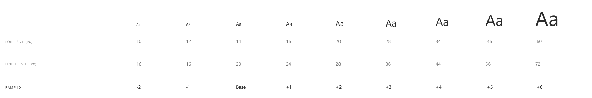

# Typography

## Overview

*Typography* defines the underlying type size system for applying to elements, css classes, or within components. This spec does not propose any components of its own.

### Background

A type ramp can help create balance and contrast in formatted content. Sizes from a ramp can be applied linearly to form progression and information hierarchy, or selected artistically.

The use of type ramps has existed since the early days of printing, where fixed sizes and intervals were common. In digital representation we have increased flexibility and options, including calculating more precise and variable scales.

This typography system provides an extensible structure anchored around a base size, from fixed values or generated using a modular scale.

### Use Cases

- Formatting main body content
- Defining page hierarchy using headings
- Providing a label for an input field
- Adding a caption to an image or figure

### Features

- An extensible type ramp around a base font size
- CSS variables to apply the type ramp

### Risks and Challenges

Further typography-related specs build on the underlying principles and resources defined here. It will be important to provide meaningful ways to allow for semantic styles and consistent application of appearances in balance with flexibility and maintenance cost.

### Prior Art / Examples

- [FAST Typography (React)](https://www.npmjs.com/package/@microsoft/fast-components-react-msft)
- [Material Design](https://material.io/design/typography/the-type-system.html)
- [Bootstrap](https://getbootstrap.com/docs/4.4/content/typography)
- [Ant Design](https://ant.design/components/typography)
- [Mineral UI](https://mineral-ui.netlify.com/typography)

---

## Design

The default type ramp uses a selection of values from Microsoft Fluent Design.

Note the "Ramp ID", which is used to apply the desired size. This ramp is built around the base type size to associate the relative sizes between content. For instance, your main body text uses the `base` size. You may want a caption to be smaller than that, so you use `-1`. You want your [headings](./headings.md) to be larger, so you use one or more of the `+` sizes.

This is more declarative than using an index position to reference the sizes, like `7` if this ramp is numbered from the top or `3` if numbered from the bottom. It also allows the sizes that you use to be related to each other rather than at other arbitrary points on the ramp. For example, three levels of headings above body text are `16px (+1)`, `20px (+2)`, and `28px (+3)` instead of jumping all the way to `60px (+6)` at the top and skipping the middle. You can add additional sizes at the top and bottom if necessary.

*Note that these are just examples and nothing about any particular usage of a type size is prescribed by the underlying ramp. See further typography specs for other systematic ways to apply the ramp sizes.*

Type style variables can be added or updated at any point in the component tree. Generally they would be created globally for consistent application throughout your app or site, or they could be overridden or added for a single section of a page. *Note that this does not prescribe if they are part of the design system or declared as css variables, TBD per larger styling system work.*

### API

Pseudo interfaces: (*Could be functions or decorators or otherwise*)

- `typeRamp()`  
A default type ramp as illustrated above
- `typeRamp({'12px', '14px', '24px', '36px'}, 1)`  
A type ramp with fixed type size values and default line height, index 1 is base
- `typeRamp({{'12px', '16px'}, {'14px', '20px'}, {'24px', '28px'}, {'36px', '44px'}}, 1)`  
A type ramp with fixed type size values and fixed individual line heights, index 1 is base
- `typeRamp({'0.75em', '0.875em', '1em', '1.25em'}, 1)`  
A type ramp with relative type size values and default line height, index 1 is base
- `typeRamp({{'10px', '16px'}, {'12px', '16px'}, {'14px', '20px'}, {'16px', '24px'}, {'20px', '28px'}, {'28px', '36px'}, {'34px', '44px'}, {'46px', '56px'}, {'60px', '72px'}}, 2)`  
The full equivalent of the default type ramp

### Anatomy and Appearance

The type ramp is provided as properties or variables that are named to extend plus and minus from the base.

- `fast-type-ramp-minus-2-size` = `"10px"`
- `fast-type-ramp-minus-2-height` = `"16px"`
- `fast-type-ramp-minus-1-size` = `"12px"`
- `fast-type-ramp-minus-1-height` = `"16px"`
- `fast-type-ramp-base-size` = `"14px"`
- `fast-type-ramp-base-height` = `"20px"`
- `fast-type-ramp-plus-1-size` = `"16px"`
- `fast-type-ramp-plus-1-height` = `"24px"`
- `fast-type-ramp-plus-2-size` = `"20px"`
- `fast-type-ramp-plus-2-height` = `"28px"`
- `fast-type-ramp-plus-3-size` = `"28px"`
- `fast-type-ramp-plus-3-height` = `"36px"`
- `fast-type-ramp-plus-4-size` = `"34px"`
- `fast-type-ramp-plus-4-height` = `"44px"`
- `fast-type-ramp-plus-5-size` = `"46px"`
- `fast-type-ramp-plus-5-height` = `"56px"`
- `fast-type-ramp-plus-6-size` = `"60px"`
- `fast-type-ramp-plus-6-height` = `"72px"`

---

## Implementation

### Accessibility

Since this spec only deals with type styles there are not traditional accessibility concerns, however this might be a point of potential future extension to allow for type sizing or capping of the smallest size.

Some typographic elements are significant for accessibility, like headings, but the underlying ramp does not dictate or facilitate any relationships in that regard. Usage mappings may be provided as an extension to the type ramp, and is recommended in custom components for further customization. 

### Tooling

As the typography styles are not components, it would be nice to provide a way to apply typical combinations to elements using a picker or other focused UI.

### Documentation

*TODO: How do we document styles? Something like this doc, but separate for styles from components?*

---

## Next Steps

Apply the styles to the current components and any example pages.

It would be nice to extend the type ramp settings in the future to be able to be specified by a [modular scale](https://type-scale.com/) or another custom algorithm.

Could be part of the main typography constructor or extracted out to another ramp provider class:

- `typeRamp[Modular](16, 1.25, 3, 5)`  
A type ramp based at `16px` on a major third [modular scale](https://type-scale.com/) of `1.25` with `3` sizes below base and `5` sizes above.
